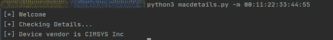

# 从 MAC 地址

获取设备供应商名称的 Python 脚本

> 原文:[https://www . geesforgeks . org/python-script-to-get-device-厂商-名称-来自 mac-address/](https://www.geeksforgeeks.org/python-script-to-get-device-vendor-name-from-mac-address/)

**先决条件:** [Python 请求](https://www.geeksforgeeks.org/python-requests-tutorial/#:~:text=Requests%20library%20is%20one%20of,URI%2C%20it%20returns%20a%20response.)

媒体访问控制地址是网络接口的唯一标识，用于在计算机网络中寻址设备。

## **MAC 地址** **由什么组成？**

媒体访问控制地址由 12 个十六进制数字组成，6 个八位字节由“:”分隔。一个媒体访问控制地址有 6 个八位字节。在前半部分，存储制造商信息。


## **我们如何获取制造商详细信息？**

在本文中，我们将使用一个为我们获取媒体访问控制地址的应用编程接口。我们将使用一个 Python 脚本来自动化提取过程，以便我们以后可以在可能需要此功能的软件和网站中使用它。

我们将使用[请求](https://www.geeksforgeeks.org/python-requests-tutorial/#:~:text=Requests%20library%20is%20one%20of,URI%2C%20it%20returns%20a%20response.)模块来使用该应用编程接口。

下面是实现。

## 蟒蛇 3

```
import requests
import argparse

print("[*] Welcome")

# Function to get the interface name
def get_arguments():

    # This will give user a neat CLI
    parser = argparse.ArgumentParser()

    # We need the MAC address
    parser.add_argument("-m", "--macaddress",
                        dest="mac_address",
                        help="MAC Address of the device. "
                        )
    options = parser.parse_args()

    # Check if address was given
    if options.mac_address:
        return options.mac_address
    else:
        parser.error("[!] Invalid Syntax. "
                     "Use --help for more details.")

def get_mac_details(mac_address):

    # We will use an API to get the vendor details
    url = "https://api.macvendors.com/"

    # Use get method to fetch details
    response = requests.get(url+mac_address)
    if response.status_code != 200:
        raise Exception("[!] Invalid MAC Address!")
    return response.content.decode()

# Driver Code
if __name__ == "__main__":
    mac_address = get_arguments()
    print("[+] Checking Details...")

    try:
        vendor_name = get_mac_details(mac_address)
        print("[+] Device vendor is "+vendor_name)
    except:

        # Incase something goes wrong
        print("[!] An error occured. Check "
              "your Internet connection.")
```

将此代码保存为 macdetails.py。我们可以使用“-h”或“–help”来查看如何从终端运行此脚本的帮助。

**输出:**

