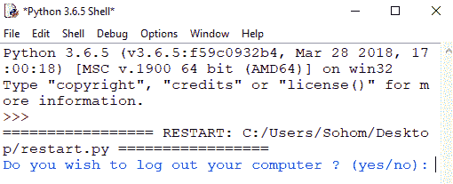

# Python 脚本注销电脑

> 原文:[https://www . geesforgeks . org/python-脚本到注销-计算机/](https://www.geeksforgeeks.org/python-script-to-logout-computer/)

众所周知，Python 是一种流行的脚本语言，因为它具有多种功能。在本文中，我们将编写一个 Python 脚本来注销计算机。让我们从如何用 Python 注销系统开始。要仅使用 Python 脚本注销您的计算机/PC/笔记本电脑，您必须使用代码为“shut-l”的 os.system()函数。**关机-l** 命令是注销的 windows shell 命令。

让我们从如何用 Python 注销系统开始。

> **注意:**要做到这一点，您必须在 ide 中导入操作系统库。如果没有，则通过命令提示符输入“`pip install os`”。
> 
> **原因:**请确保在 IDLE 上运行此代码之前保存并关闭所有程序，因为下面的程序会立即注销您的计算机。

下面是 Python 实现–

```
import os

logout = input("Do you wish to log out your computer ? (yes / no): ")

if logout == 'no':
    exit()
else:
    os.system("shutdown -l")
```

**输出:**

这里是 Python 程序，会要求用户注销电脑，提供是或否选项，还有，当你输入是&然后按回车键，系统会瞬间注销。