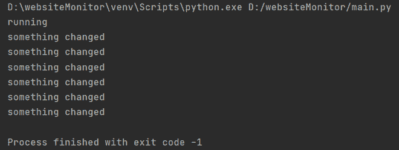

# Python 脚本监控网站变化

> 原文:[https://www . geesforgeks . org/python-脚本到监视器-网站-更改/](https://www.geeksforgeeks.org/python-script-to-monitor-website-changes/)

在本文中，我们将讨论如何创建一个 python 脚本来监控网站更改。你可以编写一个程序来监控一个网站，如果有任何变化，它会通知你。这个程序有许多有用的场景，例如，如果你的学校网站更新了一些东西，你就会了解它。

### 方法:

我们将按照以下步骤编写这个程序:

1.  读取您要监控的网址。
2.  散列整个网站。
3.  等待指定的秒数。
4.  如果与之前的哈希相比有任何变化，请通知我，否则请等待，然后再次获取哈希。

### 所需的库:

我们将使用的库有:

*   **时间:**等待指定的时间。
*   **hashlib:** 对整个网站的内容进行哈希。
*   **urllib:** 执行 get 请求并加载网站内容。

### 实施:

## 蟒蛇 3

```py
# Importing libraries
import time
import hashlib
from urllib.request import urlopen, Request

# setting the URL you want to monitor
url = Request('https://leetcode.com/',
              headers={'User-Agent': 'Mozilla/5.0'})

# to perform a GET request and load the
# content of the website and store it in a var
response = urlopen(url).read()

# to create the initial hash
currentHash = hashlib.sha224(response).hexdigest()
print("running")
time.sleep(10)
while True:
    try:
        # perform the get request and store it in a var
        response = urlopen(url).read()

        # create a hash
        currentHash = hashlib.sha224(response).hexdigest()

        # wait for 30 seconds
        time.sleep(30)

        # perform the get request
        response = urlopen(url).read()

        # create a new hash
        newHash = hashlib.sha224(response).hexdigest()

        # check if new hash is same as the previous hash
        if newHash == currentHash:
            continue

        # if something changed in the hashes
        else:
            # notify
            print("something changed")

            # again read the website
            response = urlopen(url).read()

            # create a hash
            currentHash = hashlib.sha224(response).hexdigest()

            # wait for 30 seconds
            time.sleep(30)
            continue

    # To handle exceptions
    except Exception as e:
        print("error")
```

**输出:**



输出

**注意:** time.sleep()以秒为参数。您可以更改通知，而不是在终端上打印状态。您可以编写一个程序来获取电子邮件。