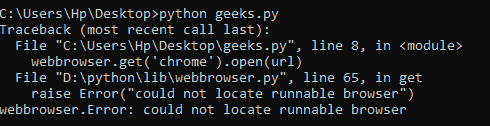
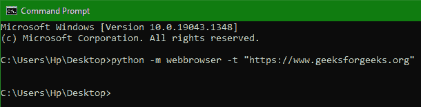

# 打开网页浏览器的 Python 脚本

> 原文:[https://www . geesforgeks . org/python-script-to-open-a-web-browser/](https://www.geeksforgeeks.org/python-script-to-open-a-web-browser/)

在本文中，我们将讨论使用 python 脚本打开 web 浏览器(我们选择的)和访问我们指定的 URL 的一些方法。

在 Python 包中，我们有一个名为 **webbrowser 的模块，**，它包含了很多方法，我们可以使用这些方法在任何我们想要的指定浏览器中打开所需的 URL。为此，我们只需要将这个模块导入到我们的脚本文件中，然后我们需要用我们需要的输入调用它的一些函数(在下面声明和定义)。因此，这个模块将打开我们想要的浏览器，并获得我们想要的页面。

**本模块中的方法描述如下:**

<figure class="table">

| **序列号** | **方法语法** | **描述** |
| --- | --- | --- |
| one | web 浏览器. open(url，new = 0，= true) | 这是打开带有传递的网址的网络浏览器并向用户显示的主要方法。如果参数“new”为 0，则在同一浏览器中打开 URL，如果为 1，则在另一个浏览器中打开 URL，如果为 2，则在另一个选项卡中打开页面。 |
| Two | web 浏览器. open_new(url) | 如果可能的话，传递的网址将在新的浏览器中打开，否则它将在默认浏览器中打开。 |
| three | web 浏览器. open_new_tab(url) | 打开在当前活动的浏览器中传递的密码页 URL 的新选项卡。 |
| four | webbrowser.get(使用=无) | 这个命令用于获取我们想要使用的网络浏览器的目标代码。简而言之，我们可以使用这个命令来获取 web 浏览器的代码(存储在 python 中)，然后我们可以使用该代码来打开特定的 web 浏览器。我们传递想要用作字符串的 web 浏览器的名称。 |
| five | webbrowser.register(名称、构造函数、实例=无，首选=假) | 如果之前没有注册代码，则此方法用于在 Python 环境中注册收藏夹浏览器的名称。实际上，在开始时，没有一个浏览器被注册，每次只调用默认的浏览器。因此，我们必须手动注册它们。 |

</figure>

现在我们将使用这些方法来看看如何用我们传递的网址打开浏览器。

**下面是实现:**

在这个实验中，我们使用了一个网址=[https://www.geeksforgeeks.org](https://www.geeksforgeeks.org/)。我们的 python 脚本存储在一个名为 geeks.py 的文件中。下面是我们在其中编写和实现的代码。

### **示例 1:**在 Python 脚本中打开 Web 浏览器的基本示例

## 蟒蛇 3

```py
# first import the module
import webbrowser

# then make a url variable
url = "https://www.geeksforgeeks.org"

# then call the default open method described above
webbrowser.open(url)
```

因此，网站在默认的网络浏览器中打开。和我的一样，它是在微软边缘打开的，如下所示:


输出:-站点在边缘打开

### **示例 2:** 指定**浏览器**

## 蟒蛇 3

```py
# first import the module
import webbrowser

# then make a url variable
url = "https://www.geeksforgeeks.org"

# then call the get method to select the code 
# for new browser and call open method 
# described above
webbrowser.get('chrome').open(url)

# results in error since chrome is not registered initially.
```

在提示符下输入“ **python geeks.py** 运行命令，就会给出结果。如果我们尝试打开我们选择的浏览器，但没有第一次注册，那么我们将得到下面给出的响应类型作为输出。



如果我们最初没有注册浏览器，则输出

因此，下面给出的是我们修改的代码，这样它现在注册浏览器，然后在其中打开那个网址。

### **示例 3:注册新浏览器**

## 蟒蛇 3

```py
# first import the module
import webbrowser

# then make a url variable
url = "https://www.geeksforgeeks.org"

# getting path
chrome_path = r"C:\Program Files\Google\Chrome\Application\chrome.exe"

# First registers the new browser
webbrowser.register('chrome', None, 
                    webbrowser.BackgroundBrowser(chrome_path))

# after registering we can open it by getting its code.
webbrowser.get('chrome').open(url)
```

在提示符下使用此命令的输出与上面给出的相同，只是方法不同。



在提示符下使用 python 脚本。

因此在执行后，它将打开浏览器。

在 python 中，还有一种使用 webbrowser 打开浏览器的方法。在这种方法中，我们不必编写整个脚本并解释它来打开浏览器。我们可以只使用 python shell 执行一个命令(如下所示)来打开带有指定 URL 的浏览器(默认)。

> shell 命令如下所示
> 
> python-m web browser-t " https://www . geeksforgeeks . org "

因此，我们看到了两种不同的方法，并向他们解释了如何使用 python 脚本打开 web 浏览器。