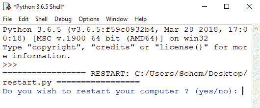

# Python 脚本重启电脑

> 原文:[https://www . geesforgeks . org/python-脚本到重启-计算机/](https://www.geeksforgeeks.org/python-script-to-restart-computer/)

众所周知，Python 是一种流行的脚本语言，因为它具有多种功能。在本文中，我们将编写一个 Python 脚本来重启计算机。让我们从如何用 Python 重启系统开始。

> **注意:**要使其工作，您必须在 ide 中导入`os library` 。如果没有，则通过命令提示符输入“`pip install os`”。
> 
> **原因:**请确保在 IDLE 上运行此代码之前保存并关闭所有程序，因为下面的程序会立即重新启动您的计算机。

下面是 Python 实现–

```
import os

restart = input("Do you wish to restart your computer ? (yes / no): ")

if restart == 'no':
    exit()
else:
    os.system("shutdown /r /t 1")
```

**输出:**

这里是 Python 程序，会要求用户重启电脑，提供是或否的选项，还有，当你输入是&然后按回车键，系统会瞬间重启。