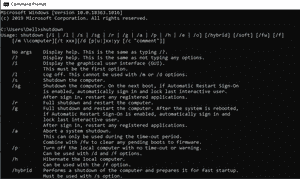

# 使用语音命令关闭电脑的 Python 脚本

> 原文:[https://www . geesforgeks . org/python-脚本-使用语音命令关闭电脑/](https://www.geeksforgeeks.org/python-script-to-shutdown-your-pc-using-voice-commands/)

是的，借助终端和 Python 中的一些模块，只需使用语音命令就可以关闭电脑，这是可能的

### **所需模块:**

*   **OS 模块:**它是 python 中的内置模块，提供与操作系统交互的功能。
*   **语音识别模块:**它是 python 中的外部模块，功能依赖于用户的语音命令。
*   **Pyttsx3 模块:**是 Python 中的一个文本到语音的转换库。

### **安装:**

```
pip install SpeechRecognition
pip install pyttsx3
```

### 终端的作用:

在终端中，关机命令有很多标签，但是我们将使用 */s* 标签来关闭系统。



### 以下是使用语音命令创建关闭个人电脑程序的步骤:

**第一步:**创建一个类 *Gfg* 然后创建它的方法，创建 *takeCommands()方法*以获取命令作为输入。

## 蟒蛇 3

```
import SpeechRecognition as sr

# Create class
class Gfg:

    # Method to take voice commands as input
    def takeCommands(self):

        # Using Recognizer and Microphone Method for input voice commands
        r = sr.Recognizer()
        with sr.Microphone() as source:
            print('Listening')

            # Number pf seconds of non-speaking audio before
            # a phrase is considered complete
            r.pause_threshold = 0.7
            audio = r.listen(source)

            # Voice input is identified
            try:

                # Listening voice commands in indian english
                print("Recognizing")
                Query = r.recognize_google(audio, language='en-in')

                # Displaying the voice command
                print("the query is printed='", Query, "'")

            except Exception as e:

                # Displaying exception
                print(e) 
                print("Say that again sir")
                return "None"
        return Query
```

**第二步:**创建一个 *Speak()* 方法，这样电脑就可以和用户进行交流了。

## 蟒蛇 3

```
# Method for voice output
def Speak(self, audio):

    # Constructor call for pyttsx3.init()
    engine = pyttsx3.init('sapi5')

    # Setting voice type and id
    voices = engine.getProperty('voices')
    engine.setProperty('voice', voices[1].id)
    engine.say(audio)
    engine.runAndWait()
```

**第三步:**现在创建 *quitSelf()* 关闭计算机。

## 蟒蛇 3

```
# Method to self shut down system
def quitSelf(self):
    self.Speak("do u want to switch off the computer sir")

    # Input voice command
    take = self.takeCommand()
    choice = take
    if choice == 'yes':

        # Shutting down
        print("Shutting down the computer")
        self.Speak("Shutting the computer")
        os.system("shutdown /s /t 30")
    if choice == 'no':

        # Idle
        print("Thank u sir")
        self.Speak("Thank u sir")
```

**第 4 步:**现在在驱动程序代码中创建一个 *Gfg* 对象，并调用 *quitSelf()* 方法。

## 蟒蛇 3

```
# Driver code
if __name__ == '__main__':

    # Creating gfg object
    Maam = Gfg()

    # Calling the method to self shut down
    Maam.quitSelf()
```

### 以下是使用语音命令关闭电脑的完整程序:

## 计算机编程语言

```
# Importing required modules
import os
import pyttsx3
import speech_recognition as sr

# Creating class
class Gfg:

    # Method to take choice commands as input
    def takeCommands(self):

          # Using Recognizer and Microphone Method for input voice commands
          r = sr.Recognizer()
          with sr.Microphone() as source:
              print('Listening')

              # Number pf seconds of non-speaking audio before
              # a phrase is considered complete
              r.pause_threshold = 0.7
              audio = r.listen(source)

              # Voice input is identified
              try:

                  # Listening voice commands in indian english
                  print("Recognizing")
                  Query = r.recognize_google(audio, language='en-in')

                  # Displaying the voice command
                  print("the query is printed='", Query, "'")

              except Exception as e:

                  # Displaying exception
                  print(e) 
                  # Handling exception
                  print("Say that again sir")
                  return "None"
          return Query

    # Method for voice output
    def Speak(self, audio):

          # Constructor call for pyttsx3.init()
          engine = pyttsx3.init('sapi5')

          # Setting voice type and id
          voices = engine.getProperty('voices')
          engine.setProperty('voice', voices[1].id)
          engine.say(audio)
          engine.runAndWait()

    # Method to self shut down system
    def quitSelf(self):
        self.Speak("do u want to switch off the computer sir")

        # Input voice command
        take = self.takeCommand()
        choice = take
        if choice == 'yes':

            # Shutting down
            print("Shutting down the computer")
            self.Speak("Shutting the computer")
            os.system("shutdown /s /t 30")
        if choice == 'no':

            # Idle
            print("Thank u sir")
            self.Speak("Thank u sir")

# Driver code           
if __name__ == '__main__':
    Maam = Gfg()
    Maam.quitSelf()
```

**输出:**

<video class="wp-video-shortcode" id="video-486347-1" width="640" height="360" preload="metadata" controls=""><source type="video/mp4" src="https://media.geeksforgeeks.org/wp-content/uploads/20200915081759/GeeksforGeeksvedio-for-shutdown_Trim.mp4?_=1">[https://media.geeksforgeeks.org/wp-content/uploads/20200915081759/GeeksforGeeksvedio-for-shutdown_Trim.mp4](https://media.geeksforgeeks.org/wp-content/uploads/20200915081759/GeeksforGeeksvedio-for-shutdown_Trim.mp4)</video>