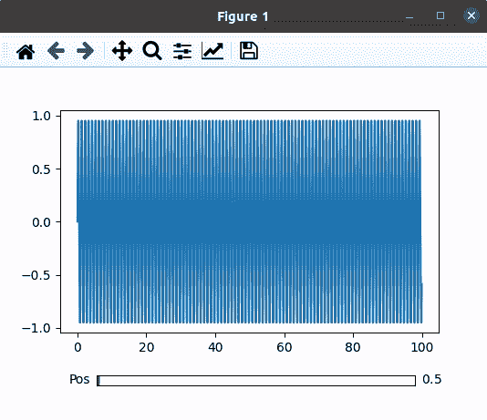
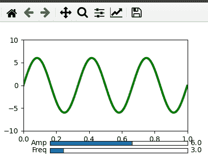

# Python–滚动图

> 原文:[https://www.geeksforgeeks.org/python-scroll-through-plots/](https://www.geeksforgeeks.org/python-scroll-through-plots/)

在 python 中，我们可以使用许多库和函数绘制图形。在本文中，我们的主要重点是向图中添加滑块。但是在移向滑块之前，有必要知道如何使用 [matplotlib.pyplot.](https://www.geeksforgeeks.org/python-introduction-matplotlib/) 在 python 中绘制一个基本的图

## 滚动图

滚动图是当我们使用滑块改变图的比例时自动更新的图。可以使用 matplotlib 和 plotly 库将滑块添加到绘图中。在本教程中，我们将学习如何使用 matplotlib.pyplot 库生成滑块。

对于每一个案例来说，滚动浏览情节可能看起来没有用处或必要，但肯定是一个有益的功能。有些情况下，数据很大，无法适合动态图，即使适合，图中的点之间也会发生碰撞。因此，使用滑块将减少点之间的碰撞，并使它看起来像样和干净。而且，学习起来也很容易。

**Slider()函数:** Slider()函数是 matplotlib.widgets 中的一个函数，帮助程序员在绘图中添加一个滑块。matplotlib.widget.Slider()的基本语法是

> **语法:** matplotlib.widgets.Slider(轴，标签，val_min，val_max，valinit = 0.5，valfmt =无，closed _ min =真，closed _ max =真，slider _ min =无，slider _ max =无，拖动=真，val _ step =无，方向= '水平'，**kwargs)

**示例 1:** 滚动滑块。

**进场:**

*   导入模块
*   将情节和轴设置为子情节
*   调整滑块小部件的大小
*   将一些虚拟数据设置到 x 轴和 y 轴
*   使用虚拟数据绘制图表
*   设置滑块和绘图的位置
*   定义一个更新函数，当我们移动滑块时，它将改变图形表示
*   使用 on_changed()函数将更新功能设置到滑块，以实现更改。
*   沿着滑块绘制图表。

**下面是实现:**

## 蟒蛇 3

```
# Import libraries using import keyword
import numpy as np
import matplotlib.pyplot as plt
from matplotlib.widgets import Slider

# Setting Plot and Axis variables as subplots()
# function returns tuple(fig, ax)
Plot, Axis = plt.subplots()

# Adjust the bottom size according to the
# requirement of the user
plt.subplots_adjust(bottom=0.25)

# Set the x and y axis to some dummy data
t = np.arange(0.0, 100.0, 0.1)
s = np.sin(2*np.pi*t)

# plot the x and y using plot function
l = plt.plot(t, s)

# Choose the Slider color
slider_color = 'White'

# Set the axis and slider position in the plot
axis_position = plt.axes([0.2, 0.1, 0.65, 0.03],
                         facecolor = slider_color)
slider_position = Slider(axis_position,
                         'Pos', 0.1, 90.0)

# update() function to change the graph when the
# slider is in use
def update(val):
    pos = slider_position.val
    Axis.axis([pos, pos+10, -1, 1])
    Plot.canvas.draw_idle()

# update function called using on_changed() function
slider_position.on_changed(update)

# Display the plot
plt.show()
```

**输出:**



**示例 2:** 滚动多个滑块。

**进场:**

*   导入模块
*   将情节和轴设置为子情节
*   调整滑块小部件的大小。
*   使用一些虚拟数据将振幅设置为 x 轴，将频率设置为 y 轴。
*   使用数据绘制图表，并根据需要给出一些基本功能，如颜色变化或尺寸变化。
*   设置振幅滑块、频率滑块和绘图的位置。
*   定义一个更新函数，当我们移动任何滑块时，它将改变图形表示。
*   使用 on_changed()功能将更新功能设置到两个滑块。
*   沿着滑块绘制图表。

**下面是实现:**

## 蟒蛇 3

```
# Importing Libraries using import function
import numpy as np
import matplotlib.pyplot as plt
from matplotlib.widgets import Slider

# Setting Plot and Axis variables as subplots()
# function returns tuple(fig, ax)
fig, ax = plt.subplots()

# Adjust the bottom size according to the
# requirement of the user
plt.subplots_adjust(bottom = 0.25)

# Set the x and y axis to some dummy data
t = np.arange(0.0, 1.0, 0.001)
# Initial values of amplitude anf frequency 
# are denoted by a0 and f0
a0 = 6
f0 = 3
s = a0*np.sin(2*np.pi*f0*t)

# plot the x and y using plot function
Plot, = plt.plot(t, s, lw = 3, color = 'green')
plt.axis([0, 1, -10, 10])

# Choose the Slider color
axcolor = "White"

# Set the frequency and amplitude axis
frequency_axis = plt.axes([0.25, 0.1, 0.65, 0.03], 
                          facecolor = axcolor)
amplitude_axis = plt.axes([0.25, 0.15, 0.65, 0.03], 
                          facecolor = axcolor)

# Set the slider for frequency and amplitude
frequency_slider = Slider(frequency_axis, 'Freq', 
                          0.1, 30.0, valinit = f0)
amplitude_slider = Slider(amplitude_axis, 'Amp', 
                          0.1, 10.0, valinit = a0)

# update() function to change the graph when the
# slider is in use
def update(val):
    amp = amplitude_slider.val
    freq = frequency_slider.val
    Plot.set_ydata(amp*np.sin(2*np.pi*freq*t))

# update function called using on_changed() function 
# for both frequency and amplitude
frequency_slider.on_changed(update)
amplitude_slider.on_changed(update)

# Display the plot
plt.show()
```

**输出:**

