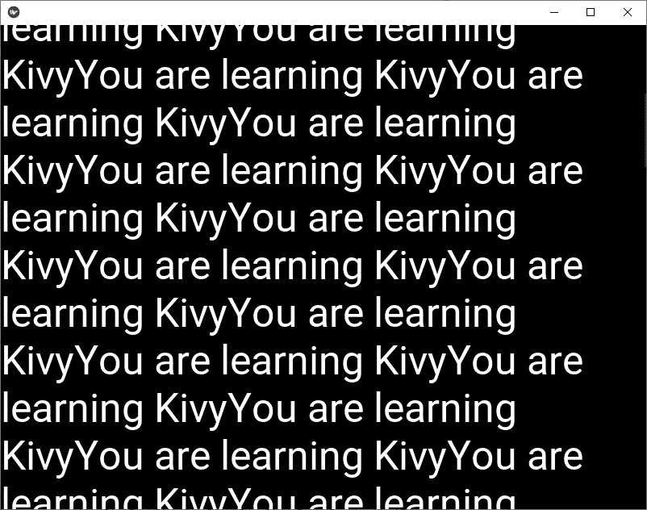

# python | kivy 中的 scroll view widget

> 哎哎哎:# t0]https://www . geeksforgeeks . org/python 滚动视图小部件-in-kivy/

Kivy 是 Python 中独立于平台的 GUI 工具。因为它可以在安卓、IOS、Linux 和视窗等平台上运行。它基本上是用来开发安卓应用的，但并不意味着它不能在桌面应用上使用。

> [Kivy 教程–通过示例学习 Kivy](https://www.geeksforgeeks.org/kivy-tutorial/)。

## 滚动视图:

ScrollView 小部件提供了一个可滚动/可平移的视口，该视口在 scrollview 的边界框处被裁剪。滚动视图只接受一个子视图，并根据两个属性对其应用一个窗口:

1.  卷起
2.  滚动 _y

为了确定交互是否是滚动手势，使用了以下属性:

*   **scroll_distance** :最小行进距离，默认为 20 像素。
*   **roll _ time out**:最大时间段，默认为 55 毫秒。

> **注意:**
> 要使用 scrollview，您必须从 kivy.uix.scrollview 导入 scrollview 来导入它:

```
Basic Approach:
1) import kivy
2) import kivyApp
3) import scroll view
4) import string property
5) Set minimum version(optional)
6) create the scroll view class
7) Build the .kv file within the .py file
8) Run an app
```

**代码的执行:**

## 蟒蛇 3

```
# Program to explain how to use scroll view in kivy 

# import kivy module    
import kivy  

# base Class of your App inherits from the App class.    
# app:always refers to the instance of your application   
from kivy.app import App 

# this restrict the kivy version i.e  
# below this kivy version you cannot  
# use the app or software  
kivy.require('1.9.0')

# The Label widget is for rendering text
from kivy.uix.label import Label

# The ScrollView widget provides a scrollable view
from kivy.uix.scrollview import ScrollView

# Property that represents a string value
from kivy.properties import StringProperty

# Static main function that starts the application loop.
from kivy.base import runTouchApp

# Builder is a global Kivy instance used in
# widgets that you can use to load other
# kv files in addition to the default ones.
from kivy.lang import Builder

# Build the .kv file
Builder.load_string('''

# Define the scroll view
<ScrollableLabel>:
    text: 'You are learning Kivy' * 500
    Label:
        text: root.text
        font_size: 50
        text_size: self.width, None
        size_hint_y: None
        height: self.texture_size[1]
''')

# Define scrollview class
class ScrollableLabel(ScrollView):
    text = StringProperty('')

# run the App
runTouchApp(ScrollableLabel())
```

**输出:**



您也可以更改滚动条的颜色和宽度，如下面的代码所示，但是为此，您必须使用像 ScrollView 这样的属性

1.  **条形颜色:**需要一个 RGB 格式的列表来指定条形颜色
2.  **条形宽度:**需要一个数字来指定条形大小

**改变条码颜色和条码宽度的代码:**

## 蟒蛇 3

```
from kivy.app import App

# importing builder from kivy
from kivy.lang import Builder

# this is the main class which will
# render the whole application
class uiApp(App):

    # method which will render our application
    def build(self):
        return Builder.load_string(

            BoxLayout:
            size_hint: (1, 1)
            ScrollView:

            # here we can set bar color
            bar_color: [0, 0, 255, 1]

            # here we can set bar width
            bar_width: 12

            BoxLayout:

            size: (self.parent.width, self.parent.height-1)
            id: container
            orientation: "vertical"
            size_hint_y: None

            height: self.minimum_height

            canvas.before:
            Color:

            rgba:  rgba("#50C878")
            Rectangle:

            pos: self.pos
            size: self.size

            Label:
            size_hint: (1, None)
            height: 300
            markup: True
            text: "[size=78]GeeksForGeeks[/size]"
            Label:
            size_hint: (1, None)
            height: 300
            markup: True
            text: "[size=78]GeeksForGeeks[/size]"
            Label:
            size_hint: (1, None)
            height: 300
            markup: True
            text: "[size=78]GeeksForGeeks[/size]"
            Label:
            size_hint: (1, None)
            height: 300
            markup: True
            text: "[size=78]GeeksForGeeks[/size]"

        )

# running the application
uiApp().run()
```

#### 输出:

<video class="wp-video-shortcode" id="video-341996-1" width="640" height="360" preload="metadata" controls=""><source type="video/mp4" src="https://media.geeksforgeeks.org/wp-content/uploads/20210312220650/bar-width-and-color.mp4?_=1">[https://media.geeksforgeeks.org/wp-content/uploads/20210312220650/bar-width-and-color.mp4](https://media.geeksforgeeks.org/wp-content/uploads/20210312220650/bar-width-and-color.mp4)</video>