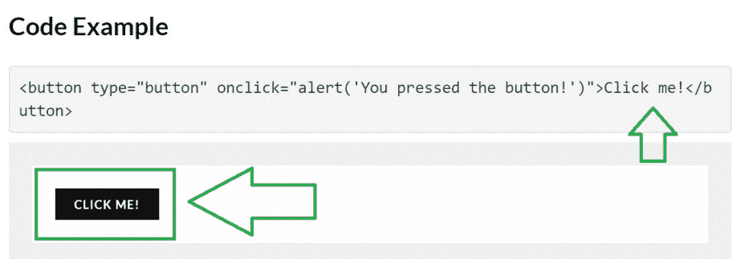
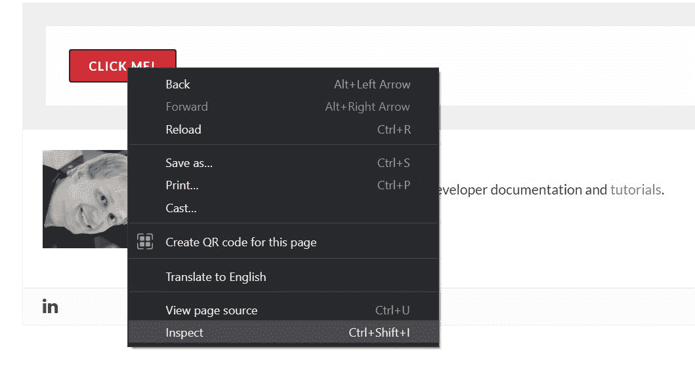
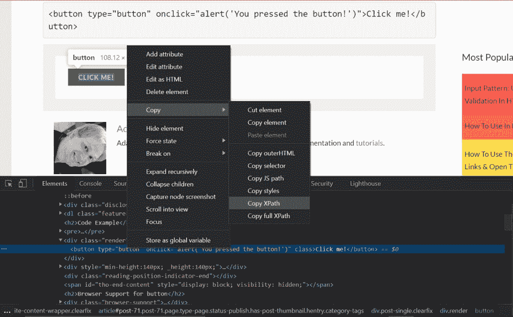

# Python Selenium–通过文本查找按钮

> 原文:[https://www . geesforgeks . org/python-selenium-按文本查找按钮/](https://www.geeksforgeeks.org/python-selenium-find-button-by-text/)

在本文中，我们来讨论一下如何使用[硒](https://www.geeksforgeeks.org/browser-automation-using-selenium/)通过文本查找按钮。参见下面的例子，了解文本查找按钮的含义。

**示例:**

> **URL:**[https://html . com/tags/button/](https://html.com/tags/button/)
> 
> 我们需要找到“点击我！”使用文本“点击我！”。



## **所需模块:**

[**Selenium:**](https://www.geeksforgeeks.org/browser-automation-using-selenium/)Selenium 包用于自动化 Python 中的 web 浏览器交互。这是一个主要用于测试的开源工具。在终端中运行以下命令来安装该库:

```py
pip install selenium
```

**设置网络驱动程序:**

网络驱动程序是一个与网络浏览器交互的包。您可以根据浏览器选择安装任何网络驱动程序。使用给定的链接安装其中任何一个-

<figure class="table">

| **Firefox** | [https://github.com/mozilla/geckodriver/releases](https://github.com/mozilla/geckodriver/releases) |
| **Safari** | [https://web kit . org/blog/6900/web driver-support-in-safari-10/](https://webkit.org/blog/6900/webdriver-support-in-safari-10/) |
| **铬** | [https://sites . Google . com/a/chromium . org/chrome driver/downloads](https://sites.google.com/a/chromium.org/chromedriver/downloads) |

</figure>

在这里，我们将使用 ChromeDriver。

**找到按钮的 XPath:**

*   **方法 1:使用 Inspect Element**
    右键单击要查找 xpath 的元素。选择“检查”选项。



*   右键单击控制台上突出显示的区域。转到复制 xpath



*   **方法二:使用 Chrome 扩展轻松找到 xpath:**
    我们可以像 [SelectorGadget](https://chrome.google.com/webstore/detail/selectorgadget/mhjhnkcfbdhnjickkkdbjoemdmbfginb?hl=en) 一样使用 Chrome 扩展轻松找到一个元素的 XPath。

**进场:**

*   导入硒和时间库
*   用您已经下载网络驱动程序的位置设置网络驱动程序路径
    示例-“C:\ chrome Driver . exe”
*   调用 driver.get()函数导航到特定的网址。
*   调用 [time.sleep()](https://www.geeksforgeeks.org/sleep-in-python/#:~:text=sleep()%20is%20defined%20in,due%20to%20the%20utility%20required.) 功能，等待驱动程序完全加载网页。
*   使用[driver . find _ element _ by _ xpath()](https://www.geeksforgeeks.org/find_elements_by_xpath-driver-method-selenium-python/)方法使用 XPath 查找按钮。
*   **通过文本查找按钮-**
    **(i)使用 normalize-space()方法:**
    driver . find _ element _ by _ XPath('//button[normalize-space()=“点击我！”]')
    **(ii)使用 text()方法:**
    driver . find _ element _ by _ XPath('//button ')
    **注意:**建议使用 **normalize-space()** 方法，因为它修剪了左右两边的空格。目标文本的开头或结尾可能有空格。
*   最后使用 driver.close()函数关闭驱动程序。

**实施:**

## 蟒蛇 3

```py
# Import Library
from selenium import webdriver
import time

# set webdriver path here it may vary
# Its the location where you have downloaded the ChromeDriver
driver = webdriver.Chrome(executable_path=r"C:\\chromedriver.exe")

# Get the target URL
driver.get('https://html.com/tags/button/')

# Wait for 5 seconds to load the webpage completely
time.sleep(5)

# Find the button using text
driver.find_element_by_xpath('//button[normalize-space()="Click me!"]').click()

time.sleep(5)

# Close the driver
driver.close()
```

**输出:**

<video class="wp-video-shortcode" id="video-565290-1" width="640" height="360" preload="metadata" controls=""><source type="video/mp4" src="https://media.geeksforgeeks.org/wp-content/uploads/20210227233751/Find-Button-By-text.mp4?_=1">[https://media.geeksforgeeks.org/wp-content/uploads/20210227233751/Find-Button-By-text.mp4](https://media.geeksforgeeks.org/wp-content/uploads/20210227233751/Find-Button-By-text.mp4)</video>