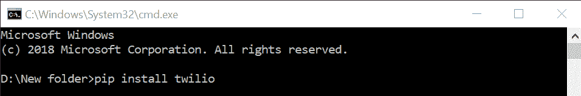

# Python |使用 Twilio 发送短信

> 原文:[https://www.geeksforgeeks.org/python-send-sms-using-twilio/](https://www.geeksforgeeks.org/python-send-sms-using-twilio/)

众所周知，Python 是一种很酷的脚本语言，可以用来编写脚本来简化日常任务。此外，由于 python 有大量的社区支持和大量可用的模块/应用编程接口，它使 Python 更加通用和受用户欢迎。

在本文中，我们将看到如何使用 Twilio API 使用 Python 发送短信。这将是一个非常快速和简单的指南来做这个非常有趣的任务。

首先，我们需要在 [Twilio 官网](https://www.twilio.com)创建一个账号，获取 ***id*** 和 ***令牌*** 。这是一项付费服务，但您将获得一笔初始金额，以便开始使用。

**创建 Twilio 账户的步骤:**

**前往 [Twilio 的注册页面](https://www.twilio.com/try-twilio)。填写所需的详细信息，完成注册。**


**从控制台(仪表盘)复制`ACCOUNT SID`和`AUTH TOKEN`。**


使用 pip 安装 *Twilio* 库。

```
pip install twilio
```



下面是 Python 实现:

```
# importing twilio
from twilio.rest import Client

# Your Account Sid and Auth Token from twilio.com / console
account_sid = 'ACXXXXXXXXXXXXXXXXXXXXXXXXXXXXXXXX'
auth_token = 'your_auth_token'

client = Client(account_sid, auth_token)

''' Change the value of 'from' with the number 
received from Twilio and the value of 'to'
with the number in which you want to send message.'''
message = client.messages.create(
                              from_='+15017122661',
                              body ='body',
                              to ='+15558675310'
                          )

print(message.sid)
```

在上面的代码中，只需将`account_sid`和`auth_token` 的值替换为您从 Twilio 收到的值。另外，用你想发送的信息替换正文，答对了！

**练习:**
从你的账户中提取电子邮件，并将主题和收件人的邮件地址作为短信转发到你的手机上。你甚至可以通过限制它只转发重要邮件来过滤它。