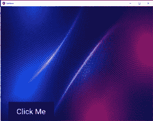

# Python |在 kivy 中设置背景模板

> 原文:[https://www . geesforgeks . org/python-set-background-template-in-kivy/](https://www.geeksforgeeks.org/python-set-background-template-in-kivy/)

[Kivy](https://www.geeksforgeeks.org/kivy-tutorial/) 是 Python 中独立于平台的 GUI 工具。因为它可以在安卓、IOS、Linux 和视窗等平台上运行。它基本上是用来开发安卓应用的，但并不意味着它不能在桌面应用上使用。

设置一个好的背景模板是一件好事，可以让你的应用看起来对用户更有吸引力。要在应用程序中插入背景模板，需要在中进行一些修改。kv 文件。下面是为你的应用程序设置背景模板的代码。

**.Py file**

```
# Program to create a background template for the App

# import necessary modules from kivy
from kivy.uix.boxlayout import BoxLayout
from kivy.app import App

# create a background class which inherits the boxlayout class
class Background(BoxLayout):
    def __init__(self, **kwargs):
        super().__init__(**kwargs)
    pass

# Create App class with name of your app
class SampleApp(App):

# return the Window having the background template.
    def build(self):
        return Background()

# run app in the main function
if __name__ == '__main__':
    SampleApp().run()
```

**。kv 文件**

```
<Background>:
    id: main_win
    orientation: "vertical"
    spacing: 10
    space_x: self.size[0]/3

    canvas.before:
        Color:
            rgba: (1, 1, 1, 1)
        Rectangle:
            source:'back.jfif'
            size: root.width, root.height
            pos: self.pos
    Button:
        text: "Click Me"
        pos_hint :{'center_x':0.2, 'center_y':0.2}
        size_hint: .30, 0
        background_color: (0.06, .36, .4, .675)
        font_size: 40
```

**输出:**
