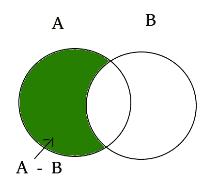

# Python 集|差异()

> 原文:[https://www.geeksforgeeks.org/python-set-difference/](https://www.geeksforgeeks.org/python-set-difference/)

Python 中两个集合之间的差异等于两个集合中元素数量的差异。函数 difference()返回一个集合，它是两个集合之间的差。让我们试着找出两个集合 A 和集合 B 之间的区别。然后(集合 A–集合 B)将是集合 A 中存在但不在集合 B 中的元素，并且(集合 B–集合 A)将是集合 B 中存在但不在集合 A 中的元素。
示例:

```
set A = {10, 20, 30, 40, 80}
set B = {100, 30, 80, 40, 60}

set A - set B = {10, 20}
set B - set A = {100, 60}

Explanation: A - B is equal to the elements present in A but not in B
             B - A is equal to the elements present in B but not in A

```

让我们看看下面差集函数的维恩图。



**语法:**

```
set_A.difference(set_B) for (A - B)
set _B.difference(set_A) for (B - A)

```

在这个程序中，我们将尝试找出两个集合 set_A 和 set_B 之间的区别，两种方法都是:

```
# Python code to get the difference between two sets
# using difference() between set A and set B

# Driver Code
A = {10, 20, 30, 40, 80}
B = {100, 30, 80, 40, 60}
print (A.difference(B))
print (B.difference(A))
```

**Output:**

```
{10, 20}
{100, 60}

```

我们还可以使用–运算符来找出两个集合之间的差异。

```
# Python code to get the difference between two sets
# using difference() between set A and set B

# Driver Code
A = {10, 20, 30, 40, 80}
B = {100, 30, 80, 40, 60}
print (A - B)
print (B - A)
```

**Output:**

```
{10, 20}
{100, 60}

```

如果我们有相等的集合，那么它将返回空集合。

```
# Python code to get the difference between two sets
# using difference() between set A and set B

# Driver Code
A = {10, 20, 30, 40, 80}
B = {10, 20, 30, 40, 80, 100}
print (A - B)
```

**Output:**

```
set()

```