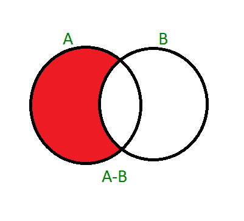

# Python 集| difference_update()

> 原文:[https://www.geeksforgeeks.org/python-set-difference_update/](https://www.geeksforgeeks.org/python-set-difference_update/)

difference_update()方法有助于就地区分集合。前面讨论的[集合差异()](https://www.geeksforgeeks.org/python-set-difference/)有助于找出两个集合之间的差异，并返回一个具有差异值的新集合，但是 difference_update()会更新现有的调用者集合。
如果 A 和 B 是两套。set difference()方法将获得(A–B)并将返回一个新的集合。set difference_update()方法修改现有的集合。如果执行(A–B)，则 A 被修改为(A–B)，如果执行(B–A)，则 B 被修改为(B–A)。
**语法:**

```py
A.difference_update(B) for (A - B)
B.difference_update(A) for (B - A)
```



函数**返回** ***【无】*** 并改变现有集合的值。
在这个例子中，我们将得到两个集合之间的差异，并展示 difference_update 是如何工作的。

## 蟒蛇 3

```py
# Python code to get the difference between two sets
# using difference_update() between set A and set B

# Driver Code
A = {10, 20, 30, 40, 80}
B = {100, 30, 80, 40, 60}

# Modifies A and returns None
A.difference_update(B)

# Prints the modified set
print (A)
```

输出:

```py
{20, 10}
```