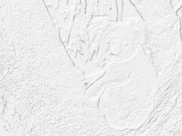

# Python–魔杖中的阴影()功能

> 原文:[https://www . geesforgeks . org/python-shade-in-function-in-wand/](https://www.geeksforgeeks.org/python-shade-function-in-wand/)

**shade()** 功能通过模拟提升角度的光线来生成 3d 类型的图像或创建 3d 效果。*方位角*参数用于控制 X 和 Y 角度，*仰角*参数用于控制图像的 z 角度。我们也可以通过将*灰度*参数设为真来获得最终的灰度图像。

> **语法:**
> 
> ```py
> wand.image.shade(gray, azimuth, elevation);
> ```
> 
> **参数:**
> 
> <figure class="table">
> 
> | 参数 | 输入类型 | 描述 |
> | --- | --- | --- |
> | 灰色 | 布尔 | 隔离对像素强度的影响。默认值为假。 |
> | 方位角 | 数字，真实的 | 与 x 轴的角度。 |
> | 海拔 | 号码。真实的 | z 轴的像素数。 |
> 
> </figure>

**来源图片:**


**例 1:**

## 蟒蛇 3

```py
# import Image from wand.image module
from wand.image import Image

# Read image using Image function
with Image(filename ="koala.jpeg") as img:

    # generating shaded image using shade() function.
    img.shade(gray = True,
              azimuth = 286.0,
              elevation = 45.0)

    img.save(filename ="shadekoala.jpeg")
```

**输出:**


**例 2:** 将灰色设置为 False，增加方位角和仰角值。

## 蟒蛇 3

```py
# import Image from wand.image module

from wand.image import Image

with Image(filename ="koala.jpeg") as img:
    # generating shaded image using shade() function.
    img.shade(gray = True,
              azimuth = 298.0,
              elevation = 70.0)

    img.save(filename ="shadekoala_2.jpeg")
```

**输出:**

