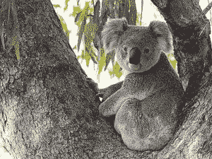
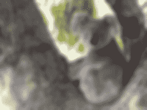

# Python–使用 pgmagick

锐化和模糊过滤

> 原文:[https://www . geesforgeks . org/python-锐化和模糊-过滤-使用-pgmagick/](https://www.geeksforgeeks.org/python-sharpen-and-blur-filtering-using-pgmagick/)

**锐化**是指增加明暗区域对比度 b/w，使图像更清晰，带出图像特征。锐化图像有三个主要原因:克服相机设备引入的模糊，将注意力吸引到某些区域，以及提高易读性。如果图像中出现模糊的文本，它就变得容易阅读。
现在让我们学习如何在 python 的 pgmagick 库中执行图像锐化。我们使用锐化()函数来锐化图像。
T4【代码:

## 蟒蛇 3

```
# importing library
from pgmagick import Image

img = Image('koala.jpg')

# sharpening image
img.sharpen(2)
img.write('sharp_koala.jpg')
```

**输出:**




**模糊使图像变得模糊不清。这无疑会降低图像的清晰度。如果图像模糊，就看不到小边缘。模糊是一种视觉效果，它使文本或图像的边缘看起来模糊或失焦被称为模糊。让我们看看如何在 Python 中使用 pgmagick 来模糊图像。**

## 蟒蛇 3

```
# importing library
from pgmagick.api import Image

img = Image('koala.jpeg')

# blur image
img.blur(10, 5)
img.write('blur_koala.jpeg')
```

**输出:**


