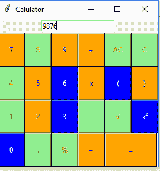

# Python |使用 Tkinter 的简单计算器

> 原文:[https://www . geesforgeks . org/python-simple-calculator-using-tkinter/](https://www.geeksforgeeks.org/python-simple-calculator-using-tkinter/)

先决条件: [Tkinter 简介](https://www.geeksforgeeks.org/python-gui-tkinter/)
[Python](https://www.geeksforgeeks.org/python-programming-language/) 提供了多种开发 GUI(图形用户界面)的选项。在所有的 GUI 方法中，tkinter 是最常用的方法。它是 Python 附带的 Tk 图形用户界面工具包的标准 Python 接口。带有 tkinter 输出的 Python 是创建图形用户界面应用程序最快最简单的方法。使用 tkinter 创建图形用户界面是一项简单的任务。
我们来看看如何使用 Tkinter 创建一个基本的计算器。

**基本步骤:**

*   首先我们创建一个名为 root out of tk 的对象。
*   我们创建一个 calc 的对象，并将 root 作为主节点传递给 init 方法。
*   Mainloop 启动一个事件循环，这基本上是一个无限循环，等待事件并做出相应的响应。主循环可以通过关闭窗口或使用 close 方法终止。

下面是实现:

## 蟒蛇 3

```py
# importing Tkinter and math
from tkinter import *
import math

# calc class
class calc:

    def getandreplace(self):

        """replace x with * and ÷ with /"""
        self.expression = self.e.get()
        self.newtext=self.expression.replace('/','/')
        self.newtext=self.newtext.replace('x','*')

    def equals(self):
        """when the equal button is pressed"""
        self.getandreplace()
        try:
            # evaluate the expression using the eval function
            self.value= eval(self.newtext)
        except SyntaxError or NameError:
            self.e.delete(0,END)
            self.e.insert(0,'Invalid Input!')
        else:
            self.e.delete(0,END)
            self.e.insert(0,self.value)

    def squareroot(self):
        """squareroot method"""
        self.getandreplace()
        try:
            # evaluate the expression using the eval function
            self.value= eval(self.newtext)
        except SyntaxError or NameError:
            self.e.delete(0,END)
            self.e.insert(0,'Invalid Input!')
        else:
            self.sqrtval=math.sqrt(self.value)
            self.e.delete(0,END)
            self.e.insert(0,self.sqrtval)

    def square(self):
        """square method"""
        self.getandreplace()
        try:
            #evaluate the expression using the eval function
            self.value= eval(self.newtext)
        except SyntaxError or NameError:
            self.e.delete(0,END)
            self.e.insert(0,'Invalid Input!')
        else:
            self.sqval=math.pow(self.value,2)
            self.e.delete(0,END)
            self.e.insert(0,self.sqval)

    def clearall(self):
            """when clear button is pressed,clears the text input area"""
            self.e.delete(0,END)

    def clear1(self):
            self.txt=self.e.get()[:-1]
            self.e.delete(0,END)
            self.e.insert(0,self.txt)

    def action(self,argi):
            """pressed button's value is inserted into the end of the text area"""
            self.e.insert(END,argi)

    def __init__(self,master):
            """Constructor method"""
            master.title('Calculator')
            master.geometry()
            self.e = Entry(master)
            self.e.grid(row=0,column=0,columnspan=6,pady=3)
            self.e.focus_set() #Sets focus on the input text area

            # Generating Buttons
            Button(master,text="=",width=11,height=3,fg="blue",
                   bg="orange",command=lambda:self.equals()).grid(
                                     row=4, column=4,columnspan=2)

            Button(master,text='AC',width=5,height=3,
                          fg="red", bg="light green",
             command=lambda:self.clearall()).grid(row=1, column=4)

            Button(master,text='C',width=5,height=3,
                   fg="red",bg="light green",
                   command=lambda:self.clear1()).grid(row=1, column=5)

            Button(master,text="+",width=5,height=3,
                   fg="blue",bg="orange",
                   command=lambda:self.action('+')).grid(row=4, column=3)

            Button(master,text="x",width=5,height=3,
                    fg="blue",bg="orange",
                    command=lambda:self.action('x')).grid(row=2, column=3)

            Button(master,text="-",width=5,height=3,
                    fg="red",bg="light green",
                    command=lambda:self.action('-')).grid(row=3, column=3)

            Button(master,text="÷",width=5,height=3,
                   fg="blue",bg="orange",
                   command=lambda:self.action('/')).grid(row=1, column=3)

            Button(master,text="%",width=5,height=3,
                   fg="red",bg="light green",
                   command=lambda:self.action('%')).grid(row=4, column=2)

            Button(master,text="7",width=5,height=3,
                   fg="blue",bg="orange",
                   command=lambda:self.action('7')).grid(row=1, column=0)

            Button(master,text="8",width=5,height=3,
                   fg="red",bg="light green",
                   command=lambda:self.action(8)).grid(row=1, column=1)

            Button(master,text="9",width=5,height=3,
                   fg="blue",bg="orange",
                   command=lambda:self.action(9)).grid(row=1, column=2)

            Button(master,text="4",width=5,height=3,
                   fg="red",bg="light green",
                   command=lambda:self.action(4)).grid(row=2, column=0)

            Button(master,text="5",width=5,height=3,
                   fg="blue",bg="orange",
                   command=lambda:self.action(5)).grid(row=2, column=1)

            Button(master,text="6",width=5,height=3,
                   fg="white",bg="blue",
                   command=lambda:self.action(6)).grid(row=2, column=2)

            Button(master,text="1",width=5,height=3,
                   fg="red",bg="light green",
                   command=lambda:self.action(1)).grid(row=3, column=0)

            Button(master,text="2",width=5,height=3,
                   fg="blue",bg="orange",
                   command=lambda:self.action(2)).grid(row=3, column=1)

            Button(master,text="3",width=5,height=3,
                   fg="white",bg="blue",
                   command=lambda:self.action(3)).grid(row=3, column=2)

            Button(master,text="0",width=5,height=3,
                   fg="white",bg="blue",
                   command=lambda:self.action(0)).grid(row=4, column=0)

            Button(master,text=".",width=5,height=3,
                   fg="red",bg="light green",
                   command=lambda:self.action('.')).grid(row=4, column=1)

            Button(master,text="(",width=5,height=3,
                   fg="white",bg="blue",
                   command=lambda:self.action('(')).grid(row=2, column=4)

            Button(master,text=")",width=5,height=3,
                   fg="blue",bg="orange",
                   command=lambda:self.action(')')).grid(row=2, column=5)

            Button(master,text="?",width=5,height=3,
                   fg="red",bg="light green",
                   command=lambda:self.squareroot()).grid(row=3, column=4)

            Button(master,text="x²",width=5,height=3,
                   fg="white",bg="blue",
                   command=lambda:self.square()).grid(row=3, column=5)

# Driver Code
root = Tk()

obj=calc(root) # object instantiated

root.mainloop()
```

**输出:**

