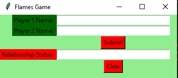

# Python |使用 Tkinter 的简单火焰游戏

> 原文:[https://www . geesforgeks . org/python-simple-fires-game-use-tkinter/](https://www.geeksforgeeks.org/python-simple-flames-game-using-tkinter/)

**先决条件:**[](https://www.geeksforgeeks.org/python-gui-tkinter/)

*   [Tkinter 介绍](https://www.geeksforgeeks.org/python-gui-tkinter/)
*   [程序实现简单的火焰游戏](https://www.geeksforgeeks.org/python-program-to-implement-simple-flames-game/)

Python 为开发图形用户界面提供了多种选择。在所有的 GUI 方法中，Tkinter 是最常用的方法。它是 Python 附带的 Tk 图形用户界面工具包的标准 Python 接口。Python 搭配 Tkinter 输出了创建 GUI 应用程序最快最简单的方法。现在，这取决于开发人员的想象力或必要性，他/她想使用这个工具包开发什么。
**创建 Tkinter :**

*   导入模块–Tkit
*   创建主窗口(容器)
*   向主窗口添加任意数量的小部件。
*   在小部件上应用事件触发器

图形用户界面如下所示:



让我们创建一个简单的火焰游戏的图形用户界面版本。 **FLAMES** 是一款以首字母缩略词命名的热门游戏:朋友、恋人、深情、婚姻、敌人、兄弟姐妹。这个游戏不能准确预测一个人是否适合你，但是和你的朋友一起玩这个游戏会很有趣。

**下面是实现:**

## 蟒蛇 3

```py
# import all functions from the tkinter
from tkinter import *

# function for removing common characters
# with their respective occurrences
def remove_match_char(list1, list2):

    for i in range(len(list1)) :
        for j in range(len(list2)) :

            # if common character is found
            # then remove that character
            # and return list of concatenated
            # list with True Flag
            if list1[i] == list2[j] :
                c = list1[i]

                # remove character from the list
                list1.remove(c)
                list2.remove(c)

                # concatenation of two list elements with *
                # * is act as border mark here
                list3 = list1 + ["*"] + list2

                # return the concatenated list with True flag
                return [list3, True]

    # no common characters is found
    # return the concatenated list with False flag
    list3 = list1 + ["*"] + list2
    return [list3, False]

# function for telling the relationship status
def tell_status() :

    # take a 1st player name from Player1_field entry box 
    p1 = Player1_field.get()

    # converted all letters into lower case
    p1 = p1.lower()

    # replace any space with empty string
    p1.replace(" ", "")

    # make a list of letters or characters
    p1_list = list(p1)

    # take a 2nd player name from Player2_field entry box
    p2 = Player2_field.get()
    p2 = p2.lower()
    p2.replace(" ", "")
    p2_list = list(p2)

    # taking a flag as True initially
    proceed = True

    # keep calling remove_match_char function
    # until common characters is found or
    # keep looping until proceed flag is True
    while proceed :

        # function calling and store return value
        ret_list = remove_match_char(p1_list, p2_list)

        # take out concatenated list from return list
        con_list = ret_list[0]

        # take out flag value from return list
        proceed = ret_list[1]

        # find the index of "*" / border mark
        star_index = con_list.index("*")

        # list slicing perform

        # all characters before * store in p1_list
        p1_list = con_list[ : star_index]

        # all characters after * store in p2_list
        p2_list = con_list[star_index + 1 : ]

    # count total remaining characters
    count = len(p1_list) + len(p2_list)

    # list of FLAMES acronym
    result = ["Friends", "Love", "Affection", "Marriage", "Enemy", "Siblings"]

    # keep looping until only one item
    # is not remaining in the result list
    while len(result) > 1 :

        # store that index value from
        # where we have to perform slicing.
        split_index = (count % len(result) - 1)

        # this steps is done for performing
        # anticlock-wise circular fashion counting.
        if split_index >= 0 :

            # list slicing
            right = result[split_index + 1 : ]
            left = result[ : split_index]

            # list concatenation
            result = right + left

        else :
            result = result[ : len(result) - 1]

    # insert method inserting the 
        # value in the text entry box.
    Status_field.insert(10, result[0])

# Function for clearing the 
# contents of all text entry boxes  
def clear_all() : 
    Player1_field.delete(0, END)  
    Player2_field.delete(0, END)
    Status_field.delete(0, END)

    # set focus on the Player1_field entry box 
    Player1_field.focus_set() 

# Driver code
if __name__ == "__main__" :

    # Create a GUI window
    root = Tk()

    # Set the background colour of GUI window
    root.configure(background = 'light green')

    # Set the configuration of GUI window
    root.geometry("350x125")

    # set the name of tkinter GUI window
    root.title("Flames Game") 

    # Create a Player 1 Name: label
    label1 = Label(root, text = "Player 1 Name: ",
                   fg = 'black', bg = 'dark green')

    # Create a Player 2 Name: label
    label2 = Label(root, text = "Player 2 Name: ",
                   fg = 'black', bg = 'dark green')

    # Create a Relation Status: label
    label3 = Label(root, text = "Relationship Status: ",
                   fg = 'black', bg = 'red')

    # grid method is used for placing 
    # the widgets at respective positions 
    # in table like structure .
    label1.grid(row = 1, column = 0, sticky ="E") 
    label2.grid(row = 2, column = 0, sticky ="E") 
    label3.grid(row = 4, column = 0, sticky ="E")

    # Create a text entry box 
    # for filling or typing the information.
    Player1_field = Entry(root) 
    Player2_field = Entry(root) 
    Status_field = Entry(root)

    # grid method is used for placing 
    # the widgets at respective positions 
    # in table like structure . 
    # ipadx keyword argument set width of entry space . 
    Player1_field.grid(row = 1, column = 1, ipadx ="50") 
    Player2_field.grid(row = 2, column = 1, ipadx ="50") 
    Status_field.grid(row = 4, column = 1, ipadx ="50") 

    # Create a Submit Button and attached 
    # to tell_status function 
    button1 = Button(root, text = "Submit", bg = "red", 
                     fg = "black", command = tell_status)

    # Create a Clear Button and attached 
    # to clear_all function 
    button2 = Button(root, text = "Clear", bg = "red", 
                     fg = "black", command = clear_all)

    # grid method is used for placing 
    # the widgets at respective positions 
    # in table like structure . 
    button1.grid(row = 3, column = 1)
    button2.grid(row = 5, column = 1)

    # Start the GUI 
    root.mainloop()
```

**输出:**

<video class="wp-video-shortcode" id="video-260822-1" width="640" height="360" preload="metadata" controls=""><source type="video/mp4" src="https://media.geeksforgeeks.org/wp-content/uploads/20210119130055/FreeOnlineScreenRecorderProject1.mp4?_=1">[https://media.geeksforgeeks.org/wp-content/uploads/20210119130055/FreeOnlineScreenRecorderProject1.mp4](https://media.geeksforgeeks.org/wp-content/uploads/20210119130055/FreeOnlineScreenRecorderProject1.mp4)</video>