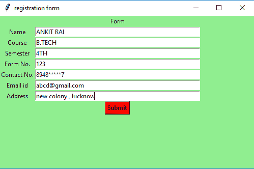
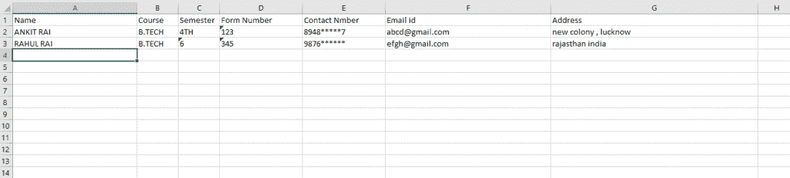

# 使用 Python Tkinter 的简单登记表

> 原文:[https://www . geesforgeks . org/python-simple-registration-form-use-tkinter/](https://www.geeksforgeeks.org/python-simple-registration-form-using-tkinter/)

先决条件: [Tkinter 简介](https://www.geeksforgeeks.org/python-gui-tkinter/)、 [openpyxl 模块](https://www.geeksforgeeks.org/python-writing-excel-file-using-openpyxl-module/)。
Python 提供了开发 GUI 应用程序的 Tkinter 工具包。现在，取决于开发人员的想象力或必要性，他/她想使用这个工具包开发什么。让我们使用 Tkinter 制作一个简单的信息表单 GUI 应用程序。在这个应用程序中，用户必须填写所需的信息，这些信息会自动写入 excel 文件。

首先，创建一个空的 excel 文件，然后在程序中传递该 excel 文件的绝对路径，以便程序能够访问该 excel 文件。

下面是实现:

## 蟒蛇 3

```py
# import openpyxl and tkinter modules
from openpyxl import *
from tkinter import *

# globally declare wb and sheet variable

# opening the existing excel file
wb = load_workbook('C:\\Users\\Admin\\Desktop\\excel.xlsx')

# create the sheet object
sheet = wb.active

def excel():

    # resize the width of columns in
    # excel spreadsheet
    sheet.column_dimensions['A'].width = 30
    sheet.column_dimensions['B'].width = 10
    sheet.column_dimensions['C'].width = 10
    sheet.column_dimensions['D'].width = 20
    sheet.column_dimensions['E'].width = 20
    sheet.column_dimensions['F'].width = 40
    sheet.column_dimensions['G'].width = 50

    # write given data to an excel spreadsheet
    # at particular location
    sheet.cell(row=1, column=1).value = "Name"
    sheet.cell(row=1, column=2).value = "Course"
    sheet.cell(row=1, column=3).value = "Semester"
    sheet.cell(row=1, column=4).value = "Form Number"
    sheet.cell(row=1, column=5).value = "Contact Number"
    sheet.cell(row=1, column=6).value = "Email id"
    sheet.cell(row=1, column=7).value = "Address"

# Function to set focus (cursor)
def focus1(event):
    # set focus on the course_field box
    course_field.focus_set()

# Function to set focus
def focus2(event):
    # set focus on the sem_field box
    sem_field.focus_set()

# Function to set focus
def focus3(event):
    # set focus on the form_no_field box
    form_no_field.focus_set()

# Function to set focus
def focus4(event):
    # set focus on the contact_no_field box
    contact_no_field.focus_set()

# Function to set focus
def focus5(event):
    # set focus on the email_id_field box
    email_id_field.focus_set()

# Function to set focus
def focus6(event):
    # set focus on the address_field box
    address_field.focus_set()

# Function for clearing the
# contents of text entry boxes
def clear():

    # clear the content of text entry box
    name_field.delete(0, END)
    course_field.delete(0, END)
    sem_field.delete(0, END)
    form_no_field.delete(0, END)
    contact_no_field.delete(0, END)
    email_id_field.delete(0, END)
    address_field.delete(0, END)

# Function to take data from GUI
# window and write to an excel file
def insert():

    # if user not fill any entry
    # then print "empty input"
    if (name_field.get() == "" and
        course_field.get() == "" and
        sem_field.get() == "" and
        form_no_field.get() == "" and
        contact_no_field.get() == "" and
        email_id_field.get() == "" and
        address_field.get() == ""):

        print("empty input")

    else:

        # assigning the max row and max column
        # value upto which data is written
        # in an excel sheet to the variable
        current_row = sheet.max_row
        current_column = sheet.max_column

        # get method returns current text
        # as string which we write into
        # excel spreadsheet at particular location
        sheet.cell(row=current_row + 1, column=1).value = name_field.get()
        sheet.cell(row=current_row + 1, column=2).value = course_field.get()
        sheet.cell(row=current_row + 1, column=3).value = sem_field.get()
        sheet.cell(row=current_row + 1, column=4).value = form_no_field.get()
        sheet.cell(row=current_row + 1, column=5).value = contact_no_field.get()
        sheet.cell(row=current_row + 1, column=6).value = email_id_field.get()
        sheet.cell(row=current_row + 1, column=7).value = address_field.get()

        # save the file
        wb.save('C:\\Users\\Admin\\Desktop\\excel.xlsx')

        # set focus on the name_field box
        name_field.focus_set()

        # call the clear() function
        clear()

# Driver code
if __name__ == "__main__":

    # create a GUI window
    root = Tk()

    # set the background colour of GUI window
    root.configure(background='light green')

    # set the title of GUI window
    root.title("registration form")

    # set the configuration of GUI window
    root.geometry("500x300")

    excel()

    # create a Form label
    heading = Label(root, text="Form", bg="light green")

    # create a Name label
    name = Label(root, text="Name", bg="light green")

    # create a Course label
    course = Label(root, text="Course", bg="light green")

    # create a Semester label
    sem = Label(root, text="Semester", bg="light green")

    # create a Form No. label
    form_no = Label(root, text="Form No.", bg="light green")

    # create a Contact No. label
    contact_no = Label(root, text="Contact No.", bg="light green")

    # create a Email id label
    email_id = Label(root, text="Email id", bg="light green")

    # create a address label
    address = Label(root, text="Address", bg="light green")

    # grid method is used for placing
    # the widgets at respective positions
    # in table like structure .
    heading.grid(row=0, column=1)
    name.grid(row=1, column=0)
    course.grid(row=2, column=0)
    sem.grid(row=3, column=0)
    form_no.grid(row=4, column=0)
    contact_no.grid(row=5, column=0)
    email_id.grid(row=6, column=0)
    address.grid(row=7, column=0)

    # create a text entry box
    # for typing the information
    name_field = Entry(root)
    course_field = Entry(root)
    sem_field = Entry(root)
    form_no_field = Entry(root)
    contact_no_field = Entry(root)
    email_id_field = Entry(root)
    address_field = Entry(root)

    # bind method of widget is used for
    # the binding the function with the events

    # whenever the enter key is pressed
    # then call the focus1 function
    name_field.bind("<Return>", focus1)

    # whenever the enter key is pressed
    # then call the focus2 function
    course_field.bind("<Return>", focus2)

    # whenever the enter key is pressed
    # then call the focus3 function
    sem_field.bind("<Return>", focus3)

    # whenever the enter key is pressed
    # then call the focus4 function
    form_no_field.bind("<Return>", focus4)

    # whenever the enter key is pressed
    # then call the focus5 function
    contact_no_field.bind("<Return>", focus5)

    # whenever the enter key is pressed
    # then call the focus6 function
    email_id_field.bind("<Return>", focus6)

    # grid method is used for placing
    # the widgets at respective positions
    # in table like structure .
    name_field.grid(row=1, column=1, ipadx="100")
    course_field.grid(row=2, column=1, ipadx="100")
    sem_field.grid(row=3, column=1, ipadx="100")
    form_no_field.grid(row=4, column=1, ipadx="100")
    contact_no_field.grid(row=5, column=1, ipadx="100")
    email_id_field.grid(row=6, column=1, ipadx="100")
    address_field.grid(row=7, column=1, ipadx="100")

    # call excel function
    excel()

    # create a Submit Button and place into the root window
    submit = Button(root, text="Submit", fg="Black",
                            bg="Red", command=insert)
    submit.grid(row=8, column=1)

    # start the GUI
    root.mainloop()
```

**输出:**


