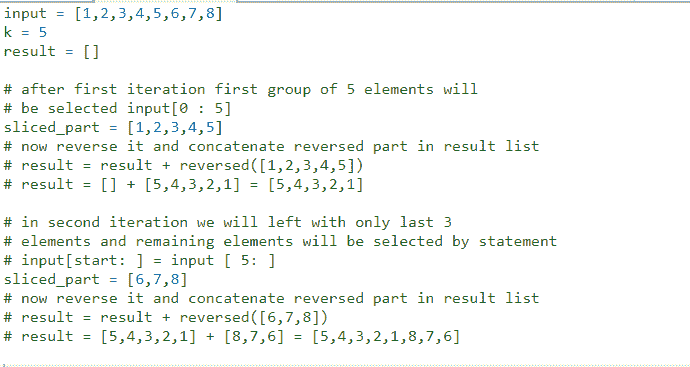

# Python 切片|在给定大小的组中反转数组

> 原文:[https://www . geesforgeks . org/python-切片-反向-数组-组-给定大小/](https://www.geeksforgeeks.org/python-slicing-reverse-array-groups-given-size/)

给定一个数组，反转由连续 k 个元素组成的每个子数组。

示例:

```
Input: 
arr = [1, 2, 3, 4, 5, 6, 7, 8, 9]
k = 3
Output:  
[3, 2, 1, 6, 5, 4, 9, 8, 7]

Input: 
arr = [1, 2, 3, 4, 5, 6, 7, 8]
k = 5
Output:  
[5, 4, 3, 2, 1, 8, 7, 6]

Input: 
arr = [1, 2, 3, 4, 5, 6]
k = 1
Output:  
[1, 2, 3, 4, 5, 6]

Input: 
arr = [1, 2, 3, 4, 5, 6, 7, 8]
k = 10
Output:  
[8, 7, 6, 5, 4, 3, 2, 1]

```

对于这个问题我们已经有了解决方案，请参考[在给定大小的组中反转一个数组](https://www.geeksforgeeks.org/reverse-an-array-in-groups-of-given-size/)链接。我们可以使用[列表切片](https://www.geeksforgeeks.org/python-list-comprehension-and-slicing/)和[反向()功能](https://www.geeksforgeeks.org/python-reversed-function/)在 Python 中快速解决这个问题。下面的例子会让你更好地理解方法。

<u>**例:**</u>


```
# function to Reverse an array in groups of given size

def reverseGroup(input,k):

    # set starting index at 0
    start = 0

    # run a while loop len(input)/k times
    # because there will be len(input)/k number 
    # of groups of size k 
    result = []
    while (start<len(input)):

           # if length of group is less than k
           # that means we are left with only last 
           # group reverse remaining elements 
           if len(input[start:])<k:
                result = result + list(reversed(input[start:]))
                break

           # select current group of size of k
           # reverse it and concatenate 
           result = result + list(reversed(input[start:start + k]))
           start = start + k
    print(result)

# Driver program
if __name__ == "__main__":
    input = [1, 2, 3, 4, 5, 6, 7, 8]
    k = 5
    reverseGroup(input,k)
```

**Output:**

```
[5, 4, 3, 2, 1, 8, 7, 6]

```

**使用直接功能**

```
# function to Reverse an array in groups of given size

def reverseGroup(a, k):

   # take an empty list
   res = []

   # iterate over the list with increment of 
   # k times in each iteration
   for i in range(0, len(a), k):

       # reverse the list in each iteration over 
       # span of k elements using extend
       res.extend((a[i:i + k])[::-1])
   print(res)

# Driver program
if __name__ == "__main__":
    input = [1, 2, 3, 4, 5, 6, 7, 8]
    k = 5
    reverseGroup(input, k)
```

**Output:**

```
[5, 4, 3, 2, 1, 8, 7, 6]

```