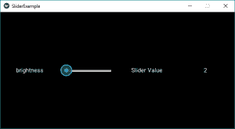
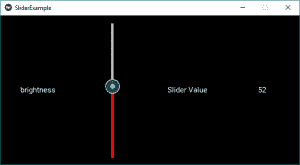

# Python | Kivy 中的滑块小部件

> 原文:[https://www.geeksforgeeks.org/python-slider-widget-in-kivy/](https://www.geeksforgeeks.org/python-slider-widget-in-kivy/)

Kivy 是 Python 中独立于平台的 GUI 工具。因为它可以在安卓、IOS、linux 和 Windows 等平台上运行。它基本上是用来开发安卓应用程序的，但并不意味着它不能在桌面应用程序上使用。

> ？？？？？？？？ [Kivy 教程–通过示例学习 Kivy](https://www.geeksforgeeks.org/kivy-tutorial/)。

**滑块:**
要使用滑块，首先必须导入包含滑块所有特征和功能的模块，即

```py
Module: kivy.uix.slider
```

滑块小部件看起来和我们在安卓系统中使用的一样，可以增加亮度、音量等。它支持水平和垂直方向、最小值/最大值和默认值。Kivy 支持多个滑块小部件选项，用于自定义光标、光标图像、边框、不同方向使用的背景、最小值和最大值之间的区域。
Kivy 还支持根据归一化值(范围 0 到 1)而不是滑块支持的真实范围进行处理。

> 创建滑块时要遵循的基本方法:
> 1)导入 kivy
> 2)导入 kivy 应用程序
> 3)导入网格布局(根据需要不是强制的)
> 4)导入标签(根据需要不是强制的)
> 5)导入滑块
> 6)导入数值属性
> 7)设置最小版本(可选)
> 8)扩展类
> 9)添加并返回小部件
> 10)运行类的实例

**下面是代码实现滑块:**

## 蟒蛇 3

```py
# import kivy module
import kivy

# this restrict the kivy version i.e
# below this kivy version you cannot
# use the app or software
kivy.require("1.9.1")

# Kivy Example App for the slider widget
from kivy.app import App

# The GridLayout arranges children in a matrix.
from kivy.uix.gridlayout import GridLayout

# If we will not import this module
# It will through the error
from kivy.uix.slider import Slider

# The Label widget is for rendering text.
from kivy.uix.label import Label

# Property that represents a numeric value
# within a minimum bound and / or maximum
# bound – within a numeric range.
from kivy.properties  import NumericProperty

# class in which we are defining the
# sliders and its effects
class WidgetContainer(GridLayout):

    def __init__(self, **kwargs):

        # super function can be used to gain access
        # to inherited methods from a parent or sibling
        # class that has been overwritten in a class object.
        super(WidgetContainer, self).__init__(**kwargs)

        # 4 columns in grid layout
        self.cols = 4

        # declaring the slider and adding some effects to it
        self.brightnessControl = Slider(min = 0, max = 100)

        # 1st row - one label, one slider   
        self.add_widget(Label(text ='brightness'))
        self.add_widget(self.brightnessControl)

        # 2nd row - one label for caption,
        # one label for slider value
        self.add_widget(Label(text ='Slider Value'))
        self.brightnessValue = Label(text ='0')
        self.add_widget(self.brightnessValue)

        # On the slider object Attach a callback
        # for the attribute named value
        self.brightnessControl.bind(value = self.on_value)

    # Adding functionality behind the slider
    # i.e when pressed increase the value
    def on_value(self, instance, brightness):
        self.brightnessValue.text = "% d"% brightness

# The app class
class SliderExample(App):
    def build(self):
        widgetContainer = WidgetContainer()
        return widgetContainer

# creating the object root for ButtonApp() class 
root = SliderExample()

# run function runs the whole program
# i.e run() method which calls the
# target function passed to the constructor.
root.run()
```

**输出:**



要给滑块添加一些样式和颜色，只需用下面的替换 42 号线，如果你愿意，也可以添加一些新功能。对于文本，样式在文本部分使用适当的命令。

## 蟒蛇 3

```py
# declaring the slider and adding some effects to it
# By default its orientation is horizontal
# if want to change to vertical do like below
        self.brightnessControl = Slider(min = 0, max = 100,
                                        orientation ='vertical',
                                        value_track = True,
                                        value_track_color =[1, 0, 0, 1])
```

**输出:**



**视频讲解滑块如何工作–**

<video class="wp-video-shortcode" id="video-300701-1" width="640" height="360" preload="metadata" controls=""><source type="video/mp4" src="https://media.geeksforgeeks.org/wp-content/uploads/20190506192257/20190506_192030.mp4?_=1">[https://media.geeksforgeeks.org/wp-content/uploads/20190506192257/20190506_192030.mp4](https://media.geeksforgeeks.org/wp-content/uploads/20190506192257/20190506_192030.mp4)</video>