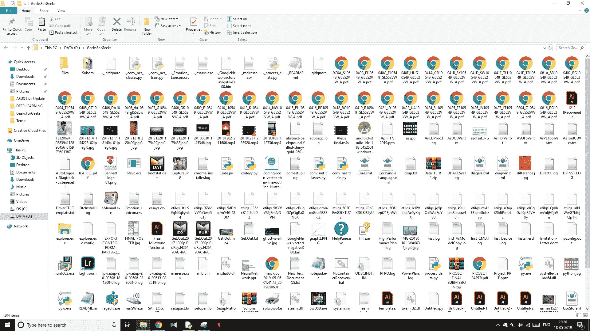

# Python |对扩展名相同的文件进行排序和存储

> 原文:[https://www . geeksforgeeks . org/python-以相同扩展名对文件进行排序和存储/](https://www.geeksforgeeks.org/python-sort-and-store-files-with-same-extension/)

你是否曾经想在一个文件夹中找到某个特定的文件，但是当你发现那个文件夹一团糟的时候，你会彻底抓狂？好吧，Python 是这里的救星。
使用 Python OS-module 和 shutil 模块，我们可以将扩展名相同的文件组织起来，存储在单独的文件夹中。

请看下图–


这个文件夹完全没有组织。如果你被告知要在这个文件夹中找到一个特定的文件(或者可能是一个更大的文件夹，里面有成千上万个文件)，你会被卡住，变得完全目瞪口呆。从这一片混乱的海洋中找到一份文件可能非常困难(甚至不可能)。使用 Python 只需几行代码就可以解决这个问题。让我们看看如何做到这一点。

下面是 Python 实现–

```
import os
import shutil

# Write the name of the directory here,
# that needs to get sorted
path = '/path/to/directory'

# This will create a properly organized 
# list with all the filename that is
# there in the directory
list_ = os.listdir(path)

# This will go through each and every file
for file_ in list_:
    name, ext = os.path.splitext(file_)

    # This is going to store the extension type
    ext = ext[1:]

    # This forces the next iteration,
    # if it is the directory
    if ext == '':
        continue

    # This will move the file to the directory
    # where the name 'ext' already exists
    if os.path.exists(path+'/'+ext):
       shutil.move(path+'/'+file_, path+'/'+ext+'/'+file_)

    # This will create a new directory,
    # if the directory does not already exist
    else:
        os.makedirs(path+'/'+ext)
        shutil.move(path+'/'+file_, path+'/'+ext+'/'+file_)
```

**输出:**
