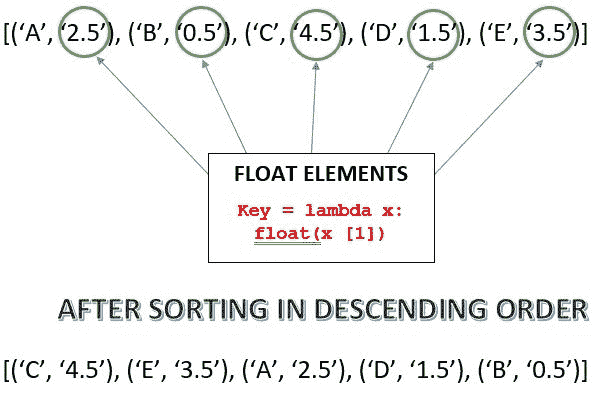

# Python |根据元组的浮点元素

对元组进行排序

> 原文:[https://www . geesforgeks . org/python-sort-tuple-float-element/](https://www.geeksforgeeks.org/python-sort-tuple-float-element/)

在本文中，我们将看到如何使用元组的 float 元素对元组(由 float 元素组成)进行排序。在这里，我们将看到如何使用内置的 sorted()方法来实现这一点，以及如何使用就地排序方法来实现这一点。

示例:

```
Input : tuple = [('lucky', '18.265'), ('nikhil', '14.107'), 
                  ('akash', '24.541'), ('anand', '4.256'), ('gaurav', '10.365')]
Output : [('akash', '24.541'), ('lucky', '18.265'), 
          ('nikhil', '14.107'), ('gaurav', '10.365'), ('anand', '4.256')]

Input : tuple = [('234', '9.4'), ('543', '16.9'), ('756', '5.5'), 
                  ('132', '4.2'), ('342', '7.3')]
Output : [('543', '16.9'), ('234', '9.4'), ('342', '7.3'), 
          ('756', '5.5'), ('132', '4.2')]

```

我们可以从下图中了解到这一点:


**方法 1:使用[排序()](https://www.geeksforgeeks.org/sorted-function-python/)方法**

Sorted()对元组进行排序，并始终以排序的方式返回包含元素的元组，而不修改原始序列。它需要三个参数，其中两个是可选的，这里我们尝试使用这三个参数:

1.  **Iterable :** 序列(列表、元组、字符串)或集合(字典、集合、frozenset)或任何其他需要排序的迭代器。
2.  **键(可选):**用作键或排序比较基础的功能。
3.  **反向(可选):**如果设置为真，则可迭代将按反向(降序)顺序排序，默认情况下设置为假。

为了按升序排序，我们可以忽略第三个参数。

```
# Python code to sort the tuples using float element
# Function to sort using sorted()
def Sort(tup):
    # reverse = True (Sorts in Descending order)
    # key is set to sort using float elements
    # lambda has been used
    return(sorted(tup, key = lambda x: float(x[1]), reverse = True))

# Driver Code
tup = [('lucky', '18.265'), ('nikhil', '14.107'), ('akash', '24.541'), 
    ('anand', '4.256'), ('gaurav', '10.365')]
print(Sort(tup))
```

输出:

```
[('akash', '24.541'), ('lucky', '18.265'), ('nikhil', '14.107'),
 ('gaurav', '10.365'), ('anand', '4.256')]

```

**方法 2:使用 sort()的就地排序方式:**

当通过这种方法排序时，元组的实际内容被改变，而在先前的方法中，原始元组的内容保持不变。

```
# Python code to sort the tuples using float element
# Inplace way to sort using sort()
def Sort(tup):
    # reverse = True (Sorts in Descending order)
    # key is set to sort using float elements
    # lambda has been used
    tup.sort(key = lambda x: float(x[1]), reverse = True)
    print(tup)

# Driver Code
tup = [('lucky', '18.265'), ('nikhil', '14.107'), ('akash', '24.541'), 
    ('anand', '4.256'), ('gaurav', '10.365')]
Sort(tup)
```

输出:

```
[('akash', '24.541'), ('lucky', '18.265'), ('nikhil', '14.107'), 
 ('gaurav', '10.365'), ('anand', '4.256')]

```

更多参考访问:
**[排序()Python 中](https://www.geeksforgeeks.org/sorted-function-python/)**
**[lambda Python 中](https://www.geeksforgeeks.org/python-lambda-anonymous-functions-filter-map-reduce/)**