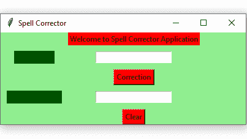

# Python–使用 Tkinter 的拼写校正器 GUI

> 原文:[https://www . geesforgeks . org/python-拼写纠正器-gui-using-tkinter/](https://www.geeksforgeeks.org/python-spell-corrector-gui-using-tkinter/)

**先决条件:**[tkinter 简介](https://www.geeksforgeeks.org/python-gui-tkinter/) | [拼写检查](https://www.geeksforgeeks.org/spelling-checker-in-python/)

Python 为开发图形用户界面提供了多种选择。在所有的 GUI 方法中，Tkinter 是最常用的方法。Python 搭配 Tkinter 输出了创建 GUI 应用程序最快最简单的方法。在本文中，我们将学习如何使用 Tkinter 创建一个 GUI 拼写校正器应用程序，并提供一步一步的指导。

要创建 Tkinter:

*   导入模块–tkinter
*   创建主窗口(容器)
*   向主窗口添加任意数量的小部件。
*   在小部件上应用事件触发器。

图形用户界面如下所示:



让我们创建一个基于图形用户界面的拼写纠正应用程序，可以纠正用户给出的单词。

**下面是实现:**

## 蟒蛇 3

```
# import all functions / classes from the tkinter
from tkinter import *
from textblob import TextBlob

# Function to clear both the text entry boxes
def clearAll() :

    # whole content of text entry area is deleted
    word1_field.delete(0, END)
    word2_field.delete(0, END)

# Function to get a corrected word
def correction() :

    # get a content from entry box
    input_word = word1_field.get()

    # create a TextBlob object
    blob_obj = TextBlob(input_word)

    # get a corrected word
    corrected_word = str(blob_obj.correct())

    # insert method inserting the
    # value in the text entry box.
    word2_field.insert(10, corrected_word)

# Driver code
if __name__ == "__main__" :

    # Create a GUI window
    root = Tk()

    # Set the background colour of GUI window
    root.configure(background = 'light green')

    # Set the configuration of GUI window (WidthxHeight)
    root.geometry("400x150")

    # set the name of tkinter GUI window
    root.title("Spell Corrector")

    # Create Welcome to Spell Corrector Application: label
    headlabel = Label(root, text = 'Welcome to Spell Corrector Application',
                    fg = 'black', bg = "red")

    # Create a "Input Word": label
    label1 = Label(root, text = "Input Word",
                fg = 'black', bg = 'dark green')

    # Create a "Corrected Word": label
    label2 = Label(root, text = "Corrected Word",
                fg = 'black', bg = 'dark green')

    # grid method is used for placing
    # the widgets at respective positions
    # in table like structure .
    # padx keyword argument used to set padding along x-axis .
    headlabel.grid(row = 0, column = 1)
    label1.grid(row = 1, column = 0)
    label2.grid(row = 3, column = 0, padx = 10)

    # Create a text entry box
    # for filling or typing the information.
    word1_field = Entry()
    word2_field = Entry()

    # padx keyword argument used to set padding along x-axis .
    # pady keyword argument used to set padding along y-axis .
    word1_field.grid(row = 1, column = 1, padx = 10, pady = 10)
    word2_field.grid(row = 3, column = 1, padx = 10, pady = 10)

    # Create a Correction Button and attached
    # with correction function
    button1 = Button(root, text = "Correction", bg = "red", fg = "black",
                                command = correction)

    button1.grid(row = 2, column = 1)

    # Create a Clear Button and attached
    # with clearAll function
    button2 = Button(root, text = "Clear", bg = "red",
                    fg = "black", command = clearAll)

    button2.grid(row = 4, column = 1)

    # Start the GUI
    root.mainloop()
```

**输出:**

<video class="wp-video-shortcode" id="video-418435-1" width="640" height="360" preload="metadata" controls=""><source type="video/mp4" src="https://media.geeksforgeeks.org/wp-content/uploads/20210116114658/FreeOnlineScreenRecorderProject4.mp4?_=1">[https://media.geeksforgeeks.org/wp-content/uploads/20210116114658/FreeOnlineScreenRecorderProject4.mp4](https://media.geeksforgeeks.org/wp-content/uploads/20210116114658/FreeOnlineScreenRecorderProject4.mp4)</video>