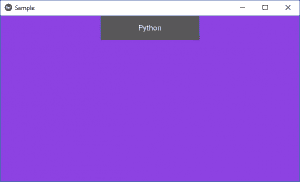
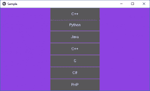
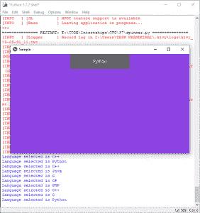

# Python | Spinner 小部件在 Kivy 中使用。kv 文件

> 原文:[https://www . geesforgeks . org/python-spinner-widget-in-kivy-using-kv-file/](https://www.geeksforgeeks.org/python-spinner-widget-in-kivy-using-kv-file/)

Kivy 是 Python 中独立于平台的 GUI 工具。因为它可以在安卓、IOS、linux 和 Windows 等平台上运行。它基本上是用来开发安卓应用程序的，但并不意味着它不能在桌面应用程序上使用。

> 👉🏽 [Kivy 教程–通过示例学习 Kivy](https://www.geeksforgeeks.org/kivy-tutorial/)。

### 微调器小部件:

要使用 spinner，您必须导入:

```
from kivy.uix.spinner import Spinner
```

Spinner 是一个小部件，它提供了从集合中选择一个值的快速方法。在默认状态下，微调器显示其当前选定的值。触摸微调器会显示一个包含所有其他可用值的下拉菜单，用户可以从中选择一个新值。
像组合框一样，微调对象可以有多个值，并且可以选择其中一个值。
回调可以附加到微调对象，以接收从微调对象选择值的通知。

```
Basic Approach:

1) import kivy
2) import kivyApp
3) import spinner
4) import Floatlayout(according to need)
5) import window(optional)
6) Set minimum version(optional)
7) Create Layout class:
      define the clicked function in it
8) Create App class
9) create .kv file (name same as the app class):
        1) create Spinner
        2) create callback
        3) And many more styling as needed
10) return Layout/widget/Class(according to requirement)
11) Run an instance of the class
```

**下面是实现:**

在下面的代码中，我们已经创建了微调器，并完成了大小调整和定位，还将回调附加到了值上。

**。py 文件:**

## 蟒蛇 3

```
# Sample spinner app in kivy using .kv file

# to change the kivy default settings we use this module config
from kivy.config import Config

# 0 being off 1 being on as in true / false
# you can use 0 or 1 && True or False
Config.set('graphics', 'resizable', True)

# Program to Show how to create a switch
# import kivy module   
import kivy 

# base Class of your App inherits from the App class.   
# app:always refers to the instance of your application  
from kivy.app import App

# this restrict the kivy version i.e 
# below this kivy version you cannot 
# use the app or software 
kivy.require('1.9.0')

# Spinner is a widget that provides a
# quick way to select one value from a set.
# like a dropdown list
from kivy.uix.spinner import Spinner

# module consists the floatlayout 
# to work with FloatLayout first 
# you have to import it 
from kivy.uix.floatlayout import FloatLayout

# Here for providing colour to the background
from kivy.core.window import Window

# create LayoutClass
class SampBoxLayout(FloatLayout):
    # For Spinner defining spinner clicked function
    def spinner_clicked(self, value):
        print("Language selected is " + value)

# # Make an App by deriving from the App class
class SampleApp(App):
    def build(self):

        # Set the background color for the window
        Window.clearcolor = (0.555, 0.261, .888, 0.5)
        return SampBoxLayout()

# create object for the Appclass
root = SampleApp()
# run the class
root.run()

```

 [.kv file](https://www.geeksforgeeks.org/python-kivy-kv-file/) of the code:

## 蟒蛇 3

```
# .kv file implementation of the .py file

# Creating the Layout i.e root of the Layout class
<SampBoxLayout>:

    # creating the spinner
    Spinner:
        # Assigning id 
        id: spinner_id

        # Callback 
        on_text: root.spinner_clicked(spinner_id.text)

        # initially text on spinner
        text: "Python"

        # total values on spinner
        values: ["Python", "Java", "C++", "C", "C#", "PHP"]

        # declaring size of the spinner
        # and the position of it
        size_hint: None, None
        size: 200, 50
        pos_hint:{'center_x':.5, 'top': 1}
```

**输出:**

**影像 1:**


**图像 2:**


**图像 3:**


下面是视频中的输出，以便更好地理解:

<video class="wp-video-shortcode" id="video-309932-1" width="665" height="374" preload="metadata" controls=""><source type="video/webm" src="https://media.geeksforgeeks.org/wp-content/uploads/20190531002953/spinner1.webm?_=1">[https://media.geeksforgeeks.org/wp-content/uploads/20190531002953/spinner1.webm](https://media.geeksforgeeks.org/wp-content/uploads/20190531002953/spinner1.webm)</video>