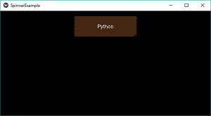
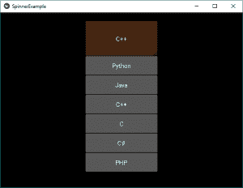
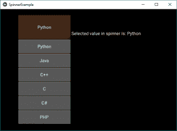
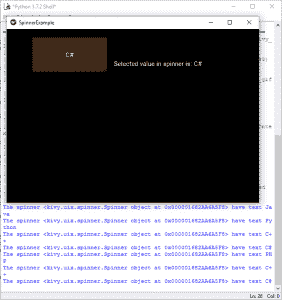

# Python | kivy 中的 Spinner 小部件

> 原文:[https://www . geesforgeks . org/python-spinner-widget-in-kivy/](https://www.geeksforgeeks.org/python-spinner-widget-in-kivy/)

Kivy 是 Python 中独立于平台的 GUI 工具。因为它可以在安卓、IOS、linux 和 Windows 等平台上运行。它基本上是用来开发安卓应用程序的，但并不意味着它不能在桌面应用程序上使用。

> 👉🏽 [Kivy 教程–通过示例学习 Kivy](https://www.geeksforgeeks.org/kivy-tutorial/)。

### 微调器小部件:

要使用 spinner，您必须导入:

```py
from kivy.uix.spinner import Spinner
```

Spinner 是一个小部件，它提供了从集合中选择一个值的快速方法。在默认状态下，微调器显示其当前选定的值。触摸微调器会显示一个包含所有其他可用值的下拉菜单，用户可以从中选择一个新值。
像组合框一样，微调对象可以有多个值，并且可以选择其中一个值。
回调可以附加到微调对象，以接收从微调对象选择值的通知。

```py
Basic Approach :

1) import kivy
2) import kivyApp
3) import Label
4) import Spinner
5) import Floatlayout
6) Set minimum version(optional)
7) create App class:
        1) Create the spinner
        2) Attach the labels to spinners
        3) Attach a callback also 
8) return Layout/widget/Class(according to requirement)
9) Run an instance of the class
```

**简单微调器的实现:**

```py
# Sample spinner app in kivy to change the
# kivy default settings we use this module config
from kivy.config import Config

# 0 being off 1 being on as in true / false
# you can use 0 or 1 && True or False
Config.set('graphics', 'resizable', True)

# Program to Show how to create a switch
# import kivy module   
import kivy 

# base Class of your App inherits from the App class.   
# app:always refers to the instance of your application  
from kivy.app import App

# this restrict the kivy version i.e 
# below this kivy version you cannot 
# use the app or software 
kivy.require('1.9.0')

# The Label widget is for rendering text. 
from kivy.uix.label import Label

# Spinner is a widget that provides a
# quick way to select one value from a set.
# like a dropdown list
from kivy.uix.spinner import Spinner

# module consist the floatlayout 
# to work with FloatLayout first 
# you have to import it 
from kivy.uix.floatlayout import FloatLayout

# Make an App by deriving from the App class
class SpinnerExample(App):

    # define build 
    def build(self):

        # creating floatlayout
        layout = FloatLayout()

        # creating the spinner
        # configure spinner object and add to layout
        self.spinnerObject = Spinner(text ="Python",
             values =("Python", "Java", "C++", "C", "C#", "PHP"),
             background_color =(0.784, 0.443, 0.216, 1)) 

        self.spinnerObject.size_hint = (0.3, 0.2)

        self.spinnerObject.pos_hint ={'x': .35, 'y':.75}

        layout.add_widget(self.spinnerObject)

        # return the layout
        return layout;

# Run the app
if __name__ == '__main__':
    SpinnerExample().run()      
```

**输出:**

**影像 1:**


**图像 2:**


现在，如果我们必须在每次选择列表中的哪个元素时告诉用户，我们将在微调器旁边显示一个标签，告诉用户所选的标签。此外，我们将打印微调器的值和文本。

**下面是实现:**

```py
# Sample spinner app in kivy to change the
# kivy default settings we use this module config
from kivy.config import Config

# 0 being off 1 being on as in true / false
# you can use 0 or 1 && True or False
Config.set('graphics', 'resizable', True)

# Program to Show how to create a switch
# import kivy module   
import kivy 

# base Class of your App inherits from the App class.   
# app:always refers to the instance of your application  
from kivy.app import App

# this restrict the kivy version i.e 
# below this kivy version you cannot 
# use the app or software 
kivy.require('1.9.0')

# The Label widget is for rendering text. 
from kivy.uix.label import Label

# Spinner is a widget that provides a
# quick way to select one value from a set.
# like a dropdown list
from kivy.uix.spinner import Spinner

# module consist the floatlayout 
# to work with FloatLayout first 
# you have to import it 
from kivy.uix.floatlayout import FloatLayout

# Make an App by deriving from the App class
class SpinnerExample(App):

    # define build 
    def build(self):

        # creating floatlayout
        layout = FloatLayout()

        # creating the spinner
        # configure spinner object and add to layout
        self.spinnerObject = Spinner(text ="Python",
              values =("Python", "Java", "C++", "C", "C#", "PHP"),
              background_color =(0.784, 0.443, 0.216, 1)) 

        self.spinnerObject.size_hint = (0.3, 0.2)

        self.spinnerObject.pos_hint ={'x': .35, 'y':.75}

        layout.add_widget(self.spinnerObject)
        self.spinnerObject.bind(text = self.on_spinner_select)

        # It changes the label info as well
        # add a label displaying the selection from the spinner
        self.spinnerSelection = Label(text ="Selected value in spinner is: %s" 
                                                     %self.spinnerObject.text)

        layout.add_widget(self.spinnerSelection)
        self.spinnerSelection.pos_hint ={'x': .1, 'y':.3}

        return layout;

    # call back for the selection in spinner object
    def on_spinner_select(self, spinner, text):
        self.spinnerSelection.text = "Selected value in spinner is: %s"
                                              %self.spinnerObject.text)

        print('The spinner', spinner, 'have text', text)

# Run the app
if __name__ == '__main__':
    SpinnerExample().run()      
```

**输出:**

**影像 1:**


**图像 2:**


下面是视频中的输出，以便更好地理解:

<video class="wp-video-shortcode" id="video-309927-1" width="665" height="374" preload="metadata" controls=""><source type="video/webm" src="https://media.geeksforgeeks.org/wp-content/uploads/20190530230143/spinner.webm?_=1">[https://media.geeksforgeeks.org/wp-content/uploads/20190530230143/spinner.webm](https://media.geeksforgeeks.org/wp-content/uploads/20190530230143/spinner.webm)</video>