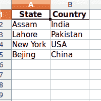

# Python |拆分给定列表并插入 excel 文件

> 原文:[https://www . geesforgeks . org/python-拆分-给定-列表-在 excel 中插入-文件/](https://www.geeksforgeeks.org/python-split-given-list-and-insert-in-excel-file/)

给定一个连续包含姓名和地址的列表，任务是一次拆分这两个元素并将其插入 excel。

我们可以使用一个非常受欢迎的库进行数据分析，熊猫。使用 pandas，我们可以很容易地操作列，只需使用 **df.to_excel()** 函数将过滤后的元素插入到 excel 文件中。

下面是实现:

```py
# Python code to split the list two element 
# at a time and insert it into excel.

# Importing pandas as pd
import pandas as pd

# List initialization
list1 = ['Assam', 'India',
         'Lahore', 'Pakistan', 
         'New York', 'USA',
         'Bejing', 'China']

df = pd.DataFrame()

# Creating two columns
df['State'] = list1[0::2]
df['Country'] = list1[1::2]

# Converting to excel
df.to_excel('result.xlsx', index = False)
```

**输出:**
