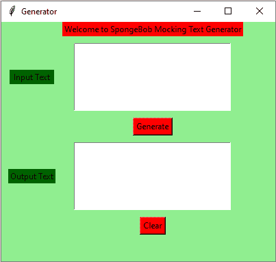

# Python–海绵宝宝嘲讽文字生成器 GUI 使用 Tkinter

> 原文:[https://www . geesforgeks . org/python-海绵宝宝-嘲讽-文本-生成器-gui-using-tkinter/](https://www.geeksforgeeks.org/python-spongebob-mocking-text-generator-gui-using-tkinter/)

**先决条件:**[tkinter 简介](https://www.geeksforgeeks.org/python-gui-tkinter/) | [海绵宝宝嘲讽文字生成器](https://www.geeksforgeeks.org/spongebob-mocking-text-generator-python/)

Python 为开发图形用户界面提供了多种选择。在所有的 GUI 方法中，Tkinter 是最常用的方法。Python 搭配 Tkinter 输出了创建 GUI 应用程序最快最简单的方法。在本文中，我们将学习如何使用 Tkinter 创建海绵宝宝嘲讽文本生成器 GUI 应用程序，并提供一步一步的指导。

要创建 Tkinter:

*   导入模块–tkinter
*   创建主窗口(容器)
*   向主窗口添加任意数量的小部件。
*   在小部件上应用事件触发器。

图形用户界面如下所示:



让我们创建一个基于图形用户界面的海绵宝宝模仿文本生成器应用程序，它可以根据用户给出的输入生成海绵宝宝文本。

**下面是实现:**

## 蟒蛇 3

```
# import all functions from the tkinter 
from tkinter import *

# import the random library
import random

# Function to clear both the text areas
def clearAll() :
    # whole content of text area  is deleted
    text1_field.delete(1.0, END)
    text2_field.delete(1.0, END)

# Function to Generate SpongeBob Mocking Text
def generate() :

    # get a whole input content from text box
    # ignoring \n from the text box content
    input_text = text1_field.get("1.0", "end")[:-1]

    # variable declaration for the output text
    output_text = ""

    # check the cases for every individual character
    for char in input_text:

        # check if the character is an alphabet
        if char.isalpha():

            # convert to upper case
            if random.random() > 0.5:
                output_text += char.upper()

            # convert to lower case
            else:
                output_text += char.lower()

        # if character is not and alphabet
        # add it as it is
        else:
            output_text += char

    text2_field.insert('end -1 chars', output_text)

# Driver code
if __name__ == "__main__" :

    # Create a GUI window
    root = Tk()

    # Set the background colour of GUI window 
    root.configure(background = 'light green') 

    # Set the configuration of GUI window (WidthxHeight)
    root.geometry("400x350") 

    # set the name of tkinter GUI window 
    root.title("Generator")

    # Create Welcome to SpongeBob Mocking Text Generator label 
    headlabel = Label(root, text = 'Welcome to SpongeBob Mocking Text Generator', 
                      fg = 'black', bg = "red") 

    # Create a "Input Text " label 
    label1 = Label(root, text = " Input Text ",
                 fg = 'black', bg = 'dark green')

    # Create a "Output Text " label 
    label2 = Label(root, text = "Output Text", 
                   fg = 'black', bg = 'dark green') 

    # grid method is used for placing 
    # the widgets at respective positions 
    # in table like structure .
    headlabel.grid(row = 0, column = 1)

    # padx keyword argument used to set padding along x-axis .
    label1.grid(row = 1, column = 0, padx = 10) 
    label2.grid(row = 3, column = 0, padx = 10)

    # Create a text area box 
    # for filling or typing the information. 
    text1_field = Text(root, height = 5, width = 25, font = "lucida 13")
    text2_field = Text(root, height = 5, width = 25, font = "lucida 13")

    # padx keyword argument used to set padding along x-axis .
    # pady keyword argument used to set padding along y-axis . 
    text1_field.grid(row = 1, column = 1, padx = 10, pady = 10) 
    text2_field.grid(row = 3, column = 1, padx = 10, pady = 10)

    # Create a Generate Button and attached 
    # with generate function 
    button1 = Button(root, text = "Generate", bg = "red", fg = "black",
                                command = generate)

    button1.grid(row = 2, column = 1)

    # Create a Clear Button and attached 
    # with clearAll function 
    button2 = Button(root, text = "Clear", bg = "red", 
                     fg = "black", command = clearAll)

    button2.grid(row = 4, column = 1)

    # Start the GUI 
    root.mainloop() 
```

**输出:**

<video class="wp-video-shortcode" id="video-418433-1" width="640" height="360" preload="metadata" controls=""><source type="video/mp4" src="https://media.geeksforgeeks.org/wp-content/uploads/20210116114040/FreeOnlineScreenRecorderProject3.mp4?_=1">[https://media.geeksforgeeks.org/wp-content/uploads/20210116114040/FreeOnlineScreenRecorderProject3.mp4](https://media.geeksforgeeks.org/wp-content/uploads/20210116114040/FreeOnlineScreenRecorderProject3.mp4)</video>