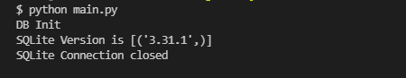

# Python SQlite–连接到数据库

> 原文:[https://www . geesforgeks . org/python-SQLite-连接到数据库/](https://www.geeksforgeeks.org/python-sqlite-connecting-to-database/)

在本文中，我们将讨论如何使用 Python 中的 sqlite3 模块连接到 SQLite 数据库。

### **连接到数据库**

连接到 SQLite 数据库可以使用 **connect()** 方法建立，传递要访问的数据库的名称作为参数。如果那个数据库不存在，那么它将被创建。

```py
sqliteConnection = sqlite3.connect('sql.db')
```

但是，如果您想在建立连接后执行一些查询，该怎么办呢？为此，必须在连接实例上使用 **cursor()** 方法创建一个游标，它将执行我们的 SQL 查询。

```py
cursor = sqliteConnection.cursor()
print('DB Init')
```

要执行的 SQL 查询可以以字符串的形式编写，然后通过在游标对象上调用 **execute()** 方法来执行。然后，可以使用 **fetchall()** 方法从服务器获取结果，在本例中，该方法是 SQLite 版本号。

```py
query = 'SQL query;'
cursor.execute(query)
result = cursor.fetchall()
print('SQLite Version is {}'.format(result))
```

考虑下面的例子，我们将连接到一个 SQLite 数据库，并运行一个简单的查询 select SqLite _ version()；找到我们正在使用的 SQLite 版本。

**示例:**

## 计算机编程语言

```py
import sqlite3

try:

    # Connect to DB and create a cursor
    sqliteConnection = sqlite3.connect('sql.db')
    cursor = sqliteConnection.cursor()
    print('DB Init')

    # Write a query and execute it with cursor
    query = 'select sqlite_version();'
    cursor.execute(query)

    # Fetch and output result
    result = cursor.fetchall()
    print('SQLite Version is {}'.format(result))

    # Close the cursor
    cursor.close()

# Handle errors
except sqlite3.Error as error:
    print('Error occured - ', error)

# Close DB Connection irrespective of success
# or failure
finally:

    if sqliteConnection:
        sqliteConnection.close()
        print('SQLite Connection closed')
```

**输出:**

