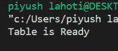

# Python SQlite–创建表格

> 原文:[https://www.geeksforgeeks.org/python-sqlite-create-table/](https://www.geeksforgeeks.org/python-sqlite-create-table/)

在本文中，我们将讨论如何使用 sqlite3 模块从 Python 程序在 SQLite 数据库中创建表。

在 SQLite 数据库中，我们使用以下语法创建一个表:

> CREATE TABLE 数据库 _name.table_name(
> 
> 列 1 数据类型主键(一列或多列)，
> 
> 列 2 数据类型，
> 
> 第 3 列数据类型，
> 
> …..
> 
> 列 N 数据类型
> 
> );

现在我们将使用 Python 创建一个表:

**进场:**

导入所需的模块

*   使用 sqlite3 模块的 **connect()** 功能建立与数据库的连接或创建连接对象。
*   通过调用连接对象的 **cursor()** 方法创建一个 Cursor 对象。
*   使用 CREATE TABLE 语句和 Cursor 类的 **execute()** 方法形成表格。

**实施:**

## 蟒蛇 3

```py
import sqlite3

# Connecting to sqlite
# connection object
connection_obj = sqlite3.connect('geek.db')

# cursor object
cursor_obj = connection_obj.cursor()

# Drop the GEEK table if already exists.
cursor_obj.execute("DROP TABLE IF EXISTS GEEK")

# Creating table
table = """ CREATE TABLE GEEK (
            Email VARCHAR(255) NOT NULL,
            First_Name CHAR(25) NOT NULL,
            Last_Name CHAR(25),
            Score INT
        ); """

cursor_obj.execute(table)

print("Table is Ready")

# Close the coonection
connection_obj.close()
```

**输出:**

