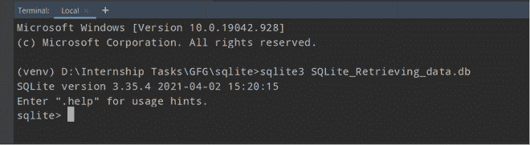
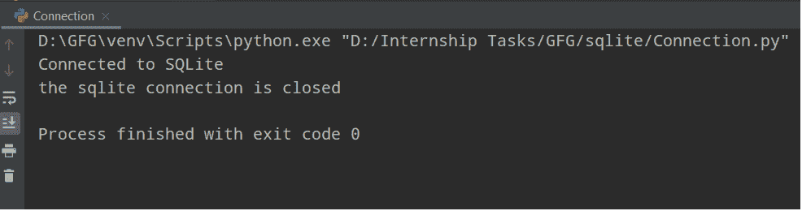

# Python SQLite–创建新数据库

> 原文:[https://www . geesforgeks . org/python-SQLite-creating-new-database/](https://www.geeksforgeeks.org/python-sqlite-creating-a-new-database/)

在本文中，我们将讨论如何使用 Python 在 SQLite 中创建数据库。

## 创建数据库

创建数据库不需要任何特殊权限。用于创建数据库的 sqlite3 命令具有以下基本语法

> **语法:** $ sqlite3 <数据库 _name_with_db_extension >

数据库名称在关系数据库管理系统中必须始终是唯一的。

**示例:**



当我们创建 sqlite 数据库时。

同样，我们可以使用 SQlite3 模块在 python 中创建这个数据库。

## 蟒蛇 3

```
import sqlite3

# filename to form database
file = "Sqlite3.db"

try:
  conn = sqlite3.connect(file)
  print("Database Sqlite3.db formed.")
except:
  print("Database Sqlite3.db not formed.")
```

**输出:**

```
Database Sqlite3.db formed.
```

### 连接数据库:

创建一个全新的 SQLite 数据库就像在 Python 首选库内建立一个与 sqlite3 模块使用的连接一样简单。要建立连接，您只需将文件路径传递给 sqlite3 模块中的 connect(…)方法。如果文件表示的数据库不存在，将在此路径下创建。

```
import sqlite3
connection = sqlite3.connect(<path_to_file_db.sqlite3>)
```

让我们看一些关于 connect()方法的描述，

> **语法:** sqlite3.connect(数据库[，超时，其他可选参数])

这个应用编程接口的使用打开了到 SQLite 数据库文件的连接。使用“:内存:”来建立与放置在内存中的数据库的连接，而不是硬盘。当数据库正确打开时，将返回一个连接对象。

可以通过多个连接访问数据库，其中一个过程是修改数据库。SQLite 数据库将挂起，直到事务提交。超时参数指定在引发异常之前，连接应该等待多长时间才能解锁。超时参数 5.0(五秒)。如果指定的数据库名称不存在，此调用将创建数据库。

如果我们想在当前目录以外的位置创建数据库数据，我们也可以使用所需的路径来指定文件名。

### 实施:

1.在 sqlite3 数据库和 Python 程序之间创建连接

```
sqliteConnection = sqlite3.connect('SQLite_Retrieving_data.db')
```

2.如果 sqlite3 与 python 程序建立了连接，那么它将打印“已连接到 sqlite”，否则它将显示错误

```
print("Connected to SQLite")
```

3.如果连接是打开的，我们需要关闭它。结束代码出现在最终区块内。我们将使用 close()方法来关闭连接对象。关闭连接对象后，我们将打印“SQLite 连接已关闭”

```
if sqliteConnection:
    sqliteConnection.close()
    print("the sqlite connection is closed")
```

## 蟒蛇 3

```
# Importing Sqlite3 Module
import sqlite3

try:
    # Making a connection between sqlite3 database and Python Program
    sqliteConnection = sqlite3.connect('SQLite_Retrieving_data.db')
    # If sqlite3 makes a connection with python program then it will print "Connected to SQLite"
    # Otherwise it will show errors
    print("Connected to SQLite")
except sqlite3.Error as error:
    print("Failed to connect with sqlite3 database", error)
finally:
    # Inside Finally Block, If connection is open, we need to close it
    if sqliteConnection:
        # using close() method, we will close the connection
        sqliteConnection.close()
        # After closing connection object, we will print "the sqlite connection is closed"
        print("the sqlite connection is closed")
```

**输出:**



上述 python 程序的输出