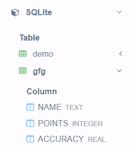
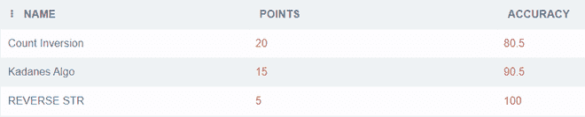
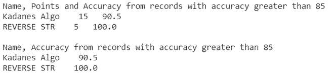
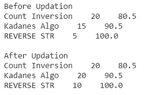
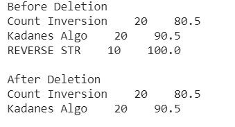

# Python SQlite–CRUD 操作

> 原文:[https://www . geesforgeks . org/python-SQLite-crud-operations/](https://www.geeksforgeeks.org/python-sqlite-crud-operations/)

在本文中，我们将使用 Python 中的 SQLite 模块来完成 CRUD 操作。

## **积垢操作**

缩写 CRUD 扩展为创建、读取、更新和删除。这四个是数据库中的基本操作。在示例数据库中，我们将创建它，并执行一些操作。让我们借助例子逐一讨论这些操作。

#### 创造

create 命令用于在数据库中创建表。首先我们将浏览它的语法，然后用一个例子来理解。

> **语法:**CREATE TABLE TABLE _ name(Attr<sub>1</sub>类型 <sub>1、</sub> Attr <sub>2</sub> 类型 <sub>2、</sub> …、Attr <sub>n</sub> 类型<sub>n</sub>)；

在本例中，我们将创建一个名为“gfg”的表，它有三个属性:

1.  名字
2.  点
3.  准确(性)

## 计算机编程语言

```py
# Python code to create a relation 
# using SQLite3

# import the sqlite3 package
import sqlite3  

# create a database named backup
cnt = sqlite3.connect("backup.dp")  

# create a table named gfg
cnt.execute('''CREATE TABLE gfg(
NAME TEXT,
POINTS INTEGER,
ACCURACY REAL);''')
```

**输出:**



#### 插入

这是指向表中插入新数据。数据以元组的形式插入。创建表时，元组中的属性数量必须等于关系模式中定义的属性数量。

> 1.要按关系模式中指定的顺序插入属性:
> **语法:将** **插入**表名**值**(值 1，值 2，…值 n )
> 
> 2 **。**按照关系模式中指定的顺序或不同的顺序插入属性:
> **将** **插入**表名(属性 1、属性 3、属性 2。。。) **VALUES** ( value1，value3，value2。。。)

下面的程序演示了将三个元组添加到先前创建的 gfg 关系中。

## 蟒蛇 3

```py
# Python3 Code to insert data into
# the database

# Insert three tuples into the gfg table
# insert in default order
cnt.execute('''INSERT INTO gfg VALUES(
'Count Inversion',20,80.5);''')

# insert in different order
cnt.execute('''INSERT INTO gfg(ACCURACY, POINTS, NAME) VALUES(
90.5, 15, 'Kadanes Algo');''')

cnt.execute('''INSERT INTO gfg(NAME, ACCURACY, POINTS) VALUES(
'REVERSE STR', 100, 5);''')

# commit changes to the database
cnt.commit()
```

**输出:**



### 阅读

这指的是从数据库中读取数据。read 语句有三个子句:

1.  **选择:**将需要查询的属性作为谓词，所有属性使用 ***** 。
2.  **FROM:** 以关系为谓语。
3.  **WHERE:** 将条件作为谓语，这不是强制性的。

在 python SQLite3 中执行 read 语句后，返回一个可迭代的游标对象。这可用于打印数据。

> **示例:从** gfg **中选择**名称、点数、精度**，其中**精度>85；

下面的程序演示了 read 语句的用法。

## 蟒蛇 3

```py
# Python3 code to read data from a table

print('Name, Points and Accuracy from '
      'records with accuracy greater than 85')

cursor = cnt.execute('''SELECT * FROM gfg WHERE ACCURACY>85;''')

# print data using the cursor object
for i in cursor:
    print(i[0]+"    "+str(i[1])+"   "+str(i[2]))

print('')  # Print new line

print('Name, Accuracy from '
      'records with accuracy greater than 85')

cursor = cnt.execute('''SELECT NAME, ACCURACY FROM
gfg WHERE ACCURACY>85;''')

# print data using the cursor object
for i in cursor:
    print(i[0]+"    "+str(i[1]))
```

**输出:**



### 更新

这是指更新表中已经存在的元组值。

> **语法:更新**表名**设置**属性 <sub>1</sub> =值 <sub>1</sub> ，属性 2 =值 2，。。。**其中**条件；
> 必须包含 WHERE 子句，否则表中的所有记录都将被更新。

> **示例:更新** gfg **设置**点数=点数+5 **其中**点数<20；

下面的程序演示了 update 语句的用法。

## 蟒蛇 3

```py
# Python3 code to update records in a database

# Print records before updation
cursor = cnt.execute('''SELECT * FROM gfg''')
print('Before Updation')
for i in cursor:
    print(i[0]+"    "+str(i[1])+"    "+str(i[2]))

print('')  # print a newline

# Execute an Update statement
cnt.execute('''UPDATE gfg SET POINTS=POINTS+5 WHERE
POINTS<20;''')

cursor = cnt.execute('''SELECT * FROM gfg''')
print('After Updation')
for i in cursor:
    print(i[0]+"    "+str(i[1])+"    "+str(i[2]))
```

**输出:**



### 删除

这指的是删除表中存在的元组。

> **语法:从**表名**中删除**条件
> 
> 如果不使用 WHERE 子句，则所有记录都将被删除。

> **示例:从** gfg **中删除**准确性> 91

下面的程序演示了 delete 语句的用法。

## 蟒蛇 3

```py
# Python3 code to delete records from database

# Print records before deletion
cursor = cnt.execute('''SELECT * FROM gfg''')
print('Before Deletion')
for i in cursor:
    print(i[0]+"    "+str(i[1])+"    "+str(i[2]))

print('')  # print a newline

# Execute a delete statement
cnt.execute('''DELETE FROM gfg WHERE ACCURACY>91;''')

cursor = cnt.execute('''SELECT * FROM gfg''')
print('After Deletion')
for i in cursor:
    print(i[0]+"    "+str(i[1])+"    "+str(i[2]))
```

**输出:**

