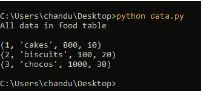
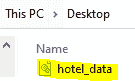
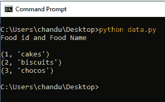

# Python SQlite–光标对象

> 原文:[https://www.geeksforgeeks.org/python-sqlite-cursor-object/](https://www.geeksforgeeks.org/python-sqlite-cursor-object/)

在本文中，我们将讨论 Python 的 **sqlite3** 模块中的光标对象。

## **光标对象**

它是一个对象，用于建立执行 SQL 查询的连接。它充当 SQLite 数据库连接和 SQL 查询之间的中间件。它是在连接到 SQLite 数据库后创建的。

> **语法:**cursor _ object = connection _ object . execute(“SQL 查询”)；

**示例 1:** 创建 hotel_data 数据库并将记录插入酒店表的 Python 代码。

## 蟒蛇 3

```py
# importing sqlite3 module
import sqlite3

# create connection by using object
# to connect with hotel_data database
connection = sqlite3.connect('hotel_data.db')

# query to create a table named FOOD1
connection.execute(''' CREATE TABLE hotel
         (FID INT PRIMARY KEY     NOT NULL,
         FNAME           TEXT    NOT NULL,
         COST            INT     NOT NULL,
         WEIGHT        INT);
         ''')

# insert query to insert food  details in 
# the above table
connection.execute("INSERT INTO hotel VALUES (1, 'cakes',800,10 )")
connection.execute("INSERT INTO hotel VALUES (2, 'biscuits',100,20 )")
connection.execute("INSERT INTO hotel VALUES (3, 'chocos',1000,30 )")

print("All data in food table\n")

# create a cousor object for select query
cursor = connection.execute("SELECT * from hotel ")

# display all data from hotel table
for row in cursor:
    print(row)
```

**输出:**



现在去你的位置，看看 SQLite 数据库是如何创建的。



**示例 2:** 显示酒店表数据的 Python 代码。

## 蟒蛇 3

```py
# importing sqlite3 module
import sqlite3

# create connection by using object
# to connect with hotel_data database
connection = sqlite3.connect('hotel_data.db')

# insert query to insert food  details 
# in the above table
connection.execute("INSERT INTO hotel VALUES (1, 'cakes',800,10 )");
connection.execute("INSERT INTO hotel VALUES (2, 'biscuits',100,20 )");
connection.execute("INSERT INTO hotel VALUES (3, 'chocos',1000,30 )");

print("Food id and Food Name\n")

# create a cousor object for select query
cursor = connection.execute("SELECT FID,FNAME from hotel ")

# display all data from FOOD1 table
for row in cursor:
     print(row)
```

**输出:**

