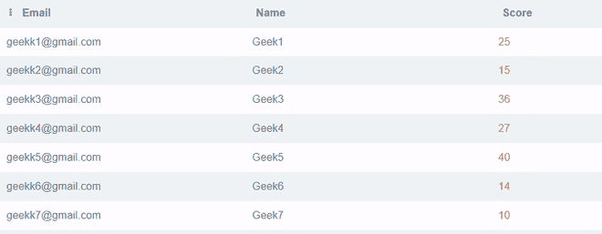
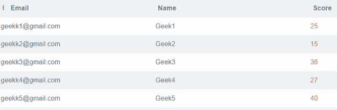
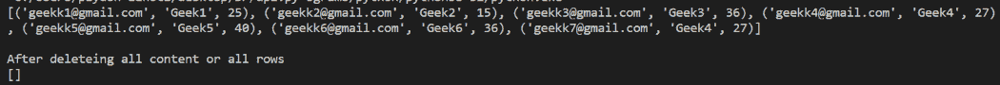

# Python SQLite–删除表中的数据

> 原文:[https://www . geesforgeks . org/python-SQLite-deleting-data-in-table/](https://www.geeksforgeeks.org/python-sqlite-deleting-data-in-table/)

在本文中，我们将讨论如何使用 sqlite3 模块从 Python 程序中删除 SQLite 数据库表中的数据。在 SQLite 数据库中，我们使用以下语法从表中删除数据:

> 从表名[WHERE 子句]中删除

为了创建数据库，我们将执行以下代码:

## 蟒蛇 3

```
import sqlite3

# Connecting to sqlite
# connection object
connection_obj = sqlite3.connect('geek.db')

# cursor object
cursor_obj = connection_obj.cursor()

# Drop the GEEK table if already exists.
cursor_obj.execute("DROP TABLE IF EXISTS GEEK")

# Creating table
table = """ CREATE TABLE GEEK (
            Email VARCHAR(255) NOT NULL,
            Name CHAR(25) NOT NULL,
            Score INT
        ); """

cursor_obj.execute(table)

#inserting data into geek table
connection_obj.execute("""INSERT INTO GEEK (Email,Name,Score) VALUES ("geekk1@gmail.com","Geek1",25)""")
connection_obj.execute("""INSERT INTO GEEK (Email,Name,Score) VALUES ("geekk2@gmail.com","Geek2",15)""")
connection_obj.execute("""INSERT INTO GEEK (Email,Name,Score) VALUES ("geekk3@gmail.com","Geek3",36)""")
connection_obj.execute("""INSERT INTO GEEK (Email,Name,Score) VALUES ("geekk4@gmail.com","Geek4",27)""")
connection_obj.execute("""INSERT INTO GEEK (Email,Name,Score) VALUES ("geekk5@gmail.com","Geek5",40)""")
connection_obj.execute("""INSERT INTO GEEK (Email,Name,Score) VALUES ("geekk6@gmail.com","Geek6",14)""")
connection_obj.execute("""INSERT INTO GEEK (Email,Name,Score) VALUES ("geekk7@gmail.com","Geek7",10)""")

connection_obj.commit()

# Close the connection
connection_obj.close()
```

**输出:**



现在我们将创建一个 python 程序来删除表中的行:

**进场:**

*   导入所需的模块。
*   使用 sqlite3 模块的 connect()函数与数据库建立连接或创建连接对象。
*   通过调用连接对象的 cursor()方法创建 Cursor 对象。
*   最后，触发对游标对象执行()方法，绕过 DELETE 语句作为参数。

**例 1:(删除部分数据)**

## 蟒蛇 3

```
import sqlite3

# Connecting to sqlite
# connection object
connection_obj = sqlite3.connect('geek.db')

# cursor object
cursor_obj = connection_obj.cursor()

#delete data
cursor_obj.execute("DELETE FROM GEEK WHERE Score < 15")

connection_obj.commit()
# Close the connection
connection_obj.close()
```

**输出:**



**例 2:(删除所有数据)**

## 蟒蛇 3

```
import sqlite3

# Connecting to sqlite
# connection object
connection_obj = sqlite3.connect('geek.db')

# cursor object
cursor_obj = connection_obj.cursor()
cursor_obj.execute("SELECT * FROM GEEK")
print(cursor_obj.fetchall())

#delete data
'''It will delete all rows from
   the table
'''
cursor_obj.execute("DELETE FROM GEEK")
print()
print("After deleting all rows")
cursor_obj.execute("SELECT * FROM GEEK")
print(cursor_obj.fetchall())
connection_obj.commit()
# Close the connection
connection_obj.close()
```

**输出:**

