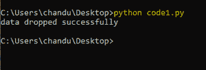

# Python SQlite–DROP 表

> 原文:[https://www.geeksforgeeks.org/python-sqlite-drop-table/](https://www.geeksforgeeks.org/python-sqlite-drop-table/)

在本文中，我们将使用 Python 讨论 SQLite 中的 DROP 命令。但是首先，让我们简单了解一下 drop 命令。

**DROP** 用于删除整个数据库或一个表。它删除了表中的两条记录以及表结构。

> **语法:**DROP TABLE TABLE _ NAME；

为了删除表，我们将首先在其中创建一个数据库和一个表。让我们在数据库中创建一个表。

## 蟒蛇 3

```py
# importing sqlite module
import sqlite3

# create connection to the database 
# geeks_database
connection = sqlite3.connect('geeks_database.db')

# create table named address of customers with
# 4 columns id,name age and address
connection.execute('''CREATE TABLE customer_address
         (ID INT PRIMARY KEY     NOT NULL,
         NAME           TEXT    NOT NULL,
         AGE            INT     NOT NULL,
         ADDRESS        CHAR(50)); ''')

# close the connection
connection.close()
```

**输出:**


现在，在客户地址表中插入 5 条记录。

## 蟒蛇 3

```py
# importing sqlite module
import sqlite3

# create connection to the database 
# geeks_database
connection = sqlite3.connect('geeks_database.db')

# insert records into table
connection.execute(
    "INSERT INTO customer_address VALUES (1, 'nikhil teja', 22, 'hyderabad' )")

connection.execute(
    "INSERT INTO customer_address VALUES (2, 'karthik', 25, 'khammam')")

connection.execute(
    "INSERT INTO customer_address VALUES (3, 'sravan', 22, 'ponnur' )")

connection.execute(
    "INSERT INTO customer_address VALUES (4, 'deepika', 25, 'chebrolu' )")

connection.execute(
    "INSERT INTO customer_address VALUES (5, 'jyothika', 22, 'noida')")

# close the connection
connection.close()
```

**输出:**


插入之后，让我们看看如何执行 drop table 命令。

## 蟒蛇 3

```py
# importing sqlite module
import sqlite3

# create connection to the 
# database geek
connection = sqlite3.connect('geeks_database.db')

# drop table
connection.execute("DROP TABLE customers_address")

print("data dropped successfully")

# close the connection
connection.close()
```

**输出:**

