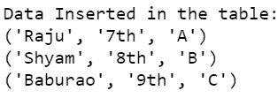
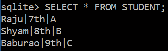

# Python SQLite–插入数据

> 原文:[https://www.geeksforgeeks.org/python-sqlite-insert-data/](https://www.geeksforgeeks.org/python-sqlite-insert-data/)

在本文中，我们将讨论如何使用 sqlite3 模块在来自 Python 的 SQLite 数据库的表中插入数据。SQL 的 **INSERT INTO** 语句用于在表中插入一个新行。使用 INSERT INTO 语句插入行有两种方式:

*   **仅值**:第一种方法是只指定要插入的数据的值，不指定列名。

> INSERT INTO table _ name VALUES(value 1，value2，value3，…)；
> 
> table_name:表的名称。
> 
> 值 1，值 2，..:新记录的第一列、第二列、…的值

*   **列名和值两者:**在第二种方法中，我们将指定要填充的列及其对应的值，如下所示:

> 插入表名(第 1 列，第 2 列，第 3 列，..)值(value1，value2，value3，..);
> 
> table_name:表的名称。
> 
> 第 1 列:第一列、第二列的名称…
> 
> 值 1、值 2、值 3:新记录的第一列、第二列、…的值

**示例 1:** 下面是一个程序，描述了如何仅使用值在 SQLite 表中插入数据。在程序中，我们首先创建一个名为 STUDENT 的表，然后使用 insert 查询的第一个语法将值插入其中。最后，我们显示表的内容并将其提交给数据库。

## 蟒蛇 3

```py
# Import module
import sqlite3

# Connecting to sqlite
conn = sqlite3.connect('geeks2.db')

# Creating a cursor object using the 
# cursor() method
cursor = conn.cursor()

# Creating table
table ="""CREATE TABLE STUDENT(NAME VARCHAR(255), CLASS VARCHAR(255),
SECTION VARCHAR(255));"""
cursor.execute(table)

# Queries to INSERT records.
cursor.execute('''INSERT INTO STUDENT VALUES ('Raju', '7th', 'A')''')
cursor.execute('''INSERT INTO STUDENT VALUES ('Shyam', '8th', 'B')''')
cursor.execute('''INSERT INTO STUDENT VALUES ('Baburao', '9th', 'C')''')

# Display data inserted
print("Data Inserted in the table: ")
data=cursor.execute('''SELECT * FROM STUDENT''')
for row in data:
    print(row)

# Commit your changes in the database    
conn.commit()

# Closing the connection
conn.close()
```

**输出:**



**SQLite3:**



**示例 2:** 下面的程序类似于第一个程序，但是我们通过用值重新排序列的名称将值插入到表中，如第二个语法一样。

## 蟒蛇 3

```py
# Import module
import sqlite3

# Connecting to sqlite
conn = sqlite3.connect('geek.db')

# Creating a cursor object using the 
# cursor() method
cursor = conn.cursor()

# Creating table
table ="""CREATE TABLE STUDENT(NAME VARCHAR(255), CLASS VARCHAR(255),
SECTION VARCHAR(255));"""
cursor.execute(table)

# Queries to INSERT records.
cursor.execute(
  '''INSERT INTO STUDENT (CLASS, SECTION, NAME) VALUES ('7th', 'A', 'Raju')''')

cursor.execute(
  '''INSERT INTO STUDENT (SECTION, NAME, CLASS) VALUES ('B', 'Shyam', '8th')''')

cursor.execute(
  '''INSERT INTO STUDENT (NAME, CLASS, SECTION ) VALUES ('Baburao', '9th', 'C')''')

# Display data inserted
print("Data Inserted in the table: ")
data=cursor.execute('''SELECT * FROM STUDENT''')
for row in data:
    print(row)

# Commit your changes in 
# the database    
conn.commit()

# Closing the connection
conn.close()
```

**输出:**


**SQLite3:**

