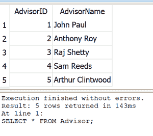
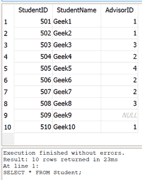

# Python SQlite–JOIN 子句

> 原文:[https://www.geeksforgeeks.org/python-sqlite-join-clause/](https://www.geeksforgeeks.org/python-sqlite-join-clause/)

在本文中，我们使用 Python 中的 **sqlite3** 模块来讨论 SQLite 中的 JOIN 子句。但是首先让我们看一下关于 SQLite 中的 join 的简介。

### 连接条款

JOIN 子句根据公共属性组合两个表中的记录。不同类型的连接如下:

*   **内部连接**(或连接)–给出两个表中具有共同属性的记录。
*   **LEFT JOIN–**给出左表的所有记录，只给出右表的公共记录。
*   **RIGHT JOIN–**给出右表的所有记录，只给出左表的公共记录。
*   **完全外部连接–**当左表或右表中有公共属性时，给出所有记录。
*   **交叉连接–**给出一个表的记录和另一个表的所有其他记录。


**注:**

*   与其他类型的联接不同，它不包括联接条件。
*   SQLite 不直接支持右连接和全外连接。

### 创建数据库

在这里，我们将创建一个简单的数据库，它有两个表 Advisor(AdvisorID，AdvisorName)和 Student(StudentID，StudentName，AdvisorID)，其中 Student 表的 AdvisorID 是引用 Advisor 表的 AdvisorID 的外键。

## 蟒蛇 3

```py
# Import required libraries
import sqlite3

# Connect to SQLite database
# New file created if it doesn't already exist
conn = sqlite3.connect(r'C:\Users\SQLite\Geeks.db')

# Create cursor object
cursor = conn.cursor()

# Create and populate tables
cursor.executescript('''
CREATE TABLE Advisor(
AdvisorID INTEGER NOT NULL,
AdvisorName TEXT NOT NULL,
PRIMARY KEY(AdvisorID)
);

CREATE TABLE Student(
StudentID NUMERIC NOT NULL,
StudentName NUMERIC NOT NULL,
AdvisorID INTEGER,
FOREIGN KEY(AdvisorID) REFERENCES Advisor(AdvisorID),
PRIMARY KEY(StudentID)
);

INSERT INTO Advisor(AdvisorID, AdvisorName) VALUES
(1,"John Paul"), 
(2,"Anthony Roy"), 
(3,"Raj Shetty"),
(4,"Sam Reeds"),
(5,"Arthur Clintwood");

INSERT INTO Student(StudentID, StudentName, AdvisorID) VALUES
(501,"Geek1",1),
(502,"Geek2",1),
(503,"Geek3",3),
(504,"Geek4",2),
(505,"Geek5",4),
(506,"Geek6",2),
(507,"Geek7",2),
(508,"Geek8",3),
(509,"Geek9",NULL),
(510,"Geek10",1);

''')

#Commit changes to database
conn.commit()

# Closing the connection
conn.close()
```

**创建的表格:**



顾问表



学生表

现在，让我们对上面创建的数据库执行不同类型的连接。

### **内部连接**

内部联接也表示为联接，它给出两个表中具有共同属性的记录。

> **语法:**
> 
> 选择列
> 
> 来自表 1
> 
> [INNER] JOIN 表 2
> 
> ON 表 1.column =表 2 . column；
> 
> INNER 关键字是可选的

## 蟒蛇 3

```py
# Import required libraries
import sqlite3

# Connect to SQLite database
conn = sqlite3.connect(r'C:\Users\SQLite\Geeks.db')

# Create cursor object
cursor = conn.cursor()

# Query for INNER JOIN
sql = '''SELECT StudentID, StudentName, AdvisorName 
FROM Student 
INNER JOIN Advisor
ON Student.AdvisorID = Advisor.AdvisorID;'''

# Executing the query
cursor.execute(sql)

# Fetching rows from the result table
result = cursor.fetchall()
for row in result:
    print(row)

# Closing the connection
conn.close()
```

**输出:**


### **左连接**

给出左表中的所有记录，仅给出右表中的公共记录。

> **语法:**
> 
> 选择列
> 
> 来自表 1
> 
> 左[外]连接表 2
> 
> ON 表 1.column =表 2 . column；
> 
> OUTER 关键字是可选的

## 蟒蛇 3

```py
# Import required libraries
import sqlite3

# Connect to SQLite database
conn = sqlite3.connect(r'C:\Users\SQLite\Geeks.db')

# Create cursor object
cursor = conn.cursor()

# Query for LEFT JOIN
sql = '''SELECT StudentID, StudentName, AdvisorName 
FROM Student 
LEFT JOIN Advisor
USING(AdvisorID) ;'''

# Executing the query
cursor.execute(sql)

# Fetching rows from the result table
result = cursor.fetchall()
for row in result:
    print(row)

# Closing the connection
conn.close()
```

由于联接表的列名(建议名)是相同的，所以可以使用子句 USING(建议名)来代替 ON Student。advisory id = advisor . advisory id

**输出:**


### **右连接**

给出右表中的所有记录，只给出左表中的公共记录。如前所述，SQLite 不直接支持 RIGHT JOIN。但是，可以通过切换学生和顾问表的位置，使用 LEFT JOIN 对其进行模拟。

> **语法:**
> 
> 选择列
> 
> 来自表 1
> 
> 右[外]连接表 2
> 
> ON 表 1.column =表 2 . column；
> 
> OUTER 关键字是可选的

## 蟒蛇 3

```py
# Import required libraries
import sqlite3

# Connect to SQLite database
conn = sqlite3.connect(r'C:\Users\SQLite\Geeks.db')

# Create cursor object
cursor = conn.cursor()

# Query for RIGHT JOIN
sql = '''SELECT StudentID, StudentName, AdvisorName 
FROM Advisor 
LEFT JOIN Student
USING(AdvisorID);'''

# Executing the query
cursor.execute(sql)

# Fetching rows from the result table
result = cursor.fetchall()
for row in result:
    print(row)

# Closing the connection
conn.close()
```

**输出:**


### **完全外部连接**

当左表或右表中有公共属性时，给出所有记录。如前所述，SQLite 不直接支持完全外部连接。但是，它可以使用 LEFT JOIN 进行模拟。在这个查询中，第二个 SELECT 语句切换了学生和顾问表的位置。UNION ALL 子句保留两个 SELECT 查询结果中的重复行。第二条 SELECT 语句中的 WHERE 子句删除已经包含在第一条 SELECT 语句的结果集中的行。

> **语法:**
> 
> 选择列
> 
> 来自表 1
> 
> 完全[外部]连接表 2
> 
> ON 表 1.column =表 2 . column；
> 
> OUTER 关键字是可选的

## 蟒蛇 3

```py
# Import required libraries
import sqlite3

# Connect to SQLite database
conn = sqlite3.connect(r'C:\Users\SQLite\Geeks.db')

# Create cursor object
cursor = conn.cursor()

# Query for FULL OUTER JOIN
sql = '''SELECT StudentID, StudentName, AdvisorName 
FROM Student 
LEFT JOIN Advisor
USING(AdvisorID)
UNION ALL
SELECT StudentID, StudentName, AdvisorName 
FROM Advisor 
LEFT JOIN Student
USING(AdvisorID)
WHERE Student.AdvisorID IS NULL;'''

# Executing the query
cursor.execute(sql)

# Fetching rows from the result table
result = cursor.fetchall()
for row in result:
    print(row)

# Closing the connection
conn.close()
```

**输出:**


**交叉连接**

它将一个表的所有记录与另一个表的所有其他记录组合在一起，也就是说，它从联接表中创建记录的笛卡尔乘积。

> **语法:**
> 
> 选择列
> 
> 来自表 1
> 
> CROSS JOIN 表 2；

## 蟒蛇 3

```py
# Import required libraries
import sqlite3

# Connect to SQLite database
conn = sqlite3.connect(r'C:\Users\SQLite\Geeks.db')

# Create cursor object
cursor = conn.cursor()

# Query for CROSS JOIN
sql = '''SELECT StudentID, StudentName, AdvisorName 
FROM Student 
CROSS JOIN Advisor;'''

# Executing the query
cursor.execute(sql)

# Fetching rows from the result table
result = cursor.fetchall()
for row in result:
    print(row)

# Closing the connection
conn.close()
```

**输出:**

