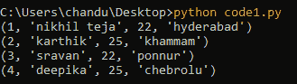

# Python SQlite–限制条款

> 原文:[https://www.geeksforgeeks.org/python-sqlite-limit-clause/](https://www.geeksforgeeks.org/python-sqlite-limit-clause/)

在本文中，我们将使用 Python 讨论 SQLite 中的 LIMIT 子句。但是首先，让我们简单了解一下 LIMIT 条款。

如果有许多元组满足查询条件，那么一次只查看少数元组可能是明智的。 **LIMIT 关键字**用于限制 SELECT 语句给出的数据。

> **语法:**
> 
> 选择第 1 列、第 2 列、第 n 列
> 
> 从表名
> 
> 限制[行数]；
> 
> 其中行数是一个整数值，指定为要从表中输出的行数。

让我们创建一个数据库。

## 蟒蛇 3

```
# importing sqlite module
import sqlite3

# create connection to the database 
# geeks_database
connection = sqlite3.connect('geeks_database.db')

# create table named address of customers
# with 4 columns id,name age and address
connection.execute('''CREATE TABLE customer_address
         (ID INT PRIMARY KEY     NOT NULL,
         NAME           TEXT    NOT NULL,
         AGE            INT     NOT NULL,
         ADDRESS        CHAR(50)); ''')

# close the connection
connection.close()
```

**输出:**


现在，在客户地址表中插入 5 条记录。

## 蟒蛇 3

```
# importing sqlite module
import sqlite3

# create connection to the database 
# geeks_database
connection = sqlite3.connect('geeks_database.db')

# insert records into table
connection.execute(
    "INSERT INTO customer_address VALUES (1, 'nikhil teja', 22, 'hyderabad' )")

connection.execute(
    "INSERT INTO customer_address VALUES (2, 'karthik', 25, 'khammam')")

connection.execute(
    "INSERT INTO customer_address VALUES (3, 'sravan', 22, 'ponnur' )")

connection.execute(
    "INSERT INTO customer_address VALUES (4, 'deepika', 25, 'chebrolu' )")

connection.execute(
    "INSERT INTO customer_address VALUES (5, 'jyothika', 22, 'noida')")

# close the connection
connection.close()
```

**输出:**


添加数据后，让我们执行限制操作。在本例中，我们将显示表格中的前 4 个数据。

## 蟒蛇 3

```
# importing sqlite module
import sqlite3

# create connection to the database 
# geeks_database
connection = sqlite3.connect('geeks_database.db')

# sql query to display top4 data from table
cursor = connection.execute("SELECT * FROM customer_address LIMIT 4")

# display data row by row
for i in cursor:
    print(i)

# close the connection
connection.close()
```

**输出:**



这样，我们可以限制输出中的行，并通过将 LIMIT 设置为 N 来打印前 N 行。