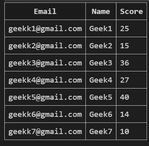

# Python SQLite–从表中选择数据

> 原文:[https://www . geesforgeks . org/python-SQLite-select-data-from-table/](https://www.geeksforgeeks.org/python-sqlite-select-data-from-table/)

在本文中，我们将讨论 Python SQLite 模块的 select 语句。该语句用于从 SQLite 表中检索数据，并返回表中包含的数据。

在 SQLite 中，选择语句的语法是:

> 选择*从表名；
> 
> *:表示表中的所有列
> 
> 要选择特定列，请用一个或多个列名替换*。

现在，我们将在 Python 程序中使用 Select 语句，并查看结果:

**展示我们的 GEEK 表:**



**创建上表:**

在这里，我们将使用上述方法创建表格。

## 蟒蛇 3

```
import sqlite3

# Connecting to sqlite
# connection object
connection_obj = sqlite3.connect('geek.db')

# cursor object
cursor_obj = connection_obj.cursor()

connection_obj.execute("""CREATE TABLE GEEK(
  Email varchar(255),
  Name varchar(50),
  Score int
  );""")

connection_obj.execute(
    """INSERT INTO GEEK (Email,Name,Score) VALUES ("geekk1@gmail.com","Geek1",25)""")
connection_obj.execute(
    """INSERT INTO GEEK (Email,Name,Score) VALUES ("geekk2@gmail.com","Geek2",15)""")
connection_obj.execute(
    """INSERT INTO GEEK (Email,Name,Score) VALUES ("geekk3@gmail.com","Geek3",36)""")
connection_obj.execute(
    """INSERT INTO GEEK (Email,Name,Score) VALUES ("geekk4@gmail.com","Geek4",27)""")
connection_obj.execute(
    """INSERT INTO GEEK (Email,Name,Score) VALUES ("geekk5@gmail.com","Geek5",40)""")
connection_obj.execute(
    """INSERT INTO GEEK (Email,Name,Score) VALUES ("geekk6@gmail.com","Geek6",36)""")
connection_obj.execute(
    """INSERT INTO GEEK (Email,Name,Score) VALUES ("geekk7@gmail.com","Geek7",27)""")

connection_obj.commit()

# Close the connection
connection_obj.close()
```