# Python SQLite–更新数据

> 原文:[https://www.geeksforgeeks.org/python-sqlite-update-data/](https://www.geeksforgeeks.org/python-sqlite-update-data/)

在本文中，我们将讨论如何使用 Python–SQLite 3 模块更新 SQLite 数据库中表中的数据。

SQL 中的 UPDATE 语句用于更新数据库中现有表的数据。根据我们的需求，我们可以使用 update 语句更新单个列和多个列。

#### 语法:

> UPDATE table_name SET 列 1 =值 1，列 2 =值 2，…
> 
> WHERE 条件；

在上面的语法中，SET 语句用于为特定列设置新值，WHERE 子句用于选择需要更新列的行。

下面是一些描述如何更新 SQLite 表中数据的例子。

**示例 1:****Python SQLite 程序更新特定列。在本例中，我们首先要创建一个 EMPLOYEE 表，并将值插入其中。然后我们要把年龄小于 25 岁的员工的收入定为 5000**

## **蟒蛇 3**

```
# Import module
import sqlite3

# Connecting to sqlite
conn = sqlite3.connect('gfg1.db')

# Creating a cursor object using 
# the cursor() method
cursor = conn.cursor()

# Creating table
table = 
"""CREATE TABLE EMPLOYEE(FIRST_NAME VARCHAR(255), 
LAST_NAME VARCHAR(255),AGE int, SEX VARCHAR(255), INCOME int);"""
cursor.execute(table)

# Queries to INSERT records.
cursor.execute(
    '''INSERT INTO EMPLOYEE(FIRST_NAME, LAST_NAME, AGE, SEX, INCOME) 
    VALUES ('Anand', 'Choubey', 25, 'M', 10000)''')

cursor.execute(
    '''INSERT INTO EMPLOYEE(FIRST_NAME, LAST_NAME, AGE, SEX, INCOME) 
    VALUES ('Mukesh', 'Sharma', 20, 'M', 9000)''')

cursor.execute(
    '''INSERT INTO EMPLOYEE(FIRST_NAME, LAST_NAME, AGE, SEX, INCOME)
    VALUES ('Ankit', 'Pandey', 24, 'M', 6300)''')

cursor.execute(
    '''INSERT INTO EMPLOYEE(FIRST_NAME, LAST_NAME, AGE, SEX, INCOME)
    VALUES ('Subhdra ', 'Singh', 26, 'F', 8000)''')

cursor.execute(
    '''INSERT INTO EMPLOYEE(FIRST_NAME, LAST_NAME, AGE, SEX, INCOME)
    VALUES ('Tanu', 'Mishra', 24, 'F', 6500)''')

# Display data inserted
print("EMPLOYEE Table: ")
data = cursor.execute('''SELECT * FROM EMPLOYEE''')
for row in data:
    print(row)

# Updating
cursor.execute('''UPDATE EMPLOYEE SET INCOME = 5000 WHERE Age<25;''')
print('\nAfter Updating...\n')

# Display data
print("EMPLOYEE Table: ")
data = cursor.execute('''SELECT * FROM EMPLOYEE''')
for row in data:
    print(row)

# Commit your changes in the database
conn.commit()

# Closing the connection
conn.close()
```

****输出:****

**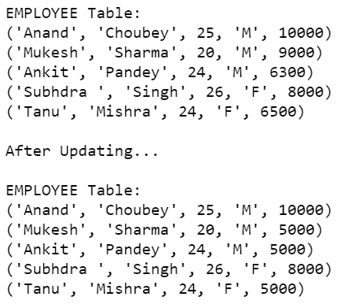**

****SQLite:****

****

****示例 2:** 在本程序中，我们创建了一个与上一个示例相似的表。这里我们将女性员工的年龄指定为 0。**

## **蟒蛇 3**

```
# Import module
import sqlite3

# Connecting to sqlite
conn = sqlite3.connect('geeks1.db')

# Creating a cursor object using the cursor() method
cursor = conn.cursor()

# Creating table
table = """CREATE TABLE EMPLOYEE(FIRST_NAME VARCHAR(255), 
LAST_NAME VARCHAR(255),AGE int, SEX VARCHAR(255), INCOME int);"""
cursor.execute(table)

# Queries to INSERT records.
cursor.execute(
    '''INSERT INTO EMPLOYEE(FIRST_NAME, LAST_NAME, AGE, SEX, INCOME) 
    VALUES ('Anand', 'Choubey', 25, 'M', 10000)''')

cursor.execute(
    '''INSERT INTO EMPLOYEE(FIRST_NAME, LAST_NAME, AGE, SEX, INCOME) 
    VALUES ('Mukesh', 'Sharma', 20, 'M', 9000)''')

cursor.execute(
    '''INSERT INTO EMPLOYEE(FIRST_NAME, LAST_NAME, AGE, SEX, INCOME) 
    VALUES ('Ankit', 'Pandey', 24, 'M', 6300)''')

cursor.execute(
    '''INSERT INTO EMPLOYEE(FIRST_NAME, LAST_NAME, AGE, SEX, INCOME) 
    VALUES ('Subhdra ', 'Singh', 26, 'F', 8000)''')

cursor.execute(
    '''INSERT INTO EMPLOYEE(FIRST_NAME, LAST_NAME, AGE, SEX, INCOME) 
    VALUES ('Tanu', 'Mishra', 24, 'F', 6500)''')

# Display data inserted
print("EMPLOYEE Table: ")
data = cursor.execute('''SELECT * FROM EMPLOYEE''')
for row in data:
    print(row)

# Updating
cursor.execute('''UPDATE EMPLOYEE SET AGE = 0 WHERE SEX='F';''')
print('\nAfer Updating...\n')

# Display data
print("EMPLOYEE Table: ")
data = cursor.execute('''SELECT * FROM EMPLOYEE''')
for row in data:
    print(row)

# Commit your changes in the database
conn.commit()

# Closing the connection
conn.close()
```

****输出:****

**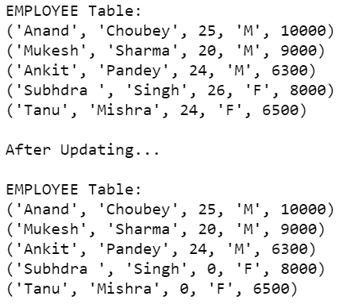**

****SQLite:****

**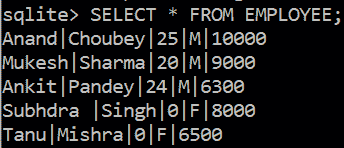**

****示例 3:** 在下面的程序中，我们使用 update 语句更新多个列。在这个例子中，我们首先要创建一个 STAFF 表，并将值插入其中。然后我们将更新所有列，即部门为计算机的员工的所有属性。**

## **蟒蛇 3**

```
# Import module
import sqlite3

# Connecting to sqlite
conn = sqlite3.connect('gfg3.db')

# Creating a cursor object using the cursor() method
cursor = conn.cursor()

# Creating table
table ="""CREATE TABLE STAFF(NAME VARCHAR(255), AGE int,
DEPARTMENT VARCHAR(255));"""
cursor.execute(table)

# Queries to INSERT records.
cursor.execute('''INSERT INTO STAFF VALUES('Anand', 45, 'Chemistry')''')
cursor.execute('''INSERT INTO STAFF VALUES('Ravi', 32, 'Physics')''')
cursor.execute('''INSERT INTO STAFF VALUES('Chandini', 32, 'Computer')''')
cursor.execute('''INSERT INTO STAFF VALUES('Latika', 40, 'Maths')''')

# Display data inserted
print("STAFF Table: ")
data=cursor.execute('''SELECT * FROM STAFF''')
for row in data:
    print(row)

# Updating    
cursor.execute('''UPDATE STAFF SET NAME = 'Ram', AGE = 30, 
DEPARTMENT = 'Biology' WHERE DEPARTMENT = 'Computer';''')
print('\nAfter Updating...\n')

# Display data 
print("STAFF Table: ")
data=cursor.execute('''SELECT * FROM STAFF''')
for row in data:
    print(row)

# Commit your changes in the database    
conn.commit()

# Closing the connection
conn.close()
```

****输出:****

**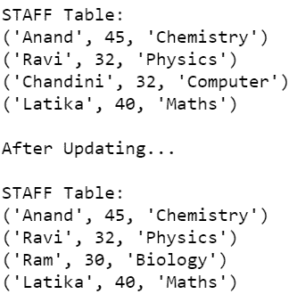**

****SQLite:****

**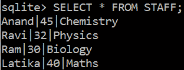**

****示例 4:** 在下面的程序中，我们创建了前面的表，并更新了化学系员工的姓名和年龄。**

## **蟒蛇 3**

```
# Import module
import sqlite3

# Connecting to sqlite
conn = sqlite3.connect('gfg4.db')

# Creating a cursor object using the cursor() method
cursor = conn.cursor()

# Creating table
table ="""CREATE TABLE STAFF(NAME VARCHAR(255), AGE int,
DEPARTMENT VARCHAR(255));"""
cursor.execute(table)

# Queries to INSERT records.
cursor.execute('''INSERT INTO STAFF VALUES('Anand', 45, 'Chemistry')''')
cursor.execute('''INSERT INTO STAFF VALUES('Ravi', 32, 'Physics')''')
cursor.execute('''INSERT INTO STAFF VALUES('Chandini', 32, 'Computer')''')
cursor.execute('''INSERT INTO STAFF VALUES('Latika', 40, 'Maths')''')

# Display data inserted
print("STAFF Table: ")
data=cursor.execute('''SELECT * FROM STAFF''')
for row in data:
    print(row)

# Updating    
cursor.execute('''UPDATE STAFF SET NAME = 'Chandini', 
AGE = 32 WHERE DEPARTMENT = 'Chemistry';''')
print('\nAfter Updating...\n')

# Display data 
print("STAFF Table: ")
data=cursor.execute('''SELECT * FROM STAFF''')
for row in data:
    print(row)

# Commit your changes in the database    
conn.commit()

# Closing the connection
conn.close()
```

****输出:****

**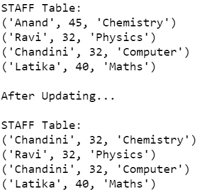**

****SQLite:****

**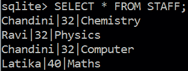**

****示例 5:** 下面的程序描述了不带 WHERE 语句的 UPDATE 语句的使用。在这个程序中，我们创建了 STUDENT 表，并将值插入其中。之后，我们更新所有学生的 SECTION 列，将其分配给 x。**

## **蟒蛇 3**

```
# Import module
import sqlite3

# Connecting to sqlite
conn = sqlite3.connect('gfg5.db')

# Creating a cursor object using the cursor() method
cursor = conn.cursor()

# Creating table
table ="""CREATE TABLE STUDENT(NAME VARCHAR(255), CLASS VARCHAR(255),
SECTION VARCHAR(255));"""
cursor.execute(table)

# Queries to INSERT records.
cursor.execute('''INSERT INTO STUDENT VALUES ('Raju', '7th', 'A')''')
cursor.execute('''INSERT INTO STUDENT VALUES ('Shyam', '8th', 'B')''')
cursor.execute('''INSERT INTO STUDENT VALUES ('Baburao', '9th', 'C')''')

# Display data inserted
print("STUDENT Table: ")
data=cursor.execute('''SELECT * FROM STUDENT''')
for row in data:
    print(row)

# Updating    
cursor.execute('''UPDATE STUDENT SET SECTION = 'X';''')
print('\nAfter Updating...\n')

# Display data 
print("STUDENT Table: ")
data=cursor.execute('''SELECT * FROM STUDENT''')
for row in data:
    print(row)

# Commit your changes in the database    
conn.commit()

# Closing the connection
conn.close()
```

****输出:****

**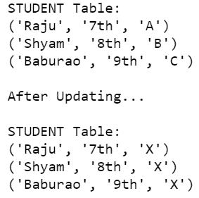**

****SQLite:****

**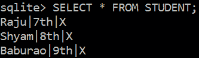**

****示例 6:** 在下面的程序中，我们创建了一个简单的 STUDENT 表，并仅使用 update 和 SET 查询将所有数据更新到其中。**

## **蟒蛇 3**

```
# Import module
import sqlite3

# Connecting to sqlite
conn = sqlite3.connect('gfg6.db')

# Creating a cursor object using the cursor() method
cursor = conn.cursor()

# Creating table
table ="""CREATE TABLE STUDENT(NAME VARCHAR(255), CLASS VARCHAR(255),
SECTION VARCHAR(255));"""
cursor.execute(table)

# Queries to INSERT records.
cursor.execute('''INSERT INTO STUDENT VALUES ('Raju', '7th', 'A')''')
cursor.execute('''INSERT INTO STUDENT VALUES ('Shyam', '8th', 'B')''')
cursor.execute('''INSERT INTO STUDENT VALUES ('Baburao', '9th', 'C')''')

# Display data inserted
print("STUDENT Table: ")
data=cursor.execute('''SELECT * FROM STUDENT''')
for row in data:
    print(row)

# Updating    
cursor.execute('''UPDATE STUDENT SET NAME = 'X',
CLASS = 'Y', SECTION = 'Z';''')
print('\nAfter Updating...\n')

# Display data 
print("STUDENT Table: ")
data=cursor.execute('''SELECT * FROM STUDENT''')
for row in data:
    print(row)

# Commit your changes in the database    
conn.commit()

# Closing the connection
conn.close()
```

****输出:****

**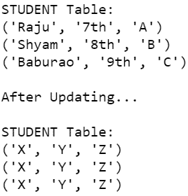**

****SQLite:****

**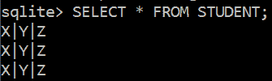**