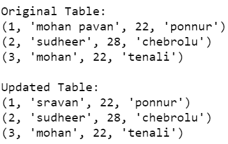
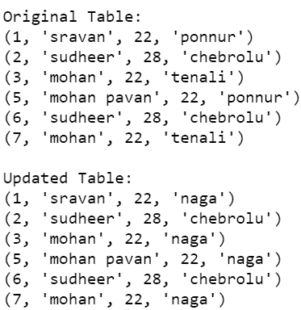

# Python SQLite–更新特定列

> 原文:[https://www . geesforgeks . org/python-SQLite-update-specific-column/](https://www.geeksforgeeks.org/python-sqlite-update-specific-column/)

在本文中，我们将讨论如何使用 Python 在 SQLite 中更新表的特定列。

为了在 SQL 中更新表中的特定列，我们使用 **UPDATE 查询。**SQL 中的 UPDATE 语句用于更新数据库中现有表的数据。根据我们的需求，我们可以使用 update 语句更新单个列和多个列。

**语法:**

> 更新表名
> 
> 设置列 1 =值 1，列 2 =值 2。，列 n =值 n
> 
> 其中[条件]；

下面是一些描述如何使用 Python 在 SQLite 中使用 UPDATE 查询的例子。

**示例 1:** 我们将创建一个 STUDENT 表，然后通过更新表中 SID 为 1 的学生的 SNAME 在其中执行更新操作。

## 蟒蛇 3

```
# importing sqlite3 module
import sqlite3

# create connection by using object to 
# connect with gfg database
connection = sqlite3.connect('gfg.db')

# query to create a table named STUDENT
connection.execute(''' CREATE TABLE STUDENTS
         (SID INT PRIMARY KEY     NOT NULL,
         SNAME           TEXT    NOT NULL,
         SAGE            INT     NOT NULL,
         ADDRESS        CHAR(50));
         ''')

# insert query to insert student details 
# in the above table
connection.execute(
    "INSERT INTO STUDENTS VALUES (1, 'mohan pavan', 22, 'ponnur' )")

connection.execute(
    "INSERT INTO STUDENTS VALUES (2, 'sudheer', 28, 'chebrolu' )")

connection.execute(
  "INSERT INTO STUDENTS VALUES (3, 'mohan', 22, 'tenali' )")

# creating cursor object to display all 
# the data in the table
cursor = connection.execute("SELECT * from STUDENTS")

# display data
print('\nOriginal Table:')
for row in cursor:
    print(row)

# update query to update sname to sravan 
# where id = 1
connection.execute("UPDATE STUDENTS set SNAME = 'sravan' where SID = 1")

# save the changes
connection.commit()

# creating cursor object to display all
# the data in the table
cursor = connection.execute("SELECT * from STUDENTS")

# display data
print('\nUpdated Table:')
for row in cursor:
    print(row)
```

**输出:**



**例 2:**

这里是另一个程序，我们更新同一表中 SAGE 列值为 22 的所有行的 ADDRESS。

## 蟒蛇 3

```
# importing sqlite3 module
import sqlite3

# create connection by using object 
# to connect with gfg database
connection = sqlite3.connect('gfg.db')

# insert query to insert student details
# in the above table
connection.execute(
    "INSERT INTO STUDENTS VALUES (5, 'mohan pavan', 22, 'ponnur' )")

connection.execute(
    "INSERT INTO STUDENTS VALUES (6, 'sudheer', 28, 'chebrolu' )")

connection.execute(
  "INSERT INTO STUDENTS VALUES (7, 'mohan', 22, 'tenali' )")

# creating cursor object to display all
# the data in the table
cursor = connection.execute("SELECT * from STUDENTS")

# display data
print('\nOriginal Table:')
for row in cursor:
    print(row)

# update query to update ADDRESS
connection.execute("UPDATE STUDENTS set ADDRESS = 'naga' where SAGE = 22")

# save the changes
connection.commit()

# creating cursor object to display 
# all the data in the table
cursor = connection.execute("SELECT * from STUDENTS")

# display data
print('\nUpdated Table:')
for row in cursor:
    print(row)
```

**输出:**

