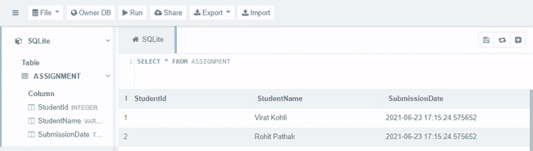
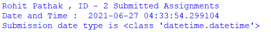

# Python SQlite–使用日期和日期时间

> 原文:[https://www . geesforgeks . org/python-SQLite-使用日期和时间/](https://www.geeksforgeeks.org/python-sqlite-working-with-date-and-datetime/)

**SQLite** 不支持内置 DateTime 存储一个类，但是 SQLite 允许我们使用时间戳类型。我们可以通过将存储在 SQLite 数据库表中的 Python 日期和日期时间信息转换为 Python 日期和[日期时间](https://www.geeksforgeeks.org/python-datetime-module-with-examples/)类型来存储和检索它们，反之亦然。

在插入日期时间值时，python sqlite3 模块将日期时间转换为字符串格式。当从 SQLite 表中检索日期时间值时，sqlite3 模块将它们转换为字符串对象。但是我们不想要字符串类型。我们希望日期时间以日期时间类型存储。为此，我们需要使用**detect _ type**，因为它在 sqlite3 模块的 connect 方法中将 **PARSE_DECLTYPES** 和 **PARSE_COLNAMES** 作为参数。

> **语法:** connect('DATABASE NAME '，detect _ types = sqlite3。PARSE_DECLTYPES | sqlite3。PARSE_COLNAMES)

**sqlite3。PARSE _ DECLTYPES:**SQLite 3 模块解析它返回的每一列的声明类型，然后使用类型转换器字典来执行为该类型注册的转换器函数。

**sqlite3。PARSE _ COLNAMES:**SQLite 接口解析它返回的每个列的列名。它将使用转换器字典，然后使用在那里找到的转换器函数来返回值。

### 插入日期和日期时间数据

首先，我们需要导入 datetime 模块并获取当前的时间和日期信息**现在可以使用()**函数。然后，他们将日期时间信息存储在一个变量中，这样它就可以用来在 SQLite 表中插入日期时间。为了在表中存储日期时间信息，我们需要使用列数据类型作为“时间戳”。

```py
column_name TIMESTAMP
```

下面的代码创建了一个数据库“StudentAssignment.db”和一个表“Assignment”。该代码还将数据插入到包含日期时间信息的表中。

## 蟒蛇 3

```py
import datetime
import sqlite3

# get the current datetime and store it in a variable
currentDateTime = datetime.datetime.now()

# make the database connection with detect_types
connection = sqlite3.connect('StudentAssignment.db',
                             detect_types=sqlite3.PARSE_DECLTYPES |
                             sqlite3.PARSE_COLNAMES)
cursor = connection.cursor()

# create table in database
createTable = '''CREATE TABLE ASSIGNMENT (
    StudentId INTEGER,
    StudentName VARCHAR(100),
    SubmissionDate TIMESTAMP);'''
cursor.execute(createTable)

# create query to insert the data
insertQuery = """INSERT INTO ASSIGNMENT
    VALUES (?, ?, ?);"""

# insert the data into table
cursor.execute(insertQuery, (1, "Virat Kohli",
                             currentDateTime))
cursor.execute(insertQuery, (2, "Rohit Pathak",
                             currentDateTime))
print("Data Inserted Successfully !")

# commit the changes,
# close the cursor and database connection
connection.commit()
cursor.close()
connection.close()
```

**输出:**

```py
Data Inserted Successfully !
```



### 检索日期和日期时间数据

为了从数据库表中检索存储的日期时间信息，我们可以简单地使用 select 查询，并可以访问各个行的数据。在这里，为了检索数据和检查存储数据的数据类型，我们需要在 sqlite3 模块的 connect 方法中使用**detect _ type**作为参数。

下面的代码从“赋值”表中检索存储的记录。该记录包含“datetime”类型信息。

## 蟒蛇 3

```py
import datetime
import sqlite3

# make a database connection and cursor object
connection = sqlite3.connect('StudentAssignment.db',
                             detect_types=sqlite3.PARSE_DECLTYPES |
                             sqlite3.PARSE_COLNAMES)
cursor = connection.cursor()

# select query to retrieve data
cursor.execute("SELECT * from ASSIGNMENT where StudentId = 2")
fetchedData = cursor.fetchall()

# to access specific fetched data
for row in fetchedData:
    StudentID = row[0]
    StudentName = row[1]
    SubmissionDate = row[2]
    print(StudentName, ", ID -",
          StudentID, "Submitted Assignments")
    print("Date and Time : ",
          SubmissionDate)
    print("Submission date type is",
          type(SubmissionDate))

# commit the changes,
# close the cursor and database connection
cursor.close()
connection.close()
```

**输出:**



正如我们从“分配”表中检索学生提交数据时在输出中看到的。我们访问了表格的每一行，并将它们打印在特定的消息中。第一行包含学生姓名和 ID，第二行我们打印学生提交作业的日期时间，第三行我们打印存储数据的类型，也就是我们存储在表中的日期时间的类型，即‘datetime . datetime’。