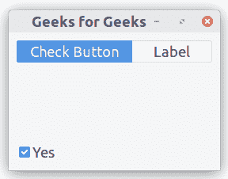
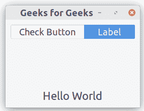

# Python–GTK+3 中的堆栈和堆栈开关

> 原文:[https://www . geesforgeks . org/python-stack-and-stackwitcher-in-GTK-3/](https://www.geeksforgeeks.org/python-stack-and-stackswitcher-in-gtk-3/)

一个`Gtk.Stack`是一个容器，允许一次看到它的一个孩子。Gtk。堆栈不为用户提供任何更改可见子级的直接访问。相反，`Gtk.StackSwitcher`小部件可以与`Gtk.Stack`一起使用来获得该功能。
在`Gtk.Stack`中，页面之间的过渡可以通过幻灯片或淡入淡出的方式完成。这可以用`Gtk.Stack.set_transition_type()`来控制。

`Gtk.StackSwitcher`小部件充当`Gtk.Stack`的控制器；它显示了一行按钮，用于在相关堆栈小部件的不同页面之间切换。按钮的内容来自`Gtk.Stack`的子属性。

**遵循以下步骤:**

1.  导入 GTK+ 3 模块。
2.  创建主窗口。
3.  实现堆栈。
4.  实现按钮。
5.  实施标签。
6.  实现 StackSwitcher。

**Example :**

```
import gi
# Since a system can have multiple versions
# of GTK + installed, we want to make 
# sure that we are importing GTK + 3.
gi.require_version("Gtk", "3.0")
from gi.repository import Gtk

class StackWindow(Gtk.Window):
    def __init__(self):
        Gtk.Window.__init__(self, title ="Geeks for Geeks")
        self.set_border_width(10)

        # Creating a box vertically oriented with a space of 100 pixel.
        vbox = Gtk.Box(orientation = Gtk.Orientation.VERTICAL, spacing = 100)
        self.add(vbox)

        # Creating stack, transition type and transition duration.
        stack = Gtk.Stack()
        stack.set_transition_type(Gtk.StackTransitionType.SLIDE_LEFT_RIGHT)
        stack.set_transition_duration(1000)

        # Creating the check button.
        checkbutton = Gtk.CheckButton("Yes")
        stack.add_titled(checkbutton, "check", "Check Button")

        # Creating label .
        label = Gtk.Label()
        label.set_markup("<big>Hello World</big>")
        stack.add_titled(label, "label", "Label")

        # Implementation of stack switcher.
        stack_switcher = Gtk.StackSwitcher()
        stack_switcher.set_stack(stack)
        vbox.pack_start(stack_switcher, True, True, 0)
        vbox.pack_start(stack, True, True, 0)

win = StackWindow()
win.connect("destroy", Gtk.main_quit)
win.show_all()
Gtk.main()
```

**输出:**

