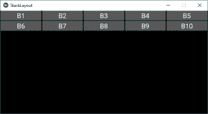
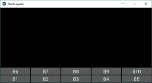
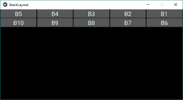
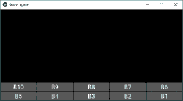
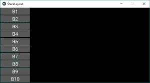
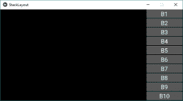
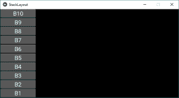
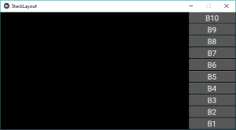

# Python |StackLayout in Kivy

> 原文:[https://www.geeksforgeeks.org/python-stacklayout-in-kivy/](https://www.geeksforgeeks.org/python-stacklayout-in-kivy/)

Kivy 是 Python 中独立于平台的 GUI 工具。因为它可以在安卓、IOS、linux 和 Windows 等平台上运行。它基本上是用来开发安卓应用程序的，但并不意味着它不能在桌面应用程序上使用。

> ？？？？？？？？ [Kivy 教程–通过示例学习 Kivy](https://www.geeksforgeeks.org/kivy-tutorial/)。

### StackLayout:

**要使用 StackLayout 首先通过下面的命令导入 StackLayout:**

```py
from kivy.uix.stacklayout import StackLayout
```

理解 Stack 和 [Boxlayout](https://www.geeksforgeeks.org/python-boxlayout-widget-in-kivy/) 的区别相当混乱。
**StackLayout** 能够以比 BoxLayout 更复杂的方式组织小部件 Boxlayout 能够以垂直或水平的方式组织小部件。但是有了 StackLayout，你可以把方向结合起来。有 4 个行方向和 4 个列方向。

```py
More flexible that Boxlayout(1D)

StackLayout Orientation (2D):
 - right to left or left to right
 - top to bottom or bottom to top
 - 'rl-bt', 'rl-tb', lr-bt', 'lr-tb'(Row wise)
 - 'bt-rl', 'bt-lr', 'tb-rl', 'tb-lr'(Column wise)
```

下图显示了四种行方向和四种列方向。

```py
Basic Approach to create Stack layout :

1) import kivy
2) import kivyApp
3) import Button
4) import Stacklayout
5) Set minimum version(optional)
6) create App class
7) return widget
8) Run an instance of the class
```

**实施办法:**

## 蟒蛇 3

```py
# code to show how to use StackLayout

# import kivy module
import kivy

# this restricts the kivy version i.e
# below this kivy version you cannot
# use the app or software
kivy.require("1.9.1")

# base Class of your App inherits from the App class.
# app:always refers to the instance of your application
from kivy.app import App

# creates the button in kivy
# if not imported shows the error
from kivy.uix.button import Button

# The StackLayout arranges children vertically
# or horizontally, as many as the layout can fit.
from kivy.uix.stacklayout import StackLayout

# class in which we are creating StackLayout
class StackLayoutApp(App):

    def build(self):

        # Different orientation
        # ['lr-tb', 'tb-lr', 'rl-tb', 'tb-rl',
           'lr-bt', 'bt-lr', 'rl-bt', 'bt-rl']       
        SL = StackLayout(orientation ='lr-tb')

        # Creating Multiple Buttons
        btn1 = Button(text ="B1",
                      font_size = 20,
                      size_hint =(.2, .1))
        btn2 = Button(text ="B2",
                      font_size = 20,
                      size_hint =(.2, .1))
        btn3 = Button(text ="B3",
                      font_size = 20,
                      size_hint =(.2, .1))
        btn4 = Button(text ="B4",
                      font_size = 20,
                      size_hint =(.2, .1))
        btn5 = Button(text ="B5",
                      font_size = 20,
                      size_hint =(.2, .1))
        btn6 = Button(text ="B6",
                      font_size = 20,
                      size_hint =(.2, .1))
        btn7 = Button(text ="B7",
                      font_size = 20,
                      size_hint =(.2, .1))
        btn8 = Button(text ="B8",
                      font_size = 20,
                      size_hint =(.2, .1))
        btn9 = Button(text ="B9",
                      font_size = 20,
                      size_hint =(.2, .1))
        btn10 = Button(text ="B10",
                      font_size = 20,
                      size_hint =(.2, .1))

        # adding widgets
        SL.add_widget(btn1)
        SL.add_widget(btn2)
        SL.add_widget(btn3)
        SL.add_widget(btn4)
        SL.add_widget(btn5)
        SL.add_widget(btn6)
        SL.add_widget(btn7)
        SL.add_widget(btn8)
        SL.add_widget(btn9)
        SL.add_widget(btn10)

        # returning widgets
        return SL

# run function runs the whole program
# i.e run() method which calls the
# target function passed to the constructor.
if __name__ == '__main__':
    StackLayoutApp().run()
```

**输出:**



这是为了“lr-tb”方向。首先从左到右添加小部件，然后从上到下添加。
**注意:**如果要改变方位，只需用以下任一方位改变 31 号线的方位–

```py
For row wise orientation use:
  -'lr-tb'
  -'lr-bt'
  -'rl-tb'
  -'rl-bt'

For column wise orientation use:
  -'tb-lr'
  -'tb-rl'
  -'bt-lr'
  -'bt-rl'
```

下面是上面所有方向的图片输出–
**行方向使用:**

```py
'lr-tb'
```

**输出:**


```py
'lr-bt'
```

**输出:**



```py
'rl-tb'
```

**输出:**



```py
'rl-bt'
```

**输出:**



**列方向使用:**

```py
'tb-lr'
```

**输出:**



```py
'tb-rl'
```

**输出:**



```py
'bt-lr'
```

**输出:**



```py
'bt-rl'
```

**输出:**

