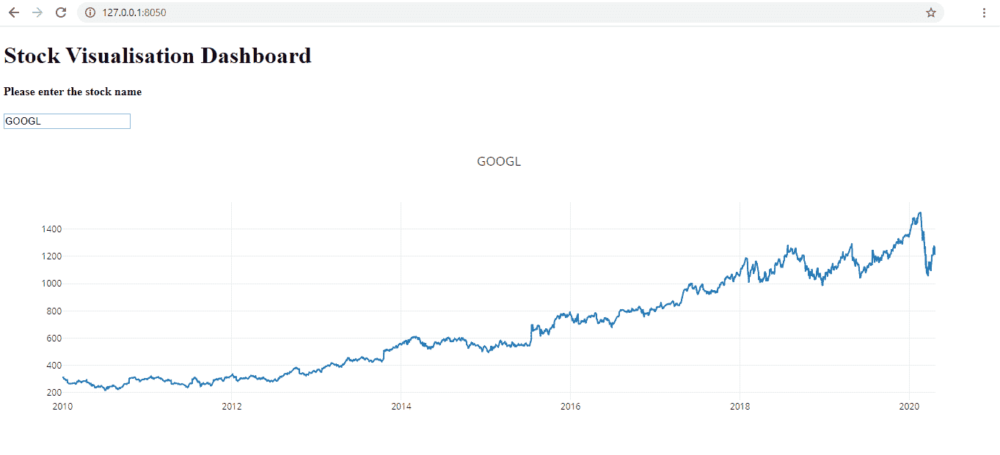

# python–股票数据可视化

> 原文:[https://www . geesforgeks . org/python-stock-data-visualization/](https://www.geeksforgeeks.org/python-stock-data-visualisation/)

Python 是进行基于数据的分析和可视化的优秀语言。还有一点也很有帮助，那就是有各种各样的开源库可以用来实现一些伟大的功能。
Python Dash 是一个库，允许您构建 web 仪表板和数据可视化，而无需复杂的前端 HTML、CSS 或 JavaScript 的麻烦。
在本文中，我们将学习使用 Python Dash、Pandas 和雅虎的财务 API 构建股票数据仪表板。

**安装:**
安装熊猫数据阅读器最新版本

```py
pip install pandas_datareader

```

安装最新版本的 Dash

```py
pip install dash

```

**实现:**
导入所有需要的库

```py
# importing required libraries
import datetime
import pandas_datareader.data as web
import dash
import dash_core_components as dcc    
import dash_html_components as html
from dash.dependencies import Input, Output 
```

现在让我们使用 dash 制作一个用户界面。我们将制作一个简单而实用的用户界面，一个简单的标题和一个输入文本框，供用户输入股票名称。

```py
# UI
app = dash.Dash()
app.title = "Stock Visualisation"
app.layout = html.Div(children =[
    html.H1("Stock Visualisation Dashboard"),

    html.H4("Please enter the stock name"),

    dcc.Input(id ='input', value ='', type ='text'),

    html.Div(id ='output-graph')
])
```

输入文本框现在只是一个静态文本框。为了从用户界面获取输入数据，在本例中是一家公司的股票名称，我们应该添加应用程序回调。读取的股票名称(*输入 _ 数据*)作为参数传递给方法*更新 _ 值*。然后，该函数从雅虎金融应用编程接口获取自 2010 年 1 月 1 日至今的所有股票数据，并存储在熊猫数据框中。绘制了一个图表，X 轴是数据框的指数，即以年为单位的时间，Y 轴是每天的收盘价，图表的名称是股票名称( *input_data* )。这个图被返回给回调包装器，然后在用户界面上显示它。
**代码:**

```py
def update_value(input_data):
    # Reads stock prices from 1st January 2010
    start = datetime.datetime(2010, 1, 1) 
    end = datetime.datetime.now()

    # Read stock data from yahoo's finance API from start to end 
    df = web.DataReader(input_data, 'yahoo', start, end)

    return dcc.Graph(id ="example",
        figure ={
            'data':[{'x':df.index, 'y':df.Close, 'type':'line', 'name':input_data},
            ],
            'layout':{
                'title':input_data
            }
        }
    )
```

**代码:最后运行服务器。**

```py
if __name__ == '__main__':
    app.run_server()
```

**执行:**
默认情况下，web 应用程序现在将在 8050 在本地主机上运行。

```py
127.0.0.1:8050

```

**例:**
我们来考虑一个例子。谷歌的股票名称是 GOOGL。让我们将这些数据输入到输入文本框中。
下面是结果。



谷歌股票数据截图