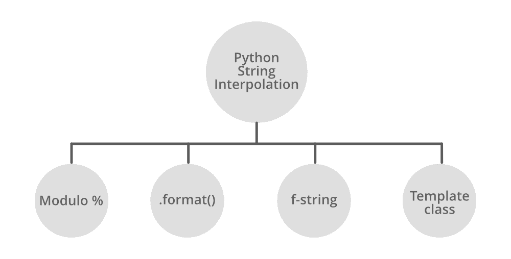

# Python 字符串插值

> 原文:[https://www.geeksforgeeks.org/python-string-interpolation/](https://www.geeksforgeeks.org/python-string-interpolation/)

**字符串插值**是将变量的值替换为字符串中占位符的过程。让我们考虑一个例子来更好地理解它，假设您想要在每次打印字符串时更改字符串的值，就像您想要打印“你好<名称>欢迎来到 geeksforgeeks”一样，其中<名称>是用户名称的占位符。Python 中的字符串插值可以帮助您使用用户名动态更改占位符，而不是每次都创建一个新字符串。



## %–格式

[%–格式化](https://www.geeksforgeeks.org/string-formatting-in-python-using/)是 Python 提供的一个特性，可以用%运算符访问。这类似于 c 语言中的 printf 样式函数。

**示例:**使用%运算符格式化字符串

## 蟒蛇 3

```py
# Python program to demonstrate
# string interpolation

n1 = 'Hello'
n2 = 'GeeksforGeeks'

# for single substitution
print("Welcome to % s" % n2)

# for single and multiple substitutions()
# mandatory
print("% s ! This is % s." % (n1, n2))
```

**Output**

```py
Welcome to GeeksforGeeks
Hello ! This is GeeksforGeeks.
```

假设它只是一个复杂的版本，但是如果我们有很多变量在字符串中被替换，因为我们并不总是想使用(“字符串”+变量+“字符串”+变量+“字符串”)这种表示，我们可以使用它。为此，我们可以使用%格式。

**注意:**要了解更多关于%-格式的信息，请参考 Python 中使用% 的[字符串格式](https://www.geeksforgeeks.org/string-formatting-in-python-using/)

## Str.format()

[str.format()](https://www.geeksforgeeks.org/python-format-function/) 的工作原理是将一对花括号{ }定义的一个或多个替换字段和占位符放入字符串中。我们希望放入占位符并与作为参数传递到 format 函数的字符串连接的值。

**示例:**使用 format()方法格式化字符串

## 蟒蛇 3

```py
# Python program to demonstrate
# string interpolation

n1 = 'Hello'
n2 = 'GeeksforGeeks'

# for single substitution
print('{}, {}'.format(n1, n2))
```

**Output**

```py
Hello, GeeksforGeeks
```

我们也可以在花括号{}中使用变量名。这将允许我们以任何我们想要的顺序使用格式函数的参数。

**示例:**用花括号内的变量格式化函数。

## 蟒蛇 3

```py
n1 = "Hello"
n2 = "GeeksForGeeks"

# for single or multiple substitutions
# let's say b1 and b2 are formal parameters
# and n1 and n2 are actual parameters
print("{b1}! This is {b2}.".format(b1=n1, b2=n2))

# we can also change the order of the
# variables in the string without changing
# the parameters of format function
print("{b2}! This is {b1}.".format(b1=n1, b2=n2))
```

**Output**

```py
Hello! This is GeeksForGeeks.
GeeksForGeeks! This is Hello.
```

**注意:**要了解更多 str.format()，请参考 Python 中的 [format()函数](https://www.geeksforgeeks.org/python-format-function/)

## f 字符串

PEP 498 引入了一种新的字符串格式化机制，称为文字字符串插值或更常见的 [F 字符串](http://geeksforgeeks.org/formatted-string-literals-f-strings-python/)(因为在字符串文字前面有一个前导 F 字符)。f-strings 背后的思想是使字符串插值更简单。

要创建 f 字符串，请在字符串前面加上字母“f”。字符串本身的格式可以与 str.format()的格式非常相似。F-strings 提供了一种简洁方便的方法，可以将 python 表达式嵌入到字符串文字中进行格式化。

**示例:**使用 f 字符串格式化字符串

## 蟒蛇 3

```py
# Python program to demonstrate
# string interpolation

n1 = 'Hello'
n2 = 'GeeksforGeeks'

# f tells Python to restore the value of two
# string variable name and program inside braces {}
print(f"{n1}! This is {n2}")
```

**Output**

```py
Hello! This is GeeksforGeeks
(2 * 3)-10 = -4
```

我们也可以使用 f 字符串来计算一些算术运算，它将执行内联算术。请参见下面的示例–

**示例:**使用 f 字符串的内联运算

## 蟒蛇 3

```py
a = 2
b = 3
c = 10

print(f"({a} * {b})-{c} = {(2 * 3)-10}")
```

**Output**

```py
(2 * 3)-10 = -4
```

**注意:**要了解更多 f 弦，请参考 Python 中的 [f 弦](https://www.geeksforgeeks.org/formatted-string-literals-f-strings-python/)

## 字符串模板类

在字符串模块中，模板类允许我们为输出规范创建简化的语法。该格式使用由$构成的占位符名称和有效的 Python 标识符(字母数字字符和下划线)。占位符周围用大括号括起来，这样后面就可以有更多的字母数字字母，中间没有空格。编写$会创建一个转义的$:

**示例:**使用模板类格式化字符串

## 蟒蛇 3

```py
# Python program to demonstrate
# string interpolation

from string import Template

n1 = 'Hello'
n2 = 'GeeksforGeeks'

# made a template which we used to
# pass two variable so n3 and n4
# formal and n1 and n2 actual
n = Template('$n3 ! This is $n4.')

# and pass the parameters into the template string.
print(n.substitute(n3=n1, n4=n2))
```

**Output**

```py
Hello ! This is GeeksforGeeks.
```

**注意:**要了解更多字符串模板类，请参考 Python 中的[字符串模板类](https://www.geeksforgeeks.org/template-class-in-python/)