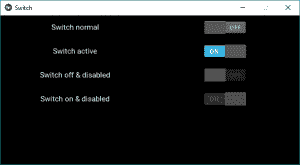
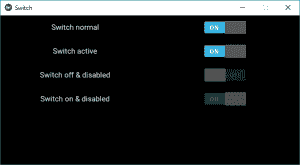
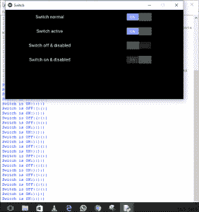

# Python | Switch 小部件在 Kivy 中使用。kv 文件

> 原文:[https://www . geesforgeks . org/python-switch-widget-in-kivy-using-kv-file/](https://www.geeksforgeeks.org/python-switch-widget-in-kivy-using-kv-file/)

Kivy 是 Python 中独立于平台的 GUI 工具。因为它可以在安卓、IOS、linux 和 Windows 等平台上运行。它基本上是用来开发安卓应用程序的，但并不意味着它不能在桌面应用程序上使用。

> ？？？？？？？？ [Kivy 教程–通过示例学习 Kivy](https://www.geeksforgeeks.org/kivy-tutorial/)。

### 开关小部件:

“开关”小部件处于活动或非活动状态，作为一个机械灯光开关。用户可以向左/向右滑动来激活/停用它。
开关表示的值为真或假。也就是说，开关可以处于接通位置或断开位置。
要使用交换机，您必须导入:

```
from kivy.uix.switch import Switch
```

**将回拨连接到交换机:**

*   交换机可以通过回叫来检索交换机的值。
*   开关的状态转换是从开到关或从关到开。
*   当交换机进行任何转换时，回调被触发，新的状态可以被检索，即来了，并且可以根据该状态采取任何其他行动。
*   默认情况下，小部件的表示是静态的。所需的最小尺寸是 83*32 像素。
*   整个小部件都是活动的，而不仅仅是有图形的部分。只要你扫过小部件的边界框，它就会工作。

```
Basic Approach:

1) import kivy
2) import kivyApp
3) import Switch
4) import Gridlayout
5) import Label
6) Set minimum version(optional)
7) create Layout class(In this you create a switch):
        --> define the callback of the switch in this
8) create App class
9) create .kv file (name same as the app class):
        1) create boxLayout
        2) Give Label
        3) Create Switch
        4) Bind a callback if needed
10) return Layout/widget/Class(according to requirement)
11) Run an instance of the class
```

**下面是实现:**
我们已经解释了如何创建按钮，给它附加一个回调，以及如何在激活/非激活按钮后禁用它。
**主文件:**

## 蟒蛇 3

```
# Program to explain how switch works

# import kivy module  
import kivy

# base Class of your App inherits from the App class.  
# app:always refers to the instance of your application 
from kivy.app import App

# this restrict the kivy version i.e
# below this kivy version you cannot
# use the app or software
kivy.require('1.9.0')

# The Switch widget is active or inactive
# The state transition of a switch is from
# either on to off or off to on.
from kivy.uix.switch import Switch

# The GridLayout arranges children in a matrix.
# It takes the available space and
# divides it into columns and rows,
# then adds widgets to the resulting “cells”.
from kivy.uix.gridlayout import GridLayout

# The Label widget is for rendering text.
from kivy.uix.label import Label

# A Gridlayout with a label a switch
# A class which contains all stuff about the switch
class SimpleSwitch(GridLayout):

    # number of rows
    rows = 4

    # Callback for the switch state transition
    # Defining a Callback function
    # Contains Two parameter switchObject, switchValue
    def switch_callback(self, switchObject, switchValue):

        # Switch value are True and False
        if(switchValue):
            print('Switch is ON:):):)')
        else:
            print('Switch is OFF:(:(:(')

# Defining the App Class
class SwitchApp(App):
     # define build function
     def build(self):
          # return the switch class
          return SimpleSwitch()

# Run the kivy app
if __name__ == '__main__':
     SwitchApp().run()
```

[。kv 文件](https://www.geeksforgeeks.org/python-kivy-kv-file/):在这里我们已经做了回调，也做了按钮禁用。

## 蟒蛇 3

```
# .kv file in which the whole functions of a switch
# Along with labels are present

<SimpleSwitch>:

    # creating box layout for better view
    BoxLayout:
        size_hint_y: None
        height: '48dp'

        # Adding label to switch
        Label:
            text: 'Switch normal'

        # creating the switch
        Switch:

            # False means OFF and True means ON
            active: False

            # Arranging a callback to the switch
            on_active: root.switch_callback(self, self.active)

    # Another for another switch

    BoxLayout:
        size_hint_y: None
        height: '48dp'

        Label:
            text: 'Switch active'
        Switch:
            active: True
            on_active: root.switch_callback(self, self.active)

    BoxLayout:
        size_hint_y: None
        height: '48dp'

        Label:
            text: 'Switch off & disabled'

        Switch:
            # disabled True means After making switch False
            # it is disabled now you cannot change its state
            disabled: True
            active: False

    BoxLayout:
        size_hint_y: None
        height: '48dp'

        Label:
            text: 'Switch on & disabled'
        Switch:
            disabled: True
            active: True
```

**输出:**
图像 1:



图 2:



显示回调的图像:

