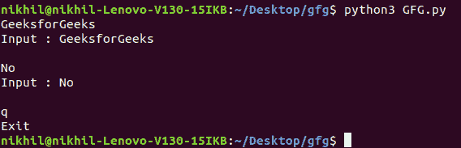
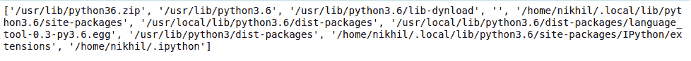
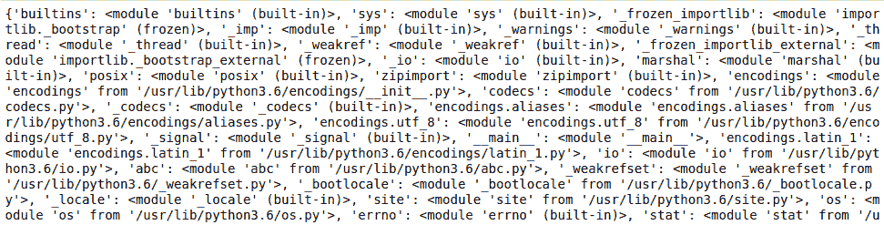

# Python 系统模块

> 原文:[https://www.geeksforgeeks.org/python-sys-module/](https://www.geeksforgeeks.org/python-sys-module/)

Python 中的 **sys 模块**提供了各种函数和变量，用于操作 Python 运行时环境的不同部分。它允许在解释器上操作，因为它提供了对与解释器强交互的变量和函数的访问。让我们考虑下面的例子。

**示例:**

## 蟒蛇 3

```
import sys

print(sys.version)
```

**输出:**

```
3.6.9 (default, Oct  8 2020, 12:12:24) 
[GCC 8.4.0]
```

在上面的例子中，使用了 **sys.version** ，它返回了一个包含 Python 解释器版本和一些附加信息的字符串。这显示了 sys 模块如何与解释器交互。让我们深入阅读这篇文章，了解更多关于 sys 模块的信息。

## 使用系统的输入和输出

sys 模块提供变量，以便更好地控制输入或输出。我们甚至可以将输入和输出重定向到其他设备。这可以通过三个变量来实现–

*   标准输入
*   stdout
*   stderr

[**stdin:**](https://www.geeksforgeeks.org/take-input-from-stdin-in-python/) 它可以用来直接从命令行获取输入。它用于标准输入。它在内部调用 input()方法。它还会在每个句子后面自动添加“\n”。

**示例:**

## 蟒蛇 3

```
import sys

for line in sys.stdin:
    if 'q' == line.rstrip():
        break
    print(f'Input : {line}')

print("Exit")
```

**输出:**



[**【stdout:**](https://www.geeksforgeeks.org/sys-stdout-write-in-python/)**一个内置的文件对象，类似于 Python 中解释器的标准输出流。stdout 用于直接向屏幕控制台显示输出。输出可以是任何形式，它可以从打印语句、表达式语句甚至直接输入的提示中输出。默认情况下，流处于文本模式。事实上，无论在代码中哪里调用打印函数，它都首先被写入 sys.stdout，然后最终显示在屏幕上。**

****示例:****

## **蟒蛇 3**

```
import sys

sys.stdout.write('Geeks')
```

****Output**

```
Geeks
```** 

**[**【stderr:**](https://www.geeksforgeeks.org/how-to-print-to-stderr-and-stdout-in-python/)**每当 Python 中出现异常时，都会将其写入 sys.stderr。****

******示例:******

## ****蟒蛇 3****

```
**import sys

def print_to_stderr(*a):

    # Here a is the array holding the objects
    # passed as the argument of the function
    print(*a, file = sys.stderr)

print_to_stderr("Hello World")**
```

******输出:******

********

## ****命令行参数****

****[命令行参数](https://www.geeksforgeeks.org/command-line-arguments-in-python/)是在程序调用期间与调用语句一起传递的参数。为了使用 sys 模块实现这一点，sys 模块提供了一个名为 [**sys.argv**](https://www.geeksforgeeks.org/how-to-use-sys-argv-in-python/) **的变量。**它的主要目的是:****

*   ****这是一个命令行参数列表。****
*   ****len(sys.argv)提供命令行参数的数量。****
*   ****sys.argv[0]是当前 Python 脚本的名称。****

******示例:**考虑一个用于添加数字的程序，数字随调用语句一起传递。****

## ****蟒蛇 3****

```
**# Python program to demonstrate
# command line arguments

import sys

# total arguments
n = len(sys.argv)
print("Total arguments passed:", n)

# Arguments passed
print("\nName of Python script:", sys.argv[0])

print("\nArguments passed:", end = " ")
for i in range(1, n):
    print(sys.argv[i], end = " ")

# Addition of numbers
Sum = 0

for i in range(1, n):
    Sum += int(sys.argv[i])

print("\n\nResult:", Sum)**
```

******输出:******

********

## ****退出程序****

******sys.exit([arg])** 可用于退出程序。可选参数 arg 可以是给出出口的整数，也可以是其他类型的对象。如果是整数，**零被认为是“成功终止”。******

******注意:**字符串也可以传递给 sys.exit()方法。****

******示例:******

## ****蟒蛇 3****

```
**# Python program to demonstrate
# sys.exit()

import sys

age = 17

if age < 18:

    # exits the program
    sys.exit("Age less than 18")    
else:
    print("Age is not less than 18")**
```

******输出:******

```
**An exception has occurred, use %tb to see the full traceback.

SystemExit: Age less than 18**
```

## ****使用模块****

****[**sys.path**](https://www.geeksforgeeks.org/sys-path-in-python/) 是 sys 模块内的内置变量，返回解释器将搜索所需模块的目录列表。****

****当在 Python 文件中导入模块时，解释器首先在其内置模块中搜索指定的模块。如果没有找到，它会查看由**系统路径**定义的目录列表。****

******注意:** sys.path 是普通列表，可以操作。****

******示例 1:** 列出所有路径****

## ****蟒蛇 3****

```
**import sys

print(sys.path)**
```

******输出:******

********

******示例 2:** 截断系统路径的值****

## ****蟒蛇 3****

```
**import sys

# Removing the values
sys.path = []

# importing pandas after removing
# values
import pandas**
```

******输出:******

```
**ModuleNotFoundError: No module named 'pandas'**
```

******sys.modules** 返回当前 shell 已经导入的 Python 模块的名称。****

******示例:******

## ****蟒蛇 3****

```
**import sys

print(sys.modules)**
```

******输出:******

********

## ****引用计数****

******sys.getrefcount()** 方法用于获取任何给定对象的引用计数。Python 使用该值，因为当该值变为 0 时，该特定值的内存将被删除。****

******示例:******

## ****蟒蛇 3****

```
**import sys

a = 'Geeks'

print(sys.getrefcount(a))**
```

******Output**

```
4
```**** 

## ****Python 系统中的更多功能****

<figure class="table">

| 功能 | 描述 |
| --- | --- |
| [缝合. setretursion limit()](https://www.geeksforgeeks.org/python-sys-setrecursionlimit-method/) | sys.setrecursionlimit()方法用于将 Python 解释器堆栈的最大深度设置为所需的限制。 |
| [sys.getrecursionlimit()方法](https://www.geeksforgeeks.org/python-sys-getrecursionlimit-method/) | sys.getrecursionlimit()方法用于查找解释器的当前递归限制或查找 Python 解释器堆栈的最大深度。 |
| [sys.settrace()](https://www.geeksforgeeks.org/python-sys-settrace/) | 它用于实现调试器、分析器和覆盖工具。这是线程特定的，必须使用 threading.settrace()注册跟踪。在更高的层次上，sys.settrace()向 Python 解释器注册回溯 |
| [sys.setswitchinterval()方法](https://www.geeksforgeeks.org/python-sys-setswitchinterval-method/) | sys.setswitchinterval()方法用于设置解释器的线程切换间隔(以秒为单位)。 |
| [缝合. maxsize()](https://www.geeksforgeeks.org/sys-maxsize-in-python/) | 它获取数据类型为 Py_ssize_t 的变量可以存储的最大值。 |
| 【T0 .缝合最大值】T1 | maxint/INT_MAX 表示可以用整数表示的最高值。 |
| [sys.getdefaultencoding()方法](https://www.geeksforgeeks.org/python-sys-getdefaultencoding-method/) | sys.getdefaultencoding()方法用于获取 Unicode 实现使用的当前默认字符串编码。 |

</figure>