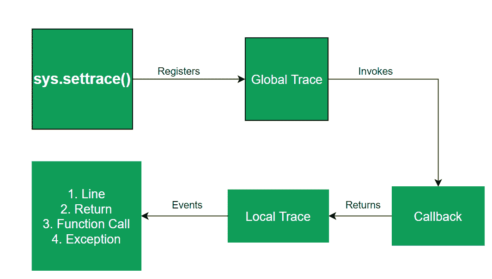

# python–sys . settrace()

> 原文:[https://www.geeksforgeeks.org/python-sys-settrace/](https://www.geeksforgeeks.org/python-sys-settrace/)

Python `sys`模块提供了一些强大的功能，但是理解起来很复杂。其中之一是`sys.settrace()`，用于实现调试器、分析器和覆盖工具。这是线程特定的，必须使用`threading.settrace()`注册跟踪。

如果您计划创建自己的调试器，那么了解函数内部的工作方式非常重要。

在更高的层次上，`sys.settrace()`向 Python 解释器注册回溯。回溯基本上是代码中发生事件时返回的信息。当您的代码出现错误或引发异常时，您可能会看到`traceback`。

当发生以下四种事件之一时，将调用注册的回溯:

1.  函数被调用
2.  函数返回
3.  一行的执行
4.  引发异常

> **语法:** sys.settrace(框架、事件、参数框架)
> 
> **参数:**
> **帧:**帧是当前堆栈帧
> **事件:**一个字符串，可以是`'call', 'line', 'return', 'exception'`也可以是`'opcode'`
> **arg:** 取决于事件类型
> 
> **返回:**对本地跟踪函数的引用，然后该函数返回对自身的引用。

**示例:**

让我们用`line, function and call`事件创建自己的本地跟踪函数。这些事件在下面给出的代码中突出显示。

```
# program to display the functioning of
# settrace()
from sys import settrace

# local trace function which returns itself
def my_tracer(frame, event, arg = None):
    # extracts frame code
    code = frame.f_code

    # extracts calling function name
    func_name = code.co_name

    # extracts the line number
    line_no = frame.f_lineno

    print(f"A {event} encountered in \
    {func_name}() at line number {line_no} ")

    return my_tracer

# global trace function is invoked here and
# local trace function is set for fun()
def fun():
    return "GFG"

# global trace function is invoked here and
# local trace function is set for check()
def check():
    return fun()

# returns reference to local
# trace function (my_tracer)
settrace(my_tracer)

check()
```

**输出:**

```
A call encountered in check() at line number 30 
A line encountered in check() at line number 31 
A call encountered in fun() at line number 24 
A line encountered in fun() at line number 25 
A return encountered in fun() at line number 25 
A return encountered in check() at line number 31 

```

你可能想知道为什么局部函数`my_code`会自己返回？
原因隐藏在`sys.settrace()`的功能中。`sys.settrace`所做的是，它首先注册一个全局跟踪，每当创建一个帧时就调用这个全局跟踪，每当上述任何一个事件发生时就返回我们的局部跟踪函数`my_trace`。为了更好地理解，请看下图:



如果我们不希望我们的范围被跟踪，那么`None`应该被返回，但是如果不是这样，我们可能希望对我们的本地跟踪函数做同样的事情，那么它应该返回`None`否则如果有错误，那么`settrace(None)`被自动调用。

**注意:**在`sys`模块中有一个名为`gettrace`的功能可以获取`sys.settrace()`设置的轨迹