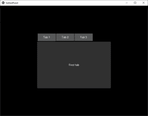
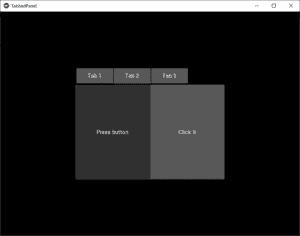
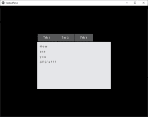

# Python | kivy 中的选项卡式面板

> 原文:[https://www.geeksforgeeks.org/python-tabbed-panel-in-kivy/](https://www.geeksforgeeks.org/python-tabbed-panel-in-kivy/)

Kivy 是 Python 中独立于平台的 GUI 工具。因为它可以在安卓、IOS、linux 和 Windows 等平台上运行。它基本上用于开发安卓应用程序，但并不意味着它不能在桌面应用程序上使用

> 👉🏽 [Kivy 教程–通过示例学习 Kivy](https://www.geeksforgeeks.org/kivy-tutorial/)。

### 选项卡式面板

选项卡面板小部件管理选项卡中的不同小部件，其中一个标题区域用于实际的选项卡按钮，一个内容区域用于显示当前的选项卡内容。

选项卡面板提供一个默认选项卡。

> 要使用它，必须从 kivy . uix . TabbedPanel 导入:
> 导入 tabbebanel

```
Basic Approach:
1) import kivy
2) import kivy App
3) import floatlayout
4) import tabbedpanel
5) set minimum version(optional)
6) Create Tabbed panel class
7) create the App class
8) create .kv file:
       # create multiple tabs in it.
       # Do there functioning also.
9) return the widget/layout etc class
10) Run an instance of the class

```

**实施方法:**

**。py 文件**

```
# Program to explain how to create tabbed panel App in kivy  

# import kivy module     
import kivy   

# base Class of your App inherits from the App class.     
# app:always refers to the instance of your application    
from kivy.app import App  

# this restrict the kivy version i.e   
# below this kivy version you cannot   
# use the app or software   
kivy.require('1.9.0')  

# to  use this must have to import it
from kivy.uix.tabbedpanel import TabbedPanel

# Floatlayout allows us to place the elements
# relatively based on the current window
# size and height especially in mobiles
from kivy.uix.floatlayout import FloatLayout

# Create Tabbed class 
class Tab(TabbedPanel):
    pass

# create App class
class TabbedPanelApp(App):
    def build(self):
        return Tab()

# run the App
if __name__ == '__main__':
    TabbedPanelApp().run()
```

**。kv 文件**

```
# .kv file of tabbed panel

<Tab>:

    # creating the size
    # and the alignment of the tab 
    size_hint: .5, .5
    pos_hint: {'center_x': .5, 'center_y': .5}
    do_default_tab: False

    # Create tab 1
    TabbedPanelItem:
        text: 'Tab 1'
        Label:
            text: "First tab"

    # Create 2nd tab
    TabbedPanelItem:
        text: 'Tab 2'
        BoxLayout:
            Label:
                text: 'Press button'
            Button:
                text: 'Click it'

    # Create 3rd tab
    TabbedPanelItem:
        text: 'Tab 3'
        RstDocument:
            text: '\n'.join(("How are you GFG's???"))
```

**输出:**

**表 1:**


**表 2:**


**表 3:**
